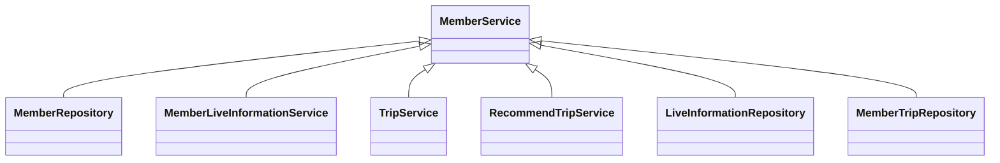
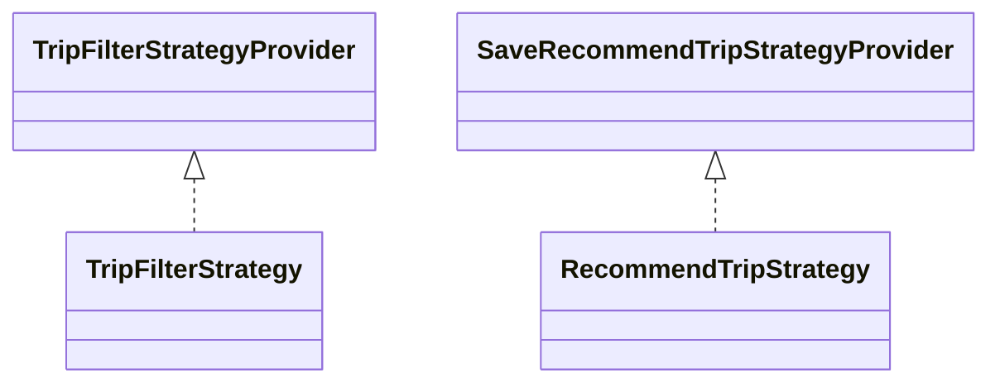
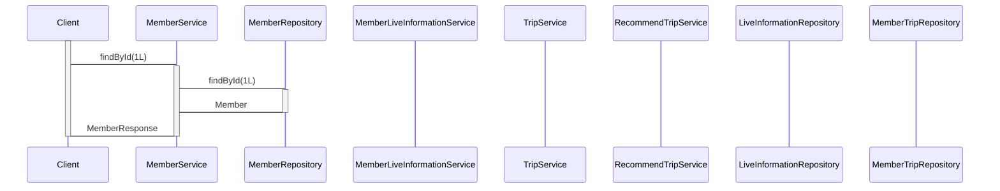

## Service Code Documentation

This documentation provides a comprehensive overview of the `MemberService` code, including its structure, implementation details, and interactions with other components.

### 1. Overall Structure

The `MemberService` code is responsible for managing member-related operations within the application. It interacts with various other components, including:

- **MemberRepository:** Handles persistence operations for `Member` entities.
- **MemberLiveInformationService:** Manages the association between members and their selected live information.
- **TripService:** Provides access to trip-related data and functionality.
- **RecommendTripService:** Handles recommendations and ranking of trips for members.
- **LiveInformationRepository:** Provides access to live information data.
- **MemberTripRepository:** Manages the association between members and their visited trips.

**Mermaid Diagram:**



### 2. Strategy Pattern Implementation

The code does not explicitly implement the Strategy pattern. However, it utilizes the concept of dependency injection to achieve similar functionality. The `TripService` and `RecommendTripService` classes rely on `TripFilterStrategyProvider` and `SaveRecommendTripStrategyProvider` respectively, which act as context classes for selecting and executing different strategies based on specific criteria.

**Class Diagram:**



### 3. Detailed Component Documentation

#### a. Classes

**MemberService:**

- **Purpose:** Provides a centralized interface for managing member-related operations.
- **Attributes:**
    - `memberRepository`: An instance of `MemberRepository` for database interactions.
    - `memberLiveInformationService`: An instance of `MemberLiveInformationService` for managing member-live information associations.
    - `tripService`: An instance of `TripService` for accessing trip-related data and functionality.
    - `recommendTripService`: An instance of `RecommendTripService` for handling trip recommendations and ranking.
    - `liveInformationRepository`: An instance of `LiveInformationRepository` for accessing live information data.
    - `memberTripRepository`: An instance of `MemberTripRepository` for managing member-trip associations.
- **Role:** Acts as a central point of access for all member-related operations, delegating tasks to other components as needed.

#### b. Methods and Functions

**findById(Long id):**

- **Purpose:** Retrieves a `Member` entity by its ID.
- **Parameters:**
    - `id`: The ID of the member to retrieve.
- **Return value:** A `MemberResponse` object containing member details.
- **Code Example:**
```java
MemberResponse memberResponse = memberService.findById(1L);
```

**findByEmail(String email):**

- **Purpose:** Retrieves a `Member` entity by its email address.
- **Parameters:**
    - `email`: The email address of the member to retrieve.
- **Return value:** A `Member` object.
- **Code Example:**
```java
Member member = memberService.findByEmail("test@example.com");
```

**existsByEmail(String email):**

- **Purpose:** Checks if a member with the given email address exists.
- **Parameters:**
    - `email`: The email address to check.
- **Return value:** `true` if a member with the given email exists, `false` otherwise.
- **Code Example:**
```java
boolean exists = memberService.existsByEmail("test@example.com");
```

**existsById(Long id):**

- **Purpose:** Checks if a member with the given ID exists.
- **Parameters:**
    - `id`: The ID to check.
- **Return value:** `true` if a member with the given ID exists, `false` otherwise.
- **Code Example:**
```java
boolean exists = memberService.existsById(1L);
```

**save(Member member):**

- **Purpose:** Saves a `Member` entity to the database.
- **Parameters:**
    - `member`: The `Member` object to save.
- **Return value:** None.
- **Code Example:**
```java
Member member = new Member("test@example.com", SocialType.GOOGLE, "https://example.com/profile.jpg");
memberService.save(member);
```

**existsByNickname(String nickname):**

- **Purpose:** Checks if a member with the given nickname exists.
- **Parameters:**
    - `nickname`: The nickname to check.
- **Return value:** `true` if a member with the given nickname exists, `false` otherwise.
- **Code Example:**
```java
boolean exists = memberService.existsByNickname("TestUser");
```

**signUpByProfile(long memberId, SignUpProfileRequest request):**

- **Purpose:** Completes the signup process by updating the member's profile information.
- **Parameters:**
    - `memberId`: The ID of the member to update.
    - `request`: A `SignUpProfileRequest` object containing the profile details.
- **Return value:** None.
- **Code Example:**
```java
SignUpProfileRequest request = new SignUpProfileRequest("TestUser", LocalDate.of(1990, 1, 1), GenderType.MALE);
memberService.signUpByProfile(1L, request);
```

**signUpByLiveInfo(long memberId, SignUpLiveInfoRequest request):**

- **Purpose:** Completes the signup process by associating the member with their selected live information.
- **Parameters:**
    - `memberId`: The ID of the member to update.
    - `request`: A `SignUpLiveInfoRequest` object containing the list of live information names.
- **Return value:** None.
- **Code Example:**
```java
SignUpLiveInfoRequest request = new SignUpLiveInfoRequest(List.of("Food", "Shopping"));
memberService.signUpByLiveInfo(1L, request);
```

**signUpByInterestTrips(long memberId, SignUpInterestTripsRequest request):**

- **Purpose:** Completes the signup process by associating the member with their selected interest trips.
- **Parameters:**
    - `memberId`: The ID of the member to update.
    - `request`: A `SignUpInterestTripsRequest` object containing the list of trip content IDs.
- **Return value:** None.
- **Code Example:**
```java
SignUpInterestTripsRequest request = new SignUpInterestTripsRequest(List.of(1L, 2L, 3L, 4L, 5L));
memberService.signUpByInterestTrips(1L, request);
```

**updateByProfile(long memberId, UpdateProfileRequest request):**

- **Purpose:** Updates the member's profile information.
- **Parameters:**
    - `memberId`: The ID of the member to update.
    - `request`: A `UpdateProfileRequest` object containing the updated profile details.
- **Return value:** None.
- **Code Example:**
```java
UpdateProfileRequest request = new UpdateProfileRequest("UpdatedUser", LocalDate.of(1991, 2, 2), GenderType.FEMALE, "https://example.com/updated_profile.jpg");
memberService.updateByProfile(1L, request);
```

**checkIsAlreadyExistNickname(String nickname):**

- **Purpose:** Checks if a nickname already exists in the database.
- **Parameters:**
    - `nickname`: The nickname to check.
- **Return value:** None.
- **Code Example:**
```java
memberService.checkIsAlreadyExistNickname("TestUser");
```

**findMemberAuthorityAndProfileImg(long memberId):**

- **Purpose:** Retrieves the member's authority and profile image URL.
- **Parameters:**
    - `memberId`: The ID of the member to retrieve information for.
- **Return value:** A `FindMemberAuthorityAndProfileResponse` object containing the authority and profile image URL.
- **Code Example:**
```java
FindMemberAuthorityAndProfileResponse response = memberService.findMemberAuthorityAndProfileImg(1L);
```

### 4. Implementation Flow

**Sequence Diagram:**



This sequence diagram illustrates the flow of execution for the `findById` method. The client calls the `findById` method on `MemberService`, which in turn delegates the request to `MemberRepository`. `MemberRepository` retrieves the `Member` entity from the database and returns it to `MemberService`. Finally, `MemberService` constructs a `MemberResponse` object and returns it to the client.

This documentation provides a comprehensive understanding of the `MemberService` code, its interactions with other components, and its role in the overall application. It can be used as a reference for developers working with the codebase, enabling them to understand its functionality and effectively utilize its features.
