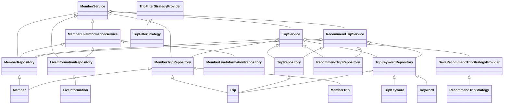

## Service Code Documentation

### 1. Overall Structure

This codebase implements a service layer for managing member-related functionalities. It interacts with various domain entities and repositories to provide functionalities like:

- **Member Registration:** Handles the registration process for new members, including profile information, live information preferences, and interest trips.
- **Member Profile Management:** Allows updating member profiles, including nickname, birthday, gender, and profile image.
- **Member Authentication:** Provides methods for checking if a member exists based on email or ID.
- **Member Authority Management:** Manages member privileges and provides methods for checking member authority and profile image access.

The codebase utilizes the **Strategy Pattern** to implement flexible and extensible logic for handling different aspects of member management, such as recommending trips based on user preferences.

**Mermaid Diagram:**

### 2. Strategy Pattern Implementation

The Strategy Pattern is implemented in the `TripService` and `RecommendTripService` classes to handle different filtering and recommendation logic based on user preferences.

**Strategy Interface:**

- **`TripFilterStrategy`:** Defines the interface for filtering trips based on specific criteria.
- **`RecommendTripStrategy`:** Defines the interface for recommending trips based on user preferences.

**Concrete Strategy Classes:**

- **`TripFilterStrategyProvider`:** Provides concrete implementations of `TripFilterStrategy` based on the filter type (e.g., `LIVE_INFO_STRATEGY`).
- **`SaveRecommendTripStrategyProvider`:** Provides concrete implementations of `RecommendTripStrategy` based on the number of recommended trips.

**Context Class:**

- **`TripService`:** Uses the `TripFilterStrategyProvider` to select and execute the appropriate filtering strategy.
- **`RecommendTripService`:** Uses the `SaveRecommendTripStrategyProvider` to select and execute the appropriate recommendation strategy.

**Class Diagram:**

### 3. Detailed Component Documentation

#### a. Classes

**1. `MemberService`:**

- **Purpose:** Provides functionalities for managing member-related operations, including registration, profile management, authentication, and authority management.
- **Attributes:**
    - `memberRepository`: Repository for accessing and manipulating member data.
    - `memberLiveInformationService`: Service for managing member live information preferences.
    - `tripService`: Service for managing trip-related operations.
    - `recommendTripService`: Service for managing trip recommendations.
    - `liveInformationRepository`: Repository for accessing and manipulating live information data.
    - `memberTripRepository`: Repository for accessing and manipulating member trip data.
- **Role:** Acts as the central service for all member-related operations, coordinating interactions with other services and repositories.

**2. `Member`:**

- **Purpose:** Represents a member entity, storing information like email, nickname, profile image, social type, birthday, gender, and authority.
- **Attributes:**
    - `id`: Unique identifier for the member.
    - `email`: Member's email address.
    - `nickName`: Member's nickname.
    - `profileImageUrl`: URL of the member's profile image.
    - `socialType`: Member's social login type.
    - `birthday`: Member's birthday.
    - `genderType`: Member's gender.
    - `authority`: Member's authority level.
- **Role:** Represents a member in the system, storing essential information and providing methods for managing member data.

**3. `MemberLiveInformation`:**

- **Purpose:** Represents the association between a member and their preferred live information.
- **Attributes:**
    - `id`: Unique identifier for the association.
    - `liveInformation`: The preferred live information.
    - `member`: The member associated with the live information.
- **Role:** Establishes a relationship between members and their preferred live information, allowing for personalized recommendations and filtering.

**4. `MemberTrip`:**

- **Purpose:** Represents the association between a member and a trip, tracking the member's interaction with the trip.
- **Attributes:**
    - `id`: Unique identifier for the association.
    - `member`: The member associated with the trip.
    - `trip`: The trip associated with the member.
    - `visitedCount`: Number of times the member has visited the trip.
- **Role:** Tracks member interactions with trips, allowing for personalized recommendations and filtering based on visited trips.

**5. `Trip`:**

- **Purpose:** Represents a trip entity, storing information like name, place name, content ID, description, trip image URL, visited count, and coordinates.
- **Attributes:**
    - `id`: Unique identifier for the trip.
    - `name`: Name of the trip.
    - `placeName`: Name of the place where the trip is located.
    - `contentId`: Unique identifier for the trip content.
    - `description`: Description of the trip.
    - `tripImageUrl`: URL of the trip image.
    - `visitedCount`: Number of times the trip has been visited.
    - `coordinateX`: X-coordinate of the trip location.
    - `coordinateY`: Y-coordinate of the trip location.
- **Role:** Represents a trip in the system, storing essential information and providing methods for managing trip data.

**6. `TripKeyword`:**

- **Purpose:** Represents the association between a trip and a keyword, allowing for keyword-based filtering and searching.
- **Attributes:**
    - `id`: Unique identifier for the association.
    - `trip`: The trip associated with the keyword.
    - `keyword`: The keyword associated with the trip.
- **Role:** Establishes a relationship between trips and keywords, enabling keyword-based filtering and searching for trips.

**7. `LiveInformation`:**

- **Purpose:** Represents a live information entity, storing information like name.
- **Attributes:**
    - `id`: Unique identifier for the live information.
    - `name`: Name of the live information.
- **Role:** Represents a live information category in the system, storing essential information and providing methods for managing live information data.

#### b. Methods and Functions

**1. `MemberService`:**

- **`findById(Long id)`:** Retrieves a member by their ID.
    - **Parameters:**
        - `id`: The ID of the member to retrieve.
    - **Return Value:** A `MemberResponse` object containing the member's information.
- **`findByEmail(String email)`:** Retrieves a member by their email address.
    - **Parameters:**
        - `email`: The email address of the member to retrieve.
    - **Return Value:** A `Member` object representing the found member.
- **`existsByEmail(String email)`:** Checks if a member exists with the given email address.
    - **Parameters:**
        - `email`: The email address to check.
    - **Return Value:** `true` if a member exists with the given email, `false` otherwise.
- **`existsById(Long id)`:** Checks if a member exists with the given ID.
    - **Parameters:**
        - `id`: The ID to check.
    - **Return Value:** `true` if a member exists with the given ID, `false` otherwise.
- **`save(Member member)`:** Saves a member to the database.
    - **Parameters:**
        - `member`: The member object to save.
    - **Return Value:** None.
- **`existsByNickname(String nickname)`:** Checks if a member exists with the given nickname.
    - **Parameters:**
        - `nickname`: The nickname to check.
    - **Return Value:** `true` if a member exists with the given nickname, `false` otherwise.
- **`signUpByProfile(long memberId, SignUpProfileRequest request)`:** Completes the member registration process by saving the member's profile information.
    - **Parameters:**
        - `memberId`: The ID of the member to update.
        - `request`: A `SignUpProfileRequest` object containing the member's profile information.
    - **Return Value:** None.
- **`signUpByLiveInfo(long memberId, SignUpLiveInfoRequest request)`:** Saves the member's preferred live information.
    - **Parameters:**
        - `memberId`: The ID of the member to update.
        - `request`: A `SignUpLiveInfoRequest` object containing the member's preferred live information.
    - **Return Value:** None.
- **`signUpByInterestTrips(long memberId, SignUpInterestTripsRequest request)`:** Saves the member's interest trips and changes their authority to `REGULAR_MEMBER`.
    - **Parameters:**
        - `memberId`: The ID of the member to update.
        - `request`: A `SignUpInterestTripsRequest` object containing the member's interest trips.
    - **Return Value:** None.
- **`updateByProfile(long memberId, UpdateProfileRequest request)`:** Updates the member's profile information.
    - **Parameters:**
        - `memberId`: The ID of the member to update.
        - `request`: An `UpdateProfileRequest` object containing the updated profile information.
    - **Return Value:** None.
- **`checkIsAlreadyExistNickname(String nickname)`:** Checks if a nickname already exists and throws an exception if it does.
    - **Parameters:**
        - `nickname`: The nickname to check.
    - **Return Value:** None.
- **`findMemberAuthorityAndProfileImg(long memberId)`:** Retrieves the member's authority and profile image URL.
    - **Parameters:**
        - `memberId`: The ID of the member to retrieve information for.
    - **Return Value:** A `FindMemberAuthorityAndProfileResponse` object containing the member's authority and profile image URL.

**2. `Member`:**

- **`changePrivilege(Authority authority)`:** Changes the member's authority level.
    - **Parameters:**
        - `authority`: The new authority level to assign to the member.
    - **Return Value:** None.
- **`isNicknameChanged(String inputNickname)`:** Checks if the member's nickname has changed.
    - **Parameters:**
        - `inputNickname`: The new nickname to compare against.
    - **Return Value:** `true` if the nickname has changed, `false` otherwise.
- **`getId()`:** Returns the member's ID.
    - **Parameters:** None.
    - **Return Value:** The member's ID.
- **`getProfileImageUrl()`:** Returns the member's profile image URL.
    - **Parameters:** None.
    - **Return Value:** The member's profile image URL.
- **`getGenderType()`:** Returns the member's gender.
    - **Parameters:** None.
    - **Return Value:** The member's gender.
- **`getNickName()`:** Returns the member's nickname.
    - **Parameters:** None.
    - **Return Value:** The member's nickname.
- **`getBirthday()`:** Returns the member's birthday.
    - **Parameters:** None.
    - **Return Value:** The member's birthday.
- **`getAuthority()`:** Returns the member's authority level.
    - **Parameters:** None.
    - **Return Value:** The member's authority level.
- **`getSocialType()`:** Returns the member's social login type.
    - **Parameters:** None.
    - **Return Value:** The member's social login type.
- **`getEmail()`:** Returns the member's email address.
    - **Parameters:** None.
    - **Return Value:** The member's email address.

**3. `MemberLiveInformation`:**

- **`getId()`:** Returns the association's ID.
    - **Parameters:** None.
    - **Return Value:** The association's ID.
- **`getLiveInformation()`:** Returns the associated live information.
    - **Parameters:** None.
    - **Return Value:** The associated live information.
- **`getMember()`:** Returns the associated member.
    - **Parameters:** None.
    - **Return Value:** The associated member.

**4. `MemberTrip`:**

- **`incrementVisitedCount()`:** Increments the visited count for the associated trip.
    - **Parameters:** None.
    - **Return Value:** None.
- **`getVisitedCount()`:** Returns the visited count for the associated trip.
    - **Parameters:** None.
    - **Return Value:** The visited count.
- **`getTrip()`:** Returns the associated trip.
    - **Parameters:** None.
    - **Return Value:** The associated trip.

**5. `Trip`:**

- **`incrementVisitedCount()`:** Increments the visited count for the trip.
    - **Parameters:** None.
    - **Return Value:** None.
- **`getName()`:** Returns the trip's name.
    - **Parameters:** None.
    - **Return Value:** The trip's name.
- **`getContentId()`:** Returns the trip's content ID.
    - **Parameters:** None.
    - **Return Value:** The trip's content ID.
- **`getId()`:** Returns the trip's ID.
    - **Parameters:** None.
    - **Return Value:** The trip's ID.
- **`getDescription()`:** Returns the trip's description.
    - **Parameters:** None.
    - **Return Value:** The trip's description.
- **`getPlaceName()`:** Returns the trip's place name.
    - **Parameters:** None.
    - **Return Value:** The trip's place name.
- **`getTripImageUrl()`:** Returns the trip's image URL.
    - **Parameters:** None.
    - **Return Value:** The trip's image URL.
- **`getVisitedCount()`:** Returns the trip's visited count.
    - **Parameters:** None.
    - **Return Value:** The trip's visited count.
- **`getCoordinateX()`:** Returns the trip's X-coordinate.
    - **Parameters:** None.
    - **Return Value:** The trip's X-coordinate.
- **`getCoordinateY()`:** Returns the trip's Y-coordinate.
    - **Parameters:** None.
    - **Return Value:** The trip's Y-coordinate.

**6. `TripKeyword`:**

- **`getId()`:** Returns the association's ID.
    - **Parameters:** None.
    - **Return Value:** The association's ID.
- **`getTrip()`:** Returns the associated trip.
    - **Parameters:** None.
    - **Return Value:** The associated trip.
- **`getKeyword()`:** Returns the associated keyword.
    - **Parameters:** None.
    - **Return Value:** The associated keyword.

**7. `LiveInformation`:**

- **`getId()`:** Returns the live information's ID.
    - **Parameters:** None.
    - **Return Value:** The live information's ID.
- **`getName()`:** Returns the live information's name.
    - **Parameters:** None.
    - **Return Value:** The live information's name.

### 4. Implementation Flow

**Sequence Diagram:**

### 5. Conclusion

This documentation provides a comprehensive overview of the service code, including its structure, strategy pattern implementation, detailed component documentation, and implementation flow. This documentation aims to help developers understand the codebase and its functionalities, enabling them to effectively work with and extend the code.
