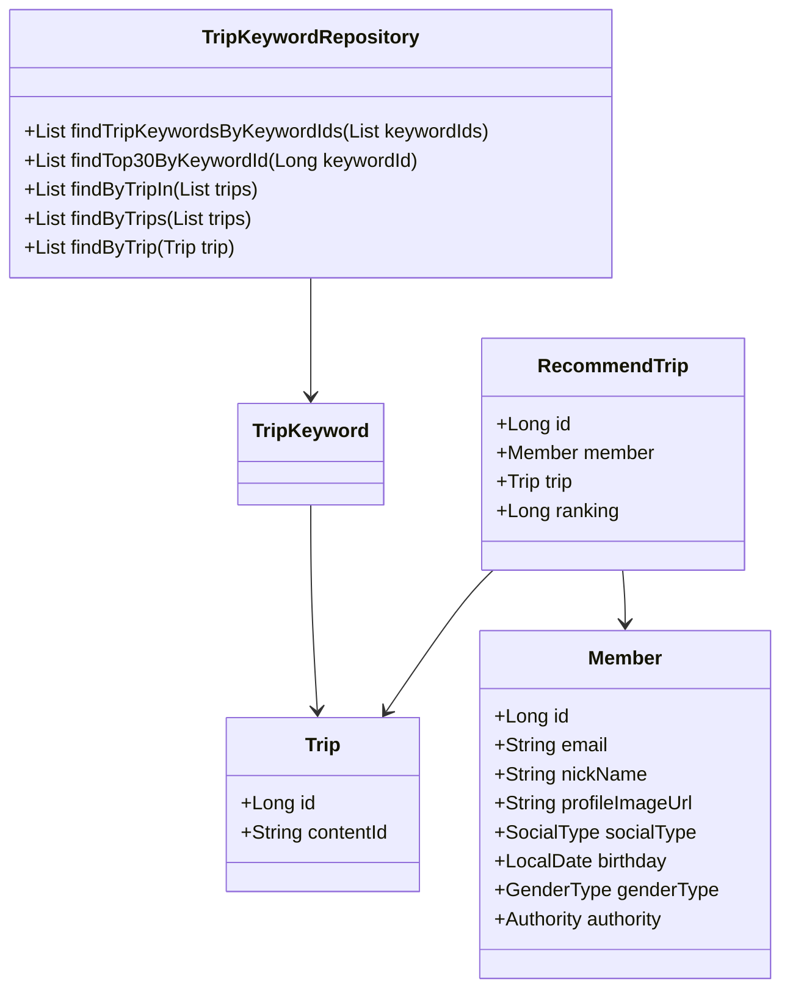
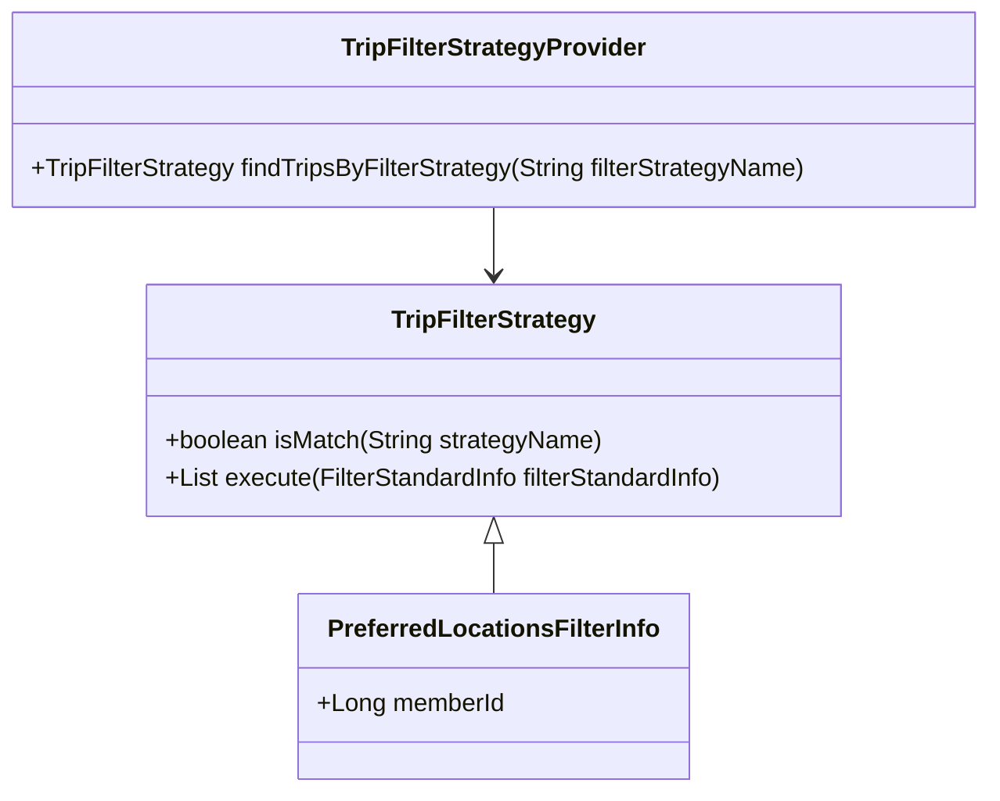
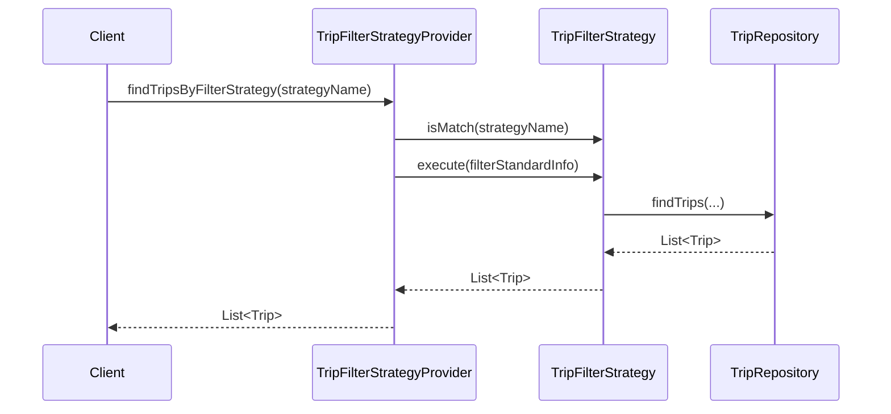
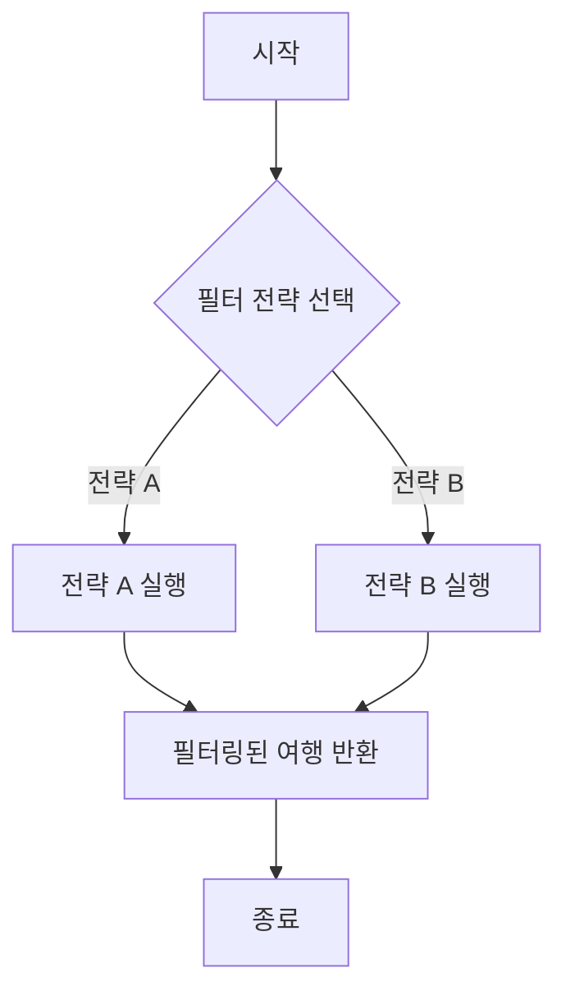

# 코드베이스에 대한 포괄적인 문서

## 1. 전체 구조

### 고수준 개요
코드베이스는 여행 추천 시스템을 중심으로 구성되어 있으며, 데이터베이스 상호작용을 위해 Spring Data JPA를 사용합니다. 여러 모듈로 구성되어 있으며, 각 모듈은 도메인 모델, 리포지토리, 예외 및 DTO(데이터 전송 객체) 등 애플리케이션의 다양한 측면을 담당합니다.

### 각 파일/모듈의 목적 및 기능
- **도메인 모델**: `Member`, `Trip`, `RecommendTrip`, `TripKeyword`와 같은 애플리케이션의 핵심 엔티티를 나타냅니다.
- **리포지토리**: 도메인 모델에 대한 CRUD 작업 및 사용자 정의 쿼리를 제공하기 위해 `JpaRepository`를 확장하는 인터페이스입니다.
- **DTO**: 클라이언트와 서버 간에 데이터를 전송하는 데 사용되는 클래스입니다. 예를 들어 `RecommendTripCreateRequest` 및 `FindTripsResponse`가 있습니다.
- **예외**: `NoExistMemberException` 및 `NoExistTripException`과 같은 특정 오류 시나리오를 처리하기 위한 사용자 정의 예외입니다.
- **필터 전략**: 다양한 기준에 따라 여행을 필터링하기 위해 전략 패턴을 구현한 인터페이스 및 클래스입니다.

### 구성 요소 간의 상호작용
- `Member`, `Trip`, `RecommendTrip` 엔티티는 각 클래스에서 정의된 관계를 통해 상호 연결되어 있습니다.
- 리포지토리는 데이터베이스와 상호작용하여 이러한 엔티티에 대한 작업을 수행합니다.
- `TripFilterStrategy` 인터페이스와 그 구현체는 사용자 선호도에 따라 여행을 동적으로 필터링할 수 있도록 합니다.

### Mermaid 다이어그램


## 2. 전략 패턴 구현

### 전략 패턴 개요
전략 패턴은 사용자 선호도에 따라 여행 필터링 전략을 동적으로 선택할 수 있도록 구현되었습니다. 이를 통해 애플리케이션은 핵심 로직을 수정하지 않고도 다양한 필터링 기준에 적응할 수 있습니다.

### 전략 인터페이스 및 구체적인 전략 클래스
- **TripFilterStrategy**: 필터링 전략에 대한 계약을 정의하는 인터페이스입니다.
    - **메서드**:
        - `boolean isMatch(final String strategyName)`: 주어진 이름과 전략이 일치하는지 확인합니다.
        - `List<Trip> execute(final FilterStandardInfo filterStandardInfo)`: 제공된 정보를 기반으로 필터링 로직을 실행합니다.

### 컨텍스트 클래스
- **TripFilterStrategyProvider**: 이 클래스는 전략 목록을 보유하고 필터 이름에 따라 적절한 전략을 찾는 메서드를 제공합니다.

### 클래스 다이어그램


## 3. 상세 구성 요소 문서

### a. 클래스

#### TripKeywordRepository
- **목적**: `TripKeyword` 엔티티에 대한 CRUD 작업을 위한 인터페이스입니다.
- **속성**: 없음 (JpaRepository에서 상속됨).
- **역할**: 다양한 기준에 따라 여행 키워드를 검색하는 메서드를 제공합니다.
- **관계**: `TripKeyword` 및 `Trip`과 상호작용합니다.

#### Member
- **목적**: 시스템 내의 사용자/회원 정보를 나타냅니다.
- **속성**:
    - `Long id`: 회원의 고유 식별자입니다.
    - `String email`: 회원의 이메일 주소입니다.
    - `String nickName`: 회원의 닉네임입니다.
    - `String profileImageUrl`: 회원의 프로필 이미지 URL입니다.
    - `SocialType socialType`: 사용된 소셜 로그인 유형입니다.
    - `LocalDate birthday`: 회원의 생일입니다.
    - `GenderType genderType`: 회원의 성별입니다.
    - `Authority authority`: 회원의 권한 수준입니다.
- **역할**: 시스템 내의 사용자를 나타내는 핵심 엔티티입니다.
- **관계**: `RecommendTrip`과 관련이 있습니다.

#### RecommendTrip
- **목적**: 회원을 위한 추천 여행을 나타냅니다.
- **속성**:
    - `Long id`: 추천의 고유 식별자입니다.
    - `Member member`: 추천과 관련된 회원입니다.
    - `Trip trip`: 추천되는 여행입니다.
    - `Long ranking`: 추천의 순위입니다.
- **역할**: 회원과 추천 여행 간의 관계를 보유합니다.
- **관계**: `Member` 및 `Trip`과 관련이 있습니다.

### b. 메서드 및 함수

#### TripKeywordRepository 메서드
- **findTripKeywordsByKeywordIds**
    - **목적**: 키워드 ID 목록에 따라 여행 키워드를 검색합니다.
    - **매개변수**: 
        - `List<Long> keywordIds`: 검색할 키워드 ID 목록입니다.
    - **반환 값**: `List<TripKeyword>`: 일치하는 여행 키워드 목록입니다.
  
- **findTop30ByKeywordId**
    - **목적**: 키워드 ID에 따라 상위 30개의 여행 키워드를 검색합니다.
    - **매개변수**: 
        - `Long keywordId`: 검색할 키워드 ID입니다.
    - **반환 값**: `List<TripKeyword>`: 상위 30개의 여행 키워드 목록입니다.

#### Member 메서드
- **changePrivilege**
    - **목적**: 회원의 권한 수준을 변경합니다.
    - **매개변수**: 
        - `Authority authority`: 설정할 새로운 권한 수준입니다.
    - **반환 값**: 없음.
  
- **validateEmail**
    - **목적**: 이메일 주소의 형식을 검증합니다.
    - **매개변수**: 
        - `String email`: 검증할 이메일 주소입니다.
    - **반환 값**: 없음 (유효하지 않은 경우 예외를 발생시킵니다).

### c. 사용 예시

#### TripKeywordRepository 사용 예
```java
@Autowired
private TripKeywordRepository tripKeywordRepository;

public void exampleUsage() {
    List<Long> keywordIds = Arrays.asList(1L, 2L, 3L);
    List<TripKeyword> tripKeywords = tripKeywordRepository.findTripKeywordsByKeywordIds(keywordIds);
    // tripKeywords 처리...
}
```

#### 전략 전환 예시
```java
@Autowired
private TripFilterStrategyProvider strategyProvider;

public void filterTrips(String strategyName, Long memberId) {
    FilterStandardInfo filterInfo = new PreferredLocationsFilterInfo(memberId);
    TripFilterStrategy strategy = strategyProvider.findTripsByFilterStrategy(strategyName);
    List<Trip> filteredTrips = strategy.execute(filterInfo);
    // filteredTrips 처리...
}
```

### d. 중요한 변수

- **EMAIL_FORMAT**: `Member` 클래스에서 이메일 형식을 검증하는 데 사용되는 패턴입니다.
- **MAX_NICK_NAME_LENGTH**: 닉네임의 최대 허용 길이입니다.
- **MIN_NICK_NAME_LENGTH**: 닉네임의 최소 허용 길이입니다.

## 4. 구현 흐름

### 시퀀스 다이어그램


### 활동 다이어그램


이 문서는 코드베이스에 대한 포괄적인 개요를 제공하며, 구조, 구성 요소 및 상호작용을 자세히 설명하고, 전략 패턴 구현 및 사용 예시를 설명합니다. 이는 새로운 개발자와 경험이 있는 개발자 모두가 코드를 이해하고 효과적으로 작업할 수 있도록 돕는 가이드 역할을 합니다.
