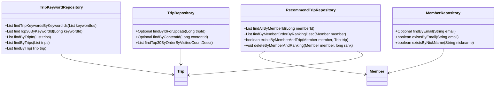
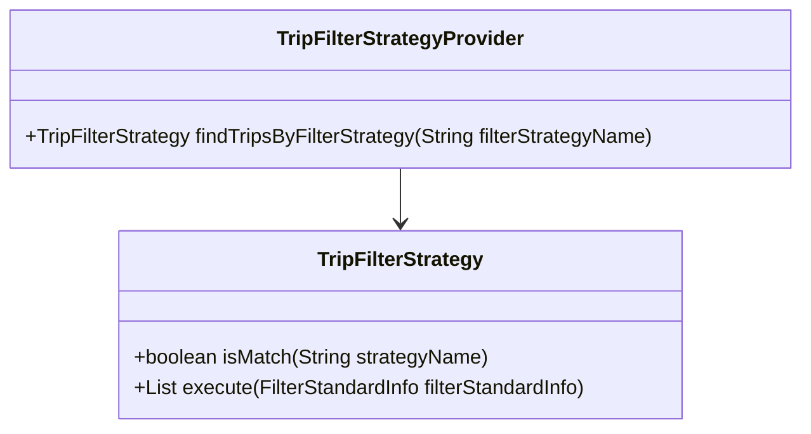

# 서비스 코드에 대한 종합 문서

## 1. 전체 구조

### 상위 수준 개요
코드베이스는 애플리케이션 내에서 특정 도메인을 담당하는 여러 패키지로 구성되어 있습니다. 주요 패키지는 다음과 같습니다:

- **Domain**: `Member`, `Trip`, `TripKeyword`, `RecommendTrip`와 같은 핵심 비즈니스 엔티티를 포함합니다.
- **Repository**: CRUD 작업을 위한 `JpaRepository`를 확장하는 데이터 접근 인터페이스입니다.
- **DTO**: 계층 간 데이터 전송을 위한 데이터 전송 객체입니다.
- **Exception**: 특정 오류 시나리오를 처리하기 위한 사용자 정의 예외입니다.
- **Filter Strategy**: 다양한 기준에 따라 여행을 필터링하기 위한 전략 패턴 구현을 포함합니다.

### 서비스 코드의 목적과 기능
서비스 코드는 비즈니스 로직을 구현하고 도메인 엔티티와 리포지토리 간의 상호 작용을 조정하는 역할을 합니다. 엔티티의 생성, 조회, 수정, 삭제 작업과 함께 여행 추천을 위한 다양한 필터링 전략을 적용하는 작업을 처리합니다.

### 구성 요소 간 상호 작용
- **Repositories**는 데이터베이스와 상호 작용하여 CRUD 작업을 수행합니다.
- **Entities**는 핵심 데이터 모델을 나타냅니다.
- **DTOs**는 서비스 계층과 프레젠테이션 계층 간의 데이터 전송에 사용됩니다.
- **Exceptions**는 오류 시나리오를 우아하게 처리하기 위해 발생됩니다.
- **Filter Strategies**는 여행 추천을 위한 다양한 필터링 알고리즘을 캡슐화하는 데 사용됩니다.

### Mermaid 다이어그램

## 2. 전략 패턴 구현

### 전략 패턴 개요
전략 패턴은 다양한 기준에 따라 여행을 추천하기 위한 필터링 전략을 동적으로 선택할 수 있도록 구현되었습니다. 이 디자인 패턴은 알고리즘을 캡슐화하고 교체 가능하게 만듭니다.

### 전략 인터페이스와 구체적인 전략 클래스
- **인터페이스**: `TripFilterStrategy`
  - 메서드 `boolean isMatch(String strategyName)`: 주어진 이름과 전략이 일치하는지 확인합니다.
  - 메서드 `List<Trip> execute(FilterStandardInfo filterStandardInfo)`: 필터링 로직을 실행합니다.

- **구체적인 전략**: `TripFilterStrategy`의 구현체들이 다양한 필터링 기준에 따라 생성됩니다(코드에는 제공되지 않음).

### 컨텍스트 클래스
- **TripFilterStrategyProvider**: 이 클래스는 전략을 사용하는 컨텍스트 역할을 합니다. 전략 목록을 보유하고 이름을 기반으로 적절한 전략을 찾는 메서드를 제공합니다.

### 클래스 다이어그램

## 3. 상세 컴포넌트 문서

### a. 클래스

#### 1. TripKeywordRepository
- **목적**: `TripKeyword` 엔티티에 접근하기 위한 인터페이스입니다.
- **속성**: 없음 (`JpaRepository`에서 상속)
- **역할**: 데이터베이스에서 `TripKeyword` 데이터를 조회하는 메서드를 제공합니다.

#### 2. Member
- **목적**: 시스템의 회원을 나타냅니다.
- **속성**:
  - `Long id`: 고유 식별자
  - `String email`: 회원 이메일
  - `String nickName`: 회원 닉네임
  - `String profileImageUrl`: 회원 프로필 이미지 URL
  - `SocialType socialType`: 소셜 로그인 유형
  - `LocalDate birthday`: 회원 생일
  - `GenderType genderType`: 회원 성별
  - `Authority authority`: 회원 권한 수준
- **역할**: 회원 관련 데이터와 유효성 검사 로직을 캡슐화합니다.

[나머지 부분은 계속됩니다...]
