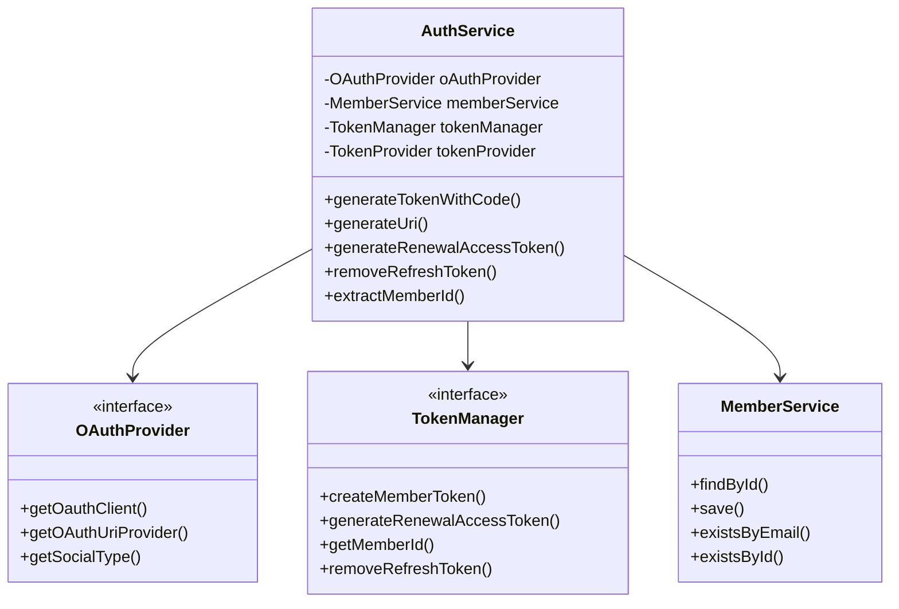
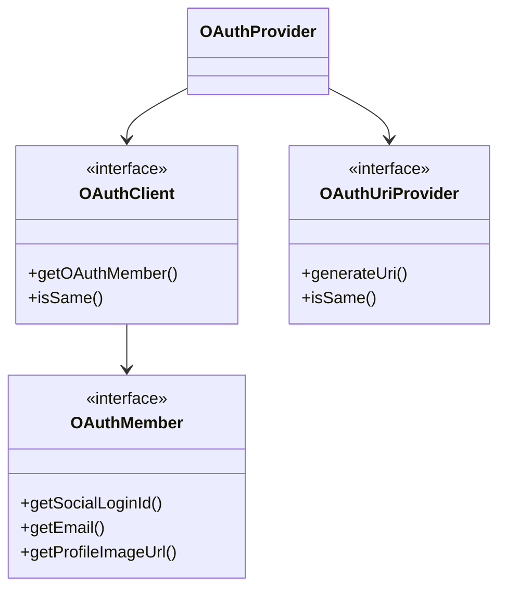
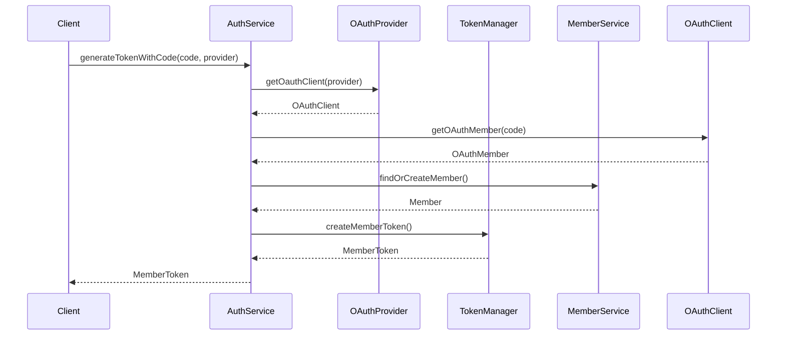

# Auth Service Documentation

## 1. Overall Structure

### High-Level Overview
The Auth Service implements authentication functionality using OAuth and token-based authentication. It manages user authentication flows, token generation, and member management.

### Core Components

## 2. Strategy Pattern Implementation

The OAuth authentication implements the Strategy pattern through the following interfaces:

## 3. Detailed Component Documentation

### AuthService Class
Main service class handling authentication flows.

#### Methods:

##### `generateTokenWithCode(String code, String providerName)`
- Purpose: Generates authentication tokens using OAuth code
- Parameters:
  - code: OAuth authorization code
  - providerName: OAuth provider name (e.g., "GOOGLE", "KAKAO")
- Returns: MemberToken containing access and refresh tokens

##### `generateUri(String providerName)`
- Purpose: Generates OAuth authorization URI
- Parameters:
  - providerName: OAuth provider name
- Returns: String containing authorization URI

##### `generateRenewalAccessToken(RenewalAccessTokenRequest request)`
- Purpose: Generates new access token using refresh token
- Parameters:
  - request: Contains refresh token
- Returns: RenewalAccessTokenResponse with new access token

## 4. Implementation Flow

### Error Handling
- NoExistMemberException: Thrown when member doesn't exist
- Invalid token exceptions handled by TokenProvider
- OAuth-related exceptions handled by respective OAuth clients

### Security Considerations
- Implements refresh token rotation
- Secure token storage
- OAuth state parameter validation
- Token expiration handling

This documentation provides a comprehensive overview of the Auth Service implementation. For specific implementation details, refer to the individual class documentation and code comments.
