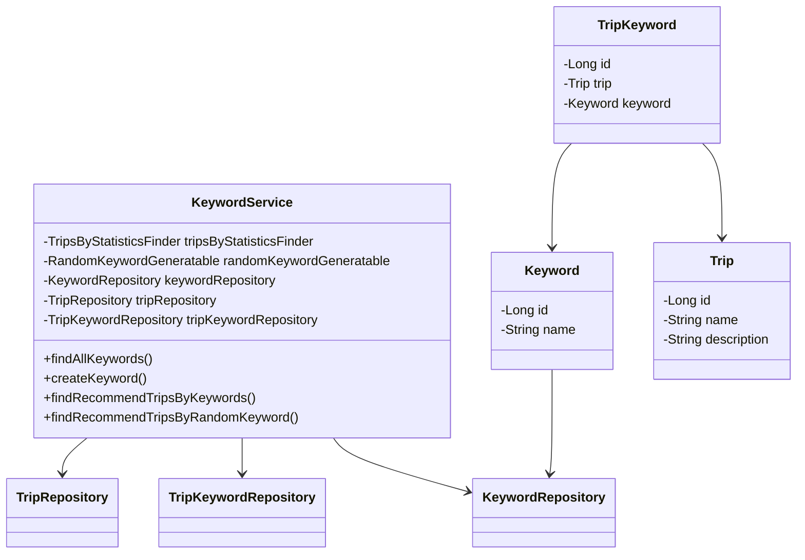
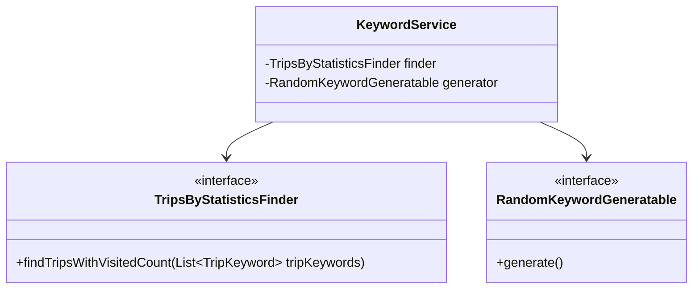
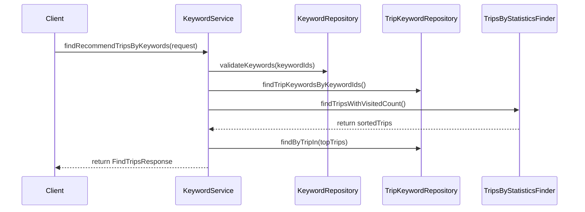

# Keyword Service Documentation

## 1. Overall Structure

The Keyword Service is a Spring-based service that manages keywords and their relationships with trips in a travel-related application. It provides functionality for keyword management, trip recommendations based on keywords, and creating associations between trips and keywords.

### Core Components

## 2. Strategy Pattern Implementation

## 3. Detailed Component Documentation

### Classes

#### KeywordService
Main service class handling keyword-related operations.

**Key Methods:**
- `findAllKeywords()`: Retrieves all keywords
- `createKeyword(KeywordCreateRequest)`: Creates a new keyword
- `findRecommendTripsByKeywords(TripsByKeyWordsRequest)`: Finds recommended trips based on keywords
- `findRecommendTripsByRandomKeyword()`: Finds trips based on a random keyword

#### Implementation Flow

### Key Features
1. Keyword Management
   - Creation and retrieval of keywords
   - Validation of keyword existence

2. Trip Recommendations
   - Based on specified keywords
   - Based on random keywords
   - Filtering and sorting by visit count

3. Trip-Keyword Associations
   - Creating relationships between trips and keywords
   - Retrieving trips with their associated keywords

### Transaction Management
- Service is annotated with `@Transactional(readOnly = true)`
- Write operations are explicitly marked with `@Transactional`

### Error Handling
- `NoExistKeywordException`: Thrown when referenced keywords don't exist
- `NoExistTripException`: Thrown when referenced trips don't exist
