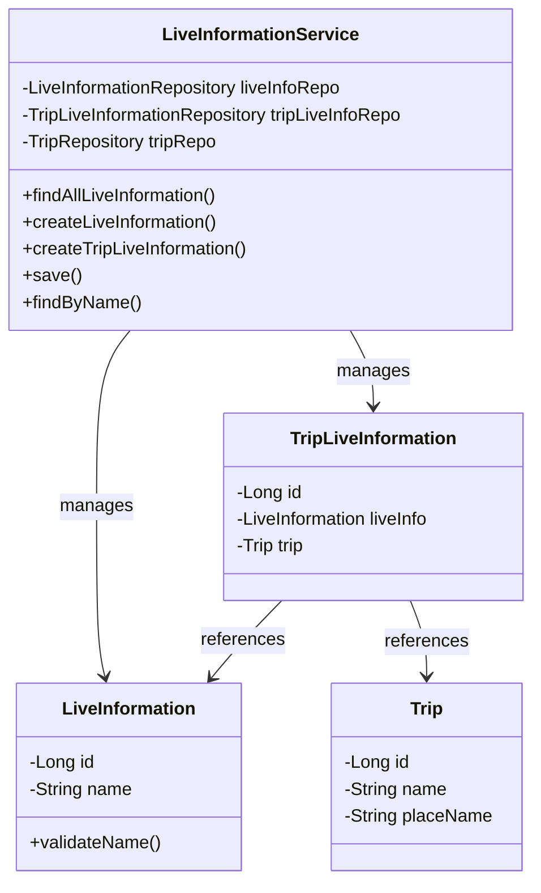
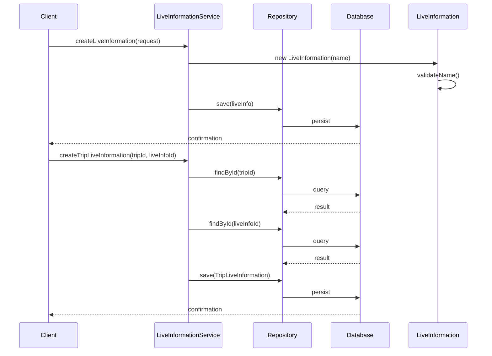

# LiveInformation Service Documentation

## 1. Overall Structure

### Overview
The LiveInformation service manages life information related to trips in a travel application. It handles creation, retrieval, and association of life information with trips.

### Core Components
- `LiveInformation`: Domain entity representing life information
- `TripLiveInformation`: Junction entity connecting trips with life information
- `LiveInformationService`: Service layer handling business logic

### Component Relationships



## 2. Service Implementation Details

### LiveInformationService Class
Main service class handling life information operations.

#### Dependencies
- `LiveInformationRepository`
- `TripLiveInformationRepository`
- `TripRepository`

#### Methods

1. `findAllLiveInformation()`
   - Purpose: Retrieves all life information entries
   - Returns: `FindAllLiveInformationResponse`
   - Transaction: Read-only

2. `createLiveInformation(LiveInformationCreateRequest request)`
   - Purpose: Creates new life information entry
   - Parameters: 
     - `request`: Contains name for new life information
   - Transaction: Write

3. `createTripLiveInformation(long tripId, long liveInfoId)`
   - Purpose: Associates life information with a trip
   - Parameters:
     - `tripId`: Trip identifier
     - `liveInfoId`: Life information identifier
   - Transaction: Write
   - Throws: 
     - `NoExistTripException`
     - `NoExistLiveInformationException`

### Runtime Behavior



## 3. Exception Handling
- `NoExistLiveInformationException`: Thrown when referenced life information doesn't exist
- `NoExistTripException`: Thrown when referenced trip doesn't exist
- `LiveInfoNameException`: Thrown when name validation fails

## 4. Transaction Management
- Service is annotated with `@Transactional(readOnly = true)`
- Write operations are explicitly marked with `@Transactional`
- Ensures data consistency and isolation

## 5. Usage Examples

```java
// Create new life information
LiveInformationCreateRequest request = new LiveInformationCreateRequest("Restaurant");
liveInformationService.createLiveInformation(request);

// Associate life information with trip
liveInformationService.createTripLiveInformation(tripId, liveInfoId);

// Retrieve all life information
FindAllLiveInformationResponse response = liveInformationService.findAllLiveInformation();
```
