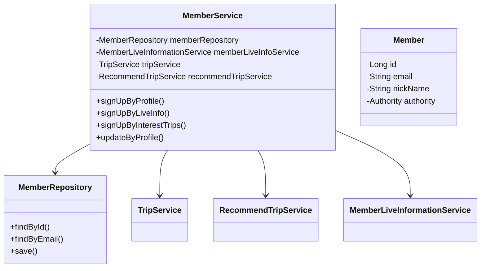
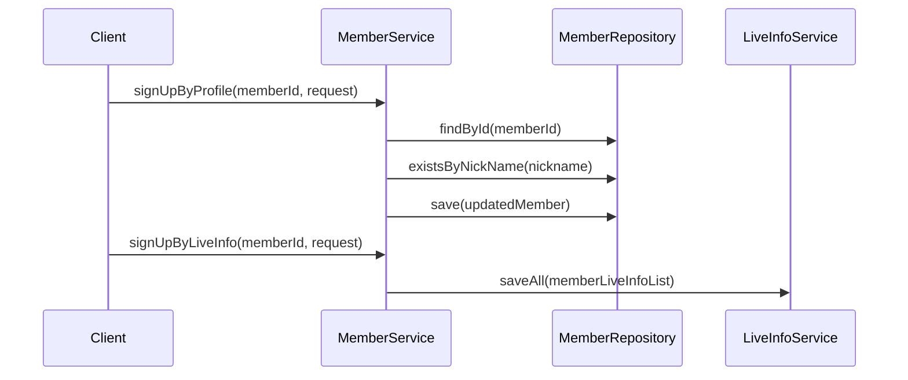

# Member Service Documentation

## 1. Overall Structure

### High-Level Overview
The MemberService is a core service class that handles member-related operations including sign-up, profile management, and member preferences for trips and live information.

### Purpose
Manages member lifecycle and related operations in the application, including:
- Member registration and profile management
- Interest/preference management
- Authority management
- Member verification

### Component Interactions


## 2. Detailed Component Documentation

### Classes

#### MemberService
Main service class handling member operations.

**Constants:**
- `MAX_RECOMMEND_TRIP_SIZE = 10L`
- `MIN_RECOMMEND_TRIP_SIZE = 5L`

**Dependencies:**
- MemberRepository
- MemberLiveInformationService
- TripService
- RecommendTripService
- LiveInformationRepository
- MemberTripRepository

### Key Methods

#### signUpByProfile
```java
@Transactional
public void signUpByProfile(long memberId, SignUpProfileRequest request)
```
**Purpose:** Handles member profile creation during sign-up
**Parameters:**
- memberId: ID of the member
- request: Profile information including nickname, birthday, gender

#### signUpByLiveInfo
```java
@Transactional
public void signUpByLiveInfo(long memberId, SignUpLiveInfoRequest request)
```
**Purpose:** Associates member with their preferred live information
**Parameters:**
- memberId: ID of the member
- request: List of live information preferences

## 3. Implementation Flow



## 4. Error Handling

The service includes various exception handlers:
- `NoExistMemberException`: When member is not found
- `DuplicateNicknameException`: When nickname already exists
- `ShortContentidsSizeException`: When interest trips selection is invalid
- `NoExistLiveInformationException`: When live information is not found

## 5. Transaction Management

The service uses Spring's transaction management:
- Class-level: `@Transactional(readOnly = true)`
- Write operations: `@Transactional`

This ensures data consistency across multiple repository operations.
