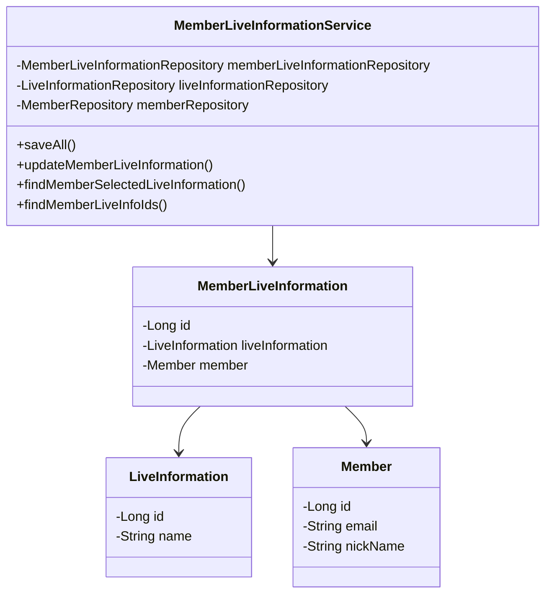
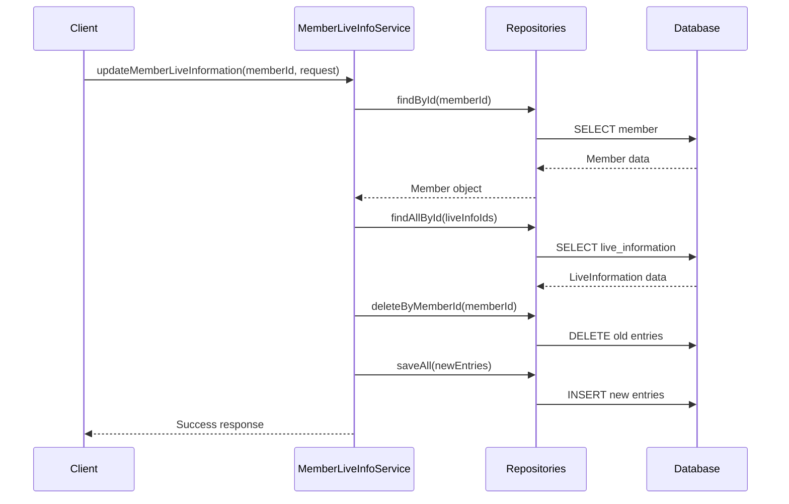

# MemberLiveInformationService Documentation

## 1. Overall Structure

The `MemberLiveInformationService` is a Spring service component that manages the relationship between members and their live information preferences. It handles CRUD operations for member-specific live information settings.

### Core Components


## 2. Detailed Component Documentation

### Classes

#### MemberLiveInformationService
- **Purpose**: Manages member live information preferences
- **Scope**: @Service component with @Transactional support
- **Dependencies**:
  - MemberLiveInformationRepository
  - LiveInformationRepository
  - MemberRepository

### Methods

#### saveAll
```java
public void saveAll(List<MemberLiveInformation> memberLiveInformations)
```
- **Purpose**: Batch saves multiple member live information entries
- **Parameters**: 
  - memberLiveInformations: List of MemberLiveInformation objects to save
- **Transaction**: Read-only

#### updateMemberLiveInformation
```java
@Transactional
public void updateMemberLiveInformation(long memberId, UpdateMemberLiveInformationRequest request)
```
- **Purpose**: Updates a member's live information preferences
- **Parameters**:
  - memberId: ID of the member
  - request: Contains new live information IDs
- **Throws**:
  - NoExistMemberException
  - NoExistLiveInformationException
- **Transaction**: Write

## 3. Implementation Flow



## 4. Error Handling

The service implements robust error handling for:
- Non-existent members
- Invalid live information IDs
- Transaction management

## 5. Usage Examples

```java
// Update member live information
UpdateMemberLiveInformationRequest request = new UpdateMemberLiveInformationRequest(Arrays.asList(1L, 2L, 3L));
service.updateMemberLiveInformation(memberId, request);

// Find member's selected live information
FindMemberLiveInformationResponses responses = service.findMemberSelectedLiveInformation(memberId);
```
