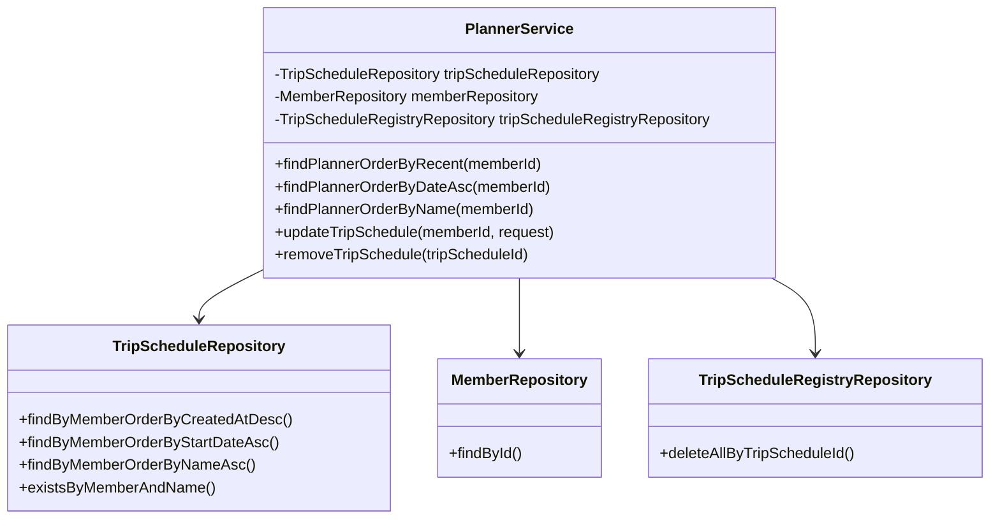
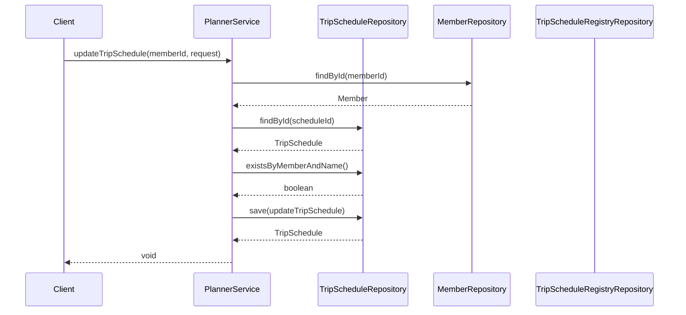

# PlannerService Documentation

## 1. Overall Structure

The PlannerService is a Spring service component that manages trip schedules for members. It provides functionality for creating, updating, finding, and removing trip schedules.

### Core Components
- PlannerService: Main service class
- TripScheduleRepository: JPA repository for trip schedule operations
- MemberRepository: JPA repository for member operations
- TripScheduleRegistryRepository: JPA repository for trip schedule registry operations



## 2. Service Methods Documentation

### findPlannerOrderByRecent
```java
public FindPlannerOrderByRecentResponse findPlannerOrderByRecent(final long memberId)
```
- **Purpose**: Retrieves trip schedules ordered by creation date (descending)
- **Parameters**: memberId (long) - ID of the member
- **Returns**: FindPlannerOrderByRecentResponse containing list of trip schedules
- **Throws**: NoExistMemberException if member not found

### findPlannerOrderByDateAsc
```java
public FindPlannerOrderByDateResponse findPlannerOrderByDateAsc(final long memberId)
```
- **Purpose**: Retrieves trip schedules ordered by start date (ascending)
- **Parameters**: memberId (long) - ID of the member
- **Returns**: FindPlannerOrderByDateResponse containing list of trip schedules
- **Throws**: NoExistMemberException if member not found

### findPlannerOrderByName
```java
public FindPLannerOrderByNameResponse findPlannerOrderByName(final long memberId)
```
- **Purpose**: Retrieves trip schedules ordered by name
- **Parameters**: memberId (long) - ID of the member
- **Returns**: FindPLannerOrderByNameResponse containing list of trip schedules
- **Throws**: NoExistMemberException if member not found

### updateTripSchedule
```java
@Transactional
public void updateTripSchedule(final long memberId, final UpdateTripScheduleRequest request)
```
- **Purpose**: Updates an existing trip schedule
- **Parameters**:
  - memberId (long) - ID of the member
  - request (UpdateTripScheduleRequest) - Contains update details
- **Throws**:
  - NoExistMemberException if member not found
  - NoExistTripScheduleException if schedule not found
  - AlreadyExistTripScheduleException if schedule name already exists

### removeTripSchedule
```java
@Transactional
public void removeTripSchedule(final Long tripScheduleId)
```
- **Purpose**: Removes a trip schedule and its registries
- **Parameters**: tripScheduleId (Long) - ID of the schedule to remove
- **Throws**: NoExistTripScheduleException if schedule not found

## 3. Implementation Flow



## 4. Error Handling
The service implements comprehensive error handling through custom exceptions:
- NoExistMemberException
- NoExistTripScheduleException
- AlreadyExistTripScheduleException

All operations are wrapped in appropriate transaction management using @Transactional annotations.
