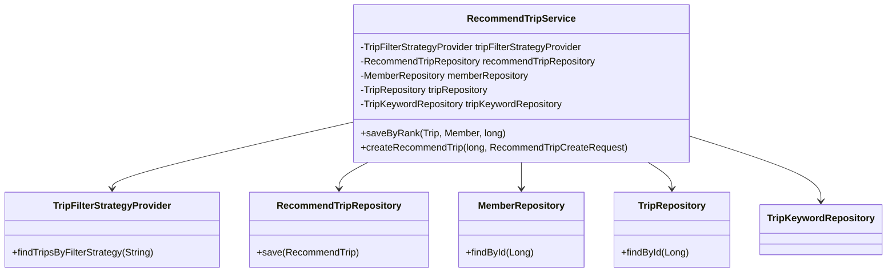
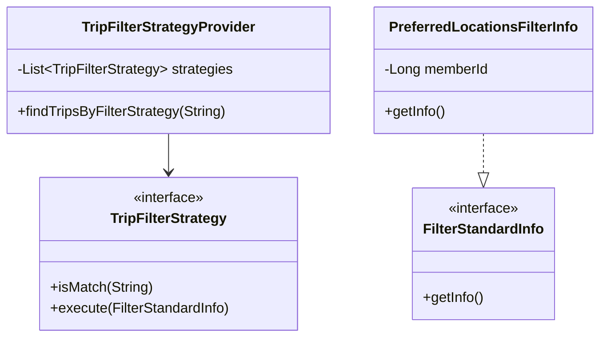
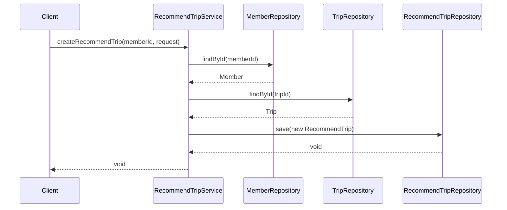

# RecommendTripService Documentation

## 1. Overall Structure

### Purpose
The `RecommendTripService` manages trip recommendations for users, handling operations related to creating and managing recommended trips for members.

### High-Level Overview


## 2. Strategy Pattern Implementation



## 3. Detailed Component Documentation

### Classes

#### RecommendTripService
- **Purpose**: Manages trip recommendations and related operations
- **Scope**: `@Service`, `@Transactional(readOnly = true)`
- **Dependencies**:
  - TripFilterStrategyProvider
  - RecommendTripRepository
  - MemberRepository
  - TripRepository
  - TripKeywordRepository

### Methods

#### saveByRank
```java
@Transactional
public void saveByRank(Trip trip, Member member, long rank)
```
- **Purpose**: Saves a recommended trip with specific ranking
- **Parameters**:
  - `trip`: Trip entity to recommend
  - `member`: Member entity for whom the recommendation is made
  - `rank`: Ranking position of the recommendation
- **Behavior**: Creates and saves new RecommendTrip entity

#### createRecommendTrip
```java
@Transactional
public void createRecommendTrip(long memberId, RecommendTripCreateRequest request)
```
- **Purpose**: Creates a new trip recommendation
- **Parameters**:
  - `memberId`: ID of the member
  - `request`: DTO containing trip ID
- **Behavior**: 
  - Validates member and trip existence
  - Creates and saves new recommendation
- **Exceptions**:
  - `NoExistMemberException`
  - `NoExistTripException`

## 4. Implementation Flow


