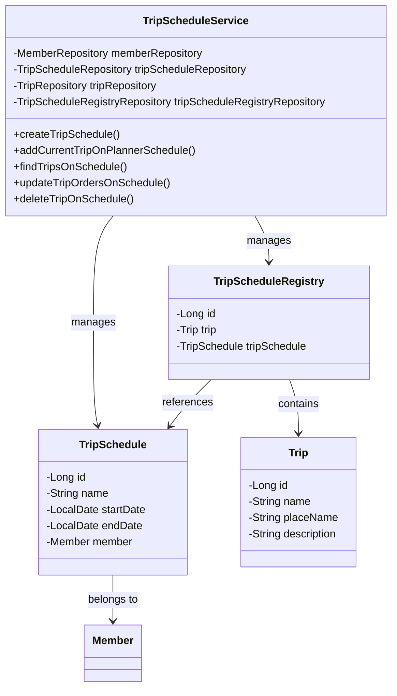
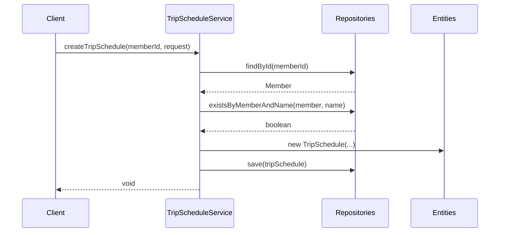

# TripScheduleService Documentation

## 1. Overall Structure

### Purpose
The `TripScheduleService` manages trip schedules and their associated trips in a travel planning system. It handles operations like creating schedules, adding trips to schedules, and managing trip orders within schedules.

### Component Relationships



## 2. Detailed Component Documentation

### Classes

#### TripScheduleService
Main service class handling trip schedule operations.

**Dependencies:**
- `MemberRepository`
- `TripScheduleRepository`
- `TripRepository`
- `TripScheduleRegistryRepository`

### Methods

#### createTripSchedule
```java
@Transactional
public void createTripSchedule(long memberId, CreateTripScheduleRequest request)
```
Creates a new trip schedule for a member.

**Parameters:**
- `memberId`: ID of the member creating the schedule
- `request`: Contains schedule details (name, dates)

#### addCurrentTripOnPlannerSchedule
```java
@Transactional
public void addCurrentTripOnPlannerSchedule(long tripId, AddTripOnScheduleRequests requests)
```
Adds a trip to multiple schedules.

**Parameters:**
- `tripId`: ID of the trip to add
- `requests`: Contains list of schedule IDs

#### findTripsOnSchedule
```java
public FindTripsOnSchedule findTripsOnSchedule(long scheduleId)
```
Retrieves all trips associated with a schedule.

**Parameters:**
- `scheduleId`: ID of the schedule to query

## 3. Implementation Flow



## 4. Transaction Management
- Service is annotated with `@Transactional(readOnly = true)`
- Write operations are explicitly marked with `@Transactional`
- Ensures data consistency across operations

## 5. Error Handling
Throws various exceptions:
- `NoExistMemberException`
- `AlreadyExistTripScheduleException`
- `NoExistTripScheduleException`
- `NoExistTripException`
- `NoExistTripScheduleRegistryException`
