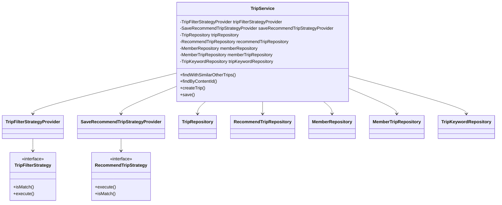
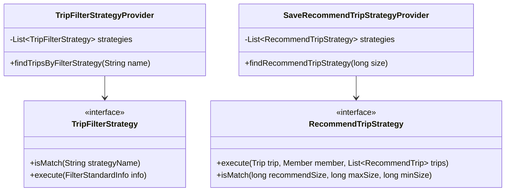
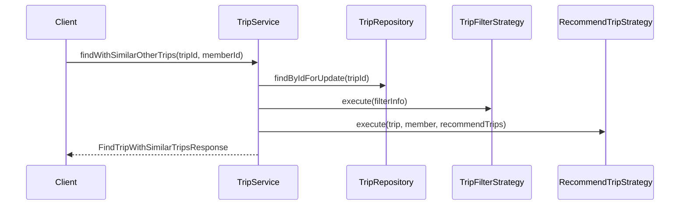

# TripService Documentation

## 1. Overall Structure

### Overview
The `TripService` is a core service class that manages trip-related operations including trip discovery, recommendations, and user interactions. It implements multiple design patterns and integrates with various repositories for data access.

### Primary Responsibilities
- Trip management and retrieval
- Trip recommendations
- User interaction tracking
- Trip filtering and similarity matching

### Component Relationships



## 2. Strategy Pattern Implementation

### Strategy Interfaces


## 3. Detailed Component Documentation

### Key Methods

#### `findWithSimilarOtherTrips`
```java
@Transactional
public FindTripWithSimilarTripsResponse findWithSimilarOtherTrips(long tripId, long memberId)
```
- **Purpose**: Retrieves a trip and finds similar trips based on live information
- **Parameters**:
  - `tripId`: ID of the target trip
  - `memberId`: ID of the requesting member
- **Returns**: Response containing trip details and similar trips
- **Behavior**:
  1. Retrieves trip with pessimistic lock
  2. Filters similar trips
  3. Increments visit count
  4. Saves recommendation logs

#### `saveRecommendTripByClickedLogs`
```java
private void saveRecommendTripByClickedLogs(long memberId, Trip trip)
```
- **Purpose**: Records user interaction with trips
- **Parameters**:
  - `memberId`: User ID
  - `trip`: Trip entity
- **Behavior**: Creates or updates member trip records and recommendation logs

## 4. Implementation Flow



### Error Handling
- `NoExistTripException`: When requested trip is not found
- `NotAbleToAccessTripByPessimisticLockException`: When concurrent access issues occur
- `NoExistMemberException`: When member is not found

### Transaction Management
- Service is marked with `@Transactional(readOnly = true)`
- Write operations are explicitly marked with `@Transactional`
