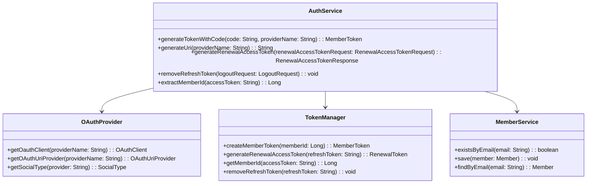
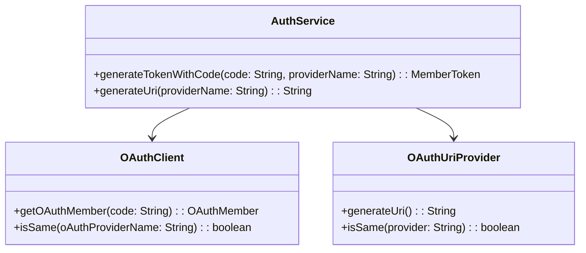
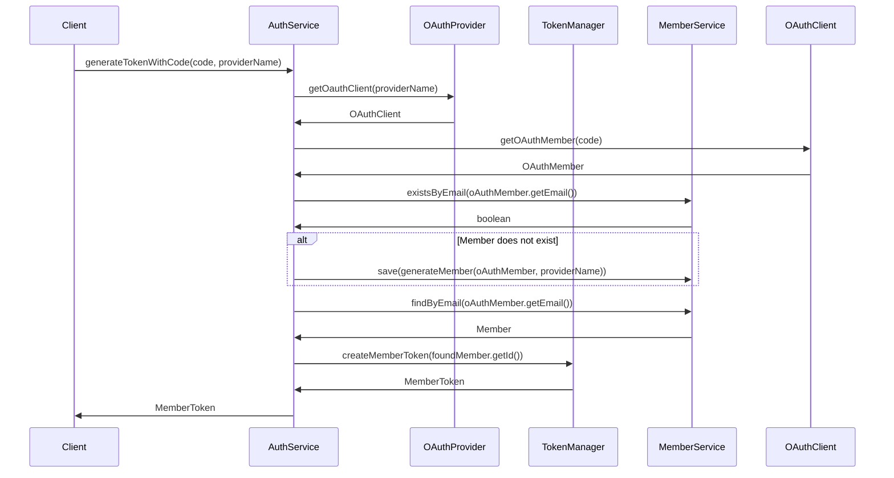

# Comprehensive Documentation for AuthService Code

## 1. Overall Structure

### High-Level Overview
The codebase is structured around the concept of authentication and authorization, primarily focusing on OAuth-based login mechanisms. It consists of several interfaces and classes that define the behavior of OAuth clients, tokens, and member management. The main components include:

- **OAuth Interfaces**: Define the behavior of OAuth clients, members, and providers.
- **Token Management**: Classes and interfaces for managing access and refresh tokens.
- **Member Management**: Services and entities related to user accounts and their attributes.
- **DTOs**: Data Transfer Objects for handling requests and responses.

### Purpose and Function of Service Code
The `AuthService` class is responsible for handling authentication-related operations, including generating tokens, managing OAuth members, and interacting with the member service to create or retrieve user accounts. It serves as a bridge between the OAuth provider and the member management system.

### Interaction Between Components
- The `AuthService` interacts with the `OAuthProvider` to obtain OAuth clients and URIs.
- It uses the `TokenManager` and `TokenProvider` to create and manage tokens.
- The `MemberService` is utilized to check for existing members and create new ones based on OAuth member information.

### Mermaid Diagram


## 2. Strategy Pattern Implementation

### Strategy Pattern Overview
The strategy pattern is implemented through the use of interfaces that define various behaviors for OAuth clients and URI providers. This allows for different implementations of these interfaces to be used interchangeably, depending on the OAuth provider being utilized.

### Strategy Interface and Concrete Strategy Classes
- **OAuthClient**: Interface for obtaining OAuth member information.
- **OAuthUriProvider**: Interface for generating OAuth URIs.
- **OAuthProvider**: Interface that provides methods to get specific OAuth clients and URI providers.

### Context Class
The `AuthService` class acts as the context that utilizes the strategies defined by the `OAuthClient` and `OAuthUriProvider` interfaces.

### Class Diagram


## 3. Detailed Component Documentation

### a. Classes

#### 1. AuthService
- **Purpose**: Handles authentication operations, including token generation and member management.
- **Attributes**:
  - `OAuthProvider oAuthProvider`: Interface for obtaining OAuth clients and URIs.
  - `MemberService memberService`: Service for managing member data.
  - `TokenManager tokenManager`: Interface for managing tokens.
  - `TokenProvider tokenProvider`: Interface for creating tokens.
- **Role**: Central service for authentication, coordinating between OAuth providers and member management.
- **Relationships**: Depends on `OAuthProvider`, `MemberService`, `TokenManager`, and `TokenProvider`.

#### 2. OAuthClient
- **Purpose**: Interface for obtaining OAuth member information.
- **Methods**:
  - `OAuthMember getOAuthMember(String code)`: Retrieves OAuth member based on the provided code.
  - `boolean isSame(String oAuthProviderName)`: Checks if the provider name matches.

#### 3. OAuthMember
- **Purpose**: Represents an OAuth member with essential attributes.
- **Methods**:
  - `String getSocialLoginId()`: Returns the social login ID.
  - `String getEmail()`: Returns the email of the member.
  - `String getProfileImageUrl()`: Returns the profile image URL.

#### 4. TokenManager
- **Purpose**: Interface for managing member tokens.
- **Methods**:
  - `MemberToken createMemberToken(long memberId)`: Creates a new member token.
  - `RenewalToken generateRenewalAccessToken(String refreshToken)`: Generates a renewal token.
  - `Long getMemberId(String accessToken)`: Retrieves member ID from access token.
  - `void removeRefreshToken(String refreshToken)`: Removes the refresh token.

### b. Methods and Functions

#### 1. generateTokenWithCode
- **Purpose**: Generates a member token using the provided OAuth code and provider name.
- **Parameters**:
  - `code`: `String` - The OAuth code received from the provider.
  - `providerName`: `String` - The name of the OAuth provider.
- **Return Value**: `MemberToken` - The generated member token.
- **Code Example**:
```java
MemberToken token = authService.generateTokenWithCode("oauth_code", "KAKAO");
```

#### 2. generateUri
- **Purpose**: Generates the OAuth URI for the specified provider.
- **Parameters**:
  - `providerName`: `String` - The name of the OAuth provider.
- **Return Value**: `String` - The generated OAuth URI.
- **Code Example**:
```java
String uri = authService.generateUri("GOOGLE");
```

#### 3. generateRenewalAccessToken
- **Purpose**: Generates a new access token using a refresh token.
- **Parameters**:
  - `renewalAccessTokenRequest`: `RenewalAccessTokenRequest` - The request containing the refresh token.
- **Return Value**: `RenewalAccessTokenResponse` - The response containing the new access token.
- **Code Example**:
```java
RenewalAccessTokenResponse response = authService.generateRenewalAccessToken(new RenewalAccessTokenRequest("refresh_token"));
```

#### 4. removeRefreshToken
- **Purpose**: Removes the refresh token associated with a logout request.
- **Parameters**:
  - `logoutRequest`: `LogoutRequest` - The request containing the refresh token to be removed.
- **Return Value**: `void`
- **Code Example**:
```java
authService.removeRefreshToken(new LogoutRequest("refresh_token"));
```

#### 5. extractMemberId
- **Purpose**: Extracts the member ID from the access token.
- **Parameters**:
  - `accessToken`: `String` - The access token from which to extract the member ID.
- **Return Value**: `Long` - The extracted member ID.
- **Code Example**:
```java
Long memberId = authService.extractMemberId("access_token");
```

## 4. Implementation Flow

### Sequence Diagram


This documentation provides a comprehensive overview of the `AuthService` code, detailing its structure, strategy pattern implementation, component documentation, and the flow of implementation. It serves as a guide for both new and experienced developers to understand and work with the code effectively.
