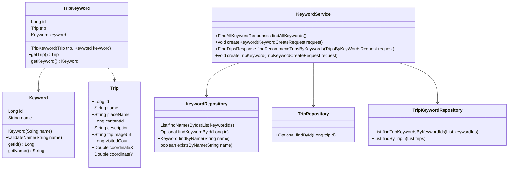
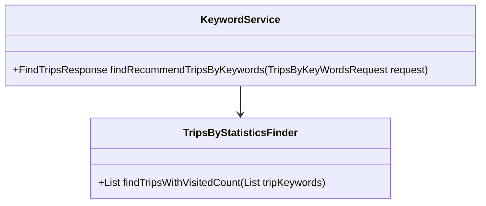
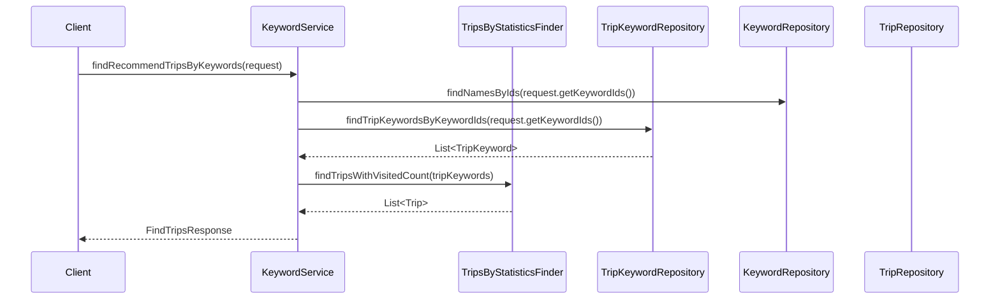

# Comprehensive Documentation for KeywordService Code

## 1. Overall Structure

### High-Level Overview
The codebase is structured into several packages, each serving a specific purpose. The main components include domain entities, repositories, DTOs (Data Transfer Objects), exceptions, and the service layer. The `KeywordService` class is the focal point for managing keywords and their associated trips.

### Purpose and Function of Service Code
The `KeywordService` class is responsible for handling business logic related to keywords and their relationships with trips. It provides methods to create keywords, find trips associated with keywords, and validate keyword existence. The service interacts with various repositories to perform CRUD operations and fetch data.

### Interaction Between Components
- **Repositories**: The service uses `KeywordRepository`, `TripRepository`, and `TripKeywordRepository` to interact with the database.
- **DTOs**: Data transfer objects like `FindAllKeywordResponses`, `FindTripsWithRandomKeywordResponse`, and `TripsByKeyWordsRequest` are used to encapsulate data for requests and responses.
- **Domain Entities**: The service operates on domain entities such as `Keyword`, `Trip`, and `TripKeyword` to perform business logic.

### Mermaid Diagram


## 2. Strategy Pattern Implementation

### Strategy Pattern Overview
The strategy pattern is implemented to allow different strategies for finding trips based on keywords. The `TripsByStatisticsFinder` interface defines the strategy, and various implementations can be created to provide different algorithms for finding trips.

### Strategy Interface and Concrete Strategy Classes
- **Strategy Interface**: `TripsByStatisticsFinder`
    - Method: `List<Trip> findTripsWithVisitedCount(List<TripKeyword> tripKeywords);`
  
- **Concrete Strategy Classes**: The actual implementations of this interface are not provided in the given code but would typically implement the logic for finding trips based on the visited count.

### Context Class
- **Context Class**: `KeywordService`
    - Uses the `TripsByStatisticsFinder` strategy to find trips based on the keywords provided.

### Class Diagram


## 3. Detailed Component Documentation

### a. Classes

#### Keyword
- **Purpose**: Represents a keyword entity.
- **Attributes**:
  - `Long id`: Unique identifier for the keyword.
  - `String name`: The name of the keyword.
- **Role**: Serves as a domain entity for keywords, ensuring valid keyword names through validation.
- **Relationships**: Inherits from `BaseEntity`.

#### Trip
- **Purpose**: Represents a trip entity.
- **Attributes**:
  - `Long id`: Unique identifier for the trip.
  - `String name`: Name of the trip.
  - `String placeName`: Place associated with the trip.
  - `Long contentId`: Content identifier.
  - `String description`: Description of the trip.
  - `String tripImageUrl`: URL for the trip image.
  - `Long visitedCount`: Count of how many times the trip has been visited.
  - `Double coordinateX`: X coordinate for the trip location.
  - `Double coordinateY`: Y coordinate for the trip location.
- **Role**: Represents a trip in the system, including validation for its attributes.
- **Relationships**: Inherits from `BaseEntity`.

#### TripKeyword
- **Purpose**: Represents the association between a trip and a keyword.
- **Attributes**:
  - `Long id`: Unique identifier for the trip-keyword association.
  - `Trip trip`: The trip associated with the keyword.
  - `Keyword keyword`: The keyword associated with the trip.
- **Role**: Acts as a linking entity between trips and keywords.
- **Relationships**: Inherits from `BaseEntity`.

#### KeywordService
- **Purpose**: Service class for managing keywords and their associated trips.
- **Attributes**:
  - `TripsByStatisticsFinder tripsByStatisticsFinder`: Strategy for finding trips.
  - `RandomKeywordGeneratable randomKeywordGeneratable`: Strategy for generating random keywords.
  - `KeywordRepository keywordRepository`: Repository for keyword operations.
  - `TripRepository tripRepository`: Repository for trip operations.
  - `TripKeywordRepository tripKeywordRepository`: Repository for trip-keyword operations.
- **Role**: Provides methods to create keywords, find trips by keywords, and validate keyword existence.
- **Relationships**: Uses multiple repositories and strategies.

### b. Methods and Functions

#### findAllKeywords
- **Purpose**: Retrieves all keywords from the repository.
- **Parameters**: None.
- **Return Value**: `FindAllKeywordResponses` - A DTO containing a list of all keywords.
- **Code Example**:
  ```java
  FindAllKeywordResponses responses = keywordService.findAllKeywords();
  ```

#### createKeyword
- **Purpose**: Creates a new keyword.
- **Parameters**:
  - `KeywordCreateRequest request`: DTO containing the keyword to create.
- **Return Value**: None.
- **Code Example**:
  ```java
  keywordService.createKeyword(new KeywordCreateRequest("New Keyword"));
  ```

#### findNamesByIds
- **Purpose**: Finds keyword names by their IDs.
- **Parameters**:
  - `TripsByKeyWordsRequest request`: DTO containing a list of keyword IDs.
- **Return Value**: `List<String>` - A list of keyword names.
- **Code Example**:
  ```java
  List<String> names = keywordService.findNamesByIds(new TripsByKeyWordsRequest(Arrays.asList(1L, 2L)));
  ```

#### findRecommendTripsByKeywords
- **Purpose**: Finds recommended trips based on provided keyword IDs.
- **Parameters**:
  - `TripsByKeyWordsRequest request`: DTO containing a list of keyword IDs.
- **Return Value**: `FindTripsResponse` - A DTO containing recommended trips.
- **Code Example**:
  ```java
  FindTripsResponse response = keywordService.findRecommendTripsByKeywords(new TripsByKeyWordsRequest(Arrays.asList(1L, 2L)));
  ```

#### createTripKeyword
- **Purpose**: Creates a new trip-keyword association.
- **Parameters**:
  - `TripKeywordCreateRequest request`: DTO containing trip ID and keyword ID.
- **Return Value**: None.
- **Code Example**:
  ```java
  keywordService.createTripKeyword(new TripKeywordCreateRequest(1L, 2L));
  ```

## 4. Implementation Flow

### Sequence Diagram


This documentation provides a comprehensive overview of the `KeywordService` code, detailing its structure, strategy pattern implementation, component documentation, and implementation flow. It serves as a guide for both new and experienced developers to understand and work with the code effectively.
