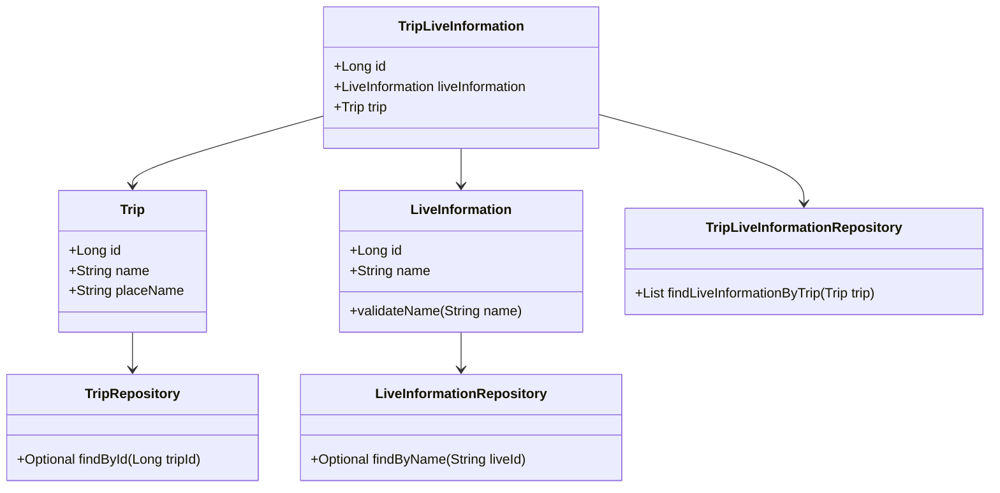
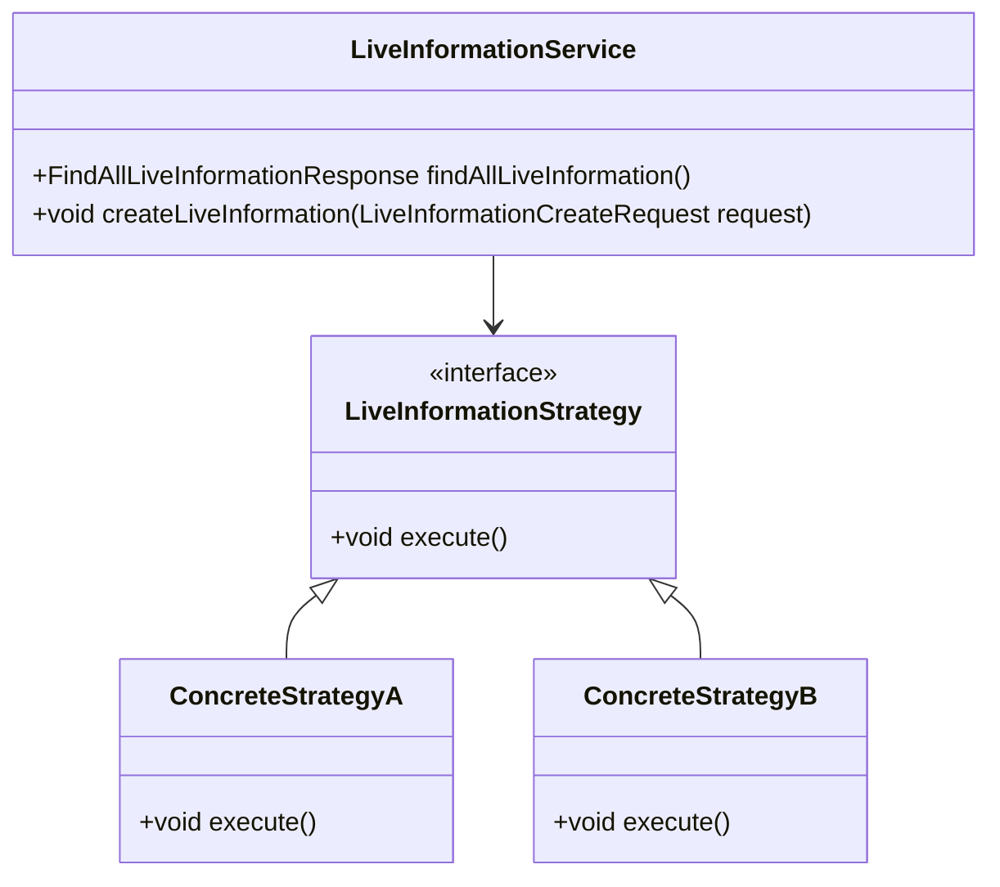
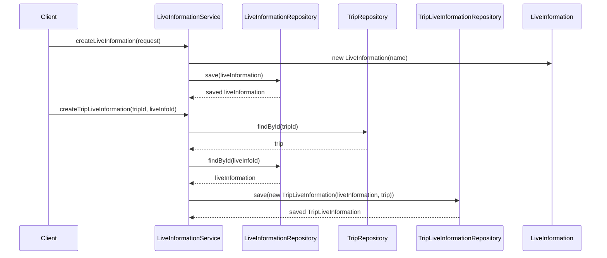

# Comprehensive Documentation for LiveInformation Service Code

## 1. Overall Structure

### High-Level Overview
The codebase is structured around the concept of managing live information related to trips. It consists of domain entities, repositories for data access, DTOs for data transfer, and a service layer that encapsulates the business logic. The main components include:

- **Domain Entities**: Represent the core business objects (e.g., `LiveInformation`, `Trip`, `TripLiveInformation`).
- **Repositories**: Interfaces for data access using Spring Data JPA (e.g., `LiveInformationRepository`, `TripLiveInformationRepository`).
- **DTOs**: Data Transfer Objects for communication between layers (e.g., `FindAllLiveInformationResponse`, `LiveInformationCreateRequest`).
- **Service Layer**: Contains business logic and interacts with repositories (e.g., `LiveInformationService`).

### Purpose and Function of Service Code
The `LiveInformationService` class is responsible for managing live information related to trips. It provides methods to create, retrieve, and manage live information and its association with trips. The service ensures that the business rules are enforced, such as validating the existence of trips and live information.

### Interaction Between Components
- The service interacts with repositories to perform CRUD operations on the domain entities.
- It uses DTOs to encapsulate data for requests and responses.
- Exception handling is implemented to manage errors related to non-existent entities.

### Mermaid Diagram

## 2. Strategy Pattern Implementation

### Strategy Pattern Overview
The strategy pattern is not explicitly implemented in the provided code. However, if we were to implement it, we could define different strategies for handling live information based on various criteria (e.g., filtering, sorting).

### Strategy Interface and Concrete Strategy Classes
- **Strategy Interface**: Define a common interface for different strategies.
- **Concrete Strategy Classes**: Implement specific strategies that adhere to the interface.

### Context Class
The context class would be `LiveInformationService`, which would use the strategy interface to delegate the behavior to the concrete strategy classes.

### Class Diagram

## 3. Detailed Component Documentation

### a. Classes

#### 1. LiveInformation
- **Purpose**: Represents live information with a name.
- **Attributes**:
  - `Long id`: Unique identifier for the live information.
  - `String name`: Name of the live information.
- **Role**: Core entity representing live information.
- **Relationships**: 
  - Inherits from `BaseEntity`.

#### 2. Trip
- **Purpose**: Represents a trip with various attributes.
- **Attributes**:
  - `Long id`: Unique identifier for the trip.
  - `String name`: Name of the trip.
  - `String placeName`: Place associated with the trip.
  - `Long contentId`: Content identifier.
  - `String description`: Description of the trip.
  - `String tripImageUrl`: URL of the trip image.
  - `Long visitedCount`: Count of visits.
  - `Double coordinateX`: X coordinate.
  - `Double coordinateY`: Y coordinate.
- **Role**: Core entity representing a trip.
- **Relationships**: 
  - Inherits from `BaseEntity`.

#### 3. TripLiveInformation
- **Purpose**: Represents the association between a trip and live information.
- **Attributes**:
  - `Long id`: Unique identifier for the association.
  - `LiveInformation liveInformation`: Associated live information.
  - `Trip trip`: Associated trip.
- **Role**: Entity representing the relationship between trips and live information.
- **Relationships**: 
  - Inherits from `BaseEntity`.

#### 4. LiveInformationRepository
- **Purpose**: Repository interface for accessing `LiveInformation` entities.
- **Methods**:
  - `Optional<LiveInformation> findByName(String liveId)`: Finds live information by name.
  - `List<LiveInformation> findLiveInformationByTrip(Trip trip)`: Finds live information associated with a trip.
  - `boolean existsByName(String name)`: Checks if live information exists by name.

#### 5. TripLiveInformationRepository
- **Purpose**: Repository interface for accessing `TripLiveInformation` entities.
- **Methods**:
  - `boolean existsByTripAndLiveInformationIn(Trip trip, List<LiveInformation> liveInformations)`: Checks existence of associations.
  - `List<LiveInformation> findLiveInformationByTrips(List<Trip> trips)`: Finds live information associated with multiple trips.

#### 6. LiveInformationCreateRequest
- **Purpose**: DTO for creating live information.
- **Attributes**:
  - `String name`: Name of the live information.
- **Role**: Encapsulates data for creating live information.

#### 7. FindAllLiveInformationResponse
- **Purpose**: DTO for returning all live information.
- **Attributes**:
  - `List<LiveInformationResponse> liveInformationResponses`: List of live information responses.
- **Role**: Encapsulates data for returning multiple live information.

### b. Methods and Functions

#### 1. LiveInformationService

- **Method**: `findAllLiveInformation()`
  - **Purpose**: Retrieves all live information.
  - **Return Value**: `FindAllLiveInformationResponse`: Response containing all live information.
  
- **Method**: `createLiveInformation(LiveInformationCreateRequest request)`
  - **Purpose**: Creates new live information.
  - **Parameters**:
    - `request`: `LiveInformationCreateRequest`: DTO containing the name of the live information.
  - **Return Value**: `void`: No return value.

- **Method**: `createTripLiveInformation(long tripId, long liveInfoId)`
  - **Purpose**: Creates an association between a trip and live information.
  - **Parameters**:
    - `tripId`: `long`: ID of the trip.
    - `liveInfoId`: `long`: ID of the live information.
  - **Return Value**: `void`: No return value.

- **Method**: `save(LiveInformation liveInformation)`
  - **Purpose**: Saves the provided live information.
  - **Parameters**:
    - `liveInformation`: `LiveInformation`: The live information to save.
  - **Return Value**: `LiveInformation`: The saved live information.

- **Method**: `findByName(String liveTypeName)`
  - **Purpose**: Finds live information by name.
  - **Parameters**:
    - `liveTypeName`: `String`: The name of the live information.
  - **Return Value**: `LiveInformation`: The found live information.

## 4. Implementation Flow

### Sequence Diagram

This documentation provides a comprehensive overview of the `LiveInformationService` code, detailing its structure, purpose, implementation of the strategy pattern, and the flow of operations. It serves as a guide for both new and experienced developers to understand and work with the code effectively.
