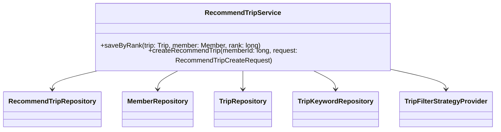
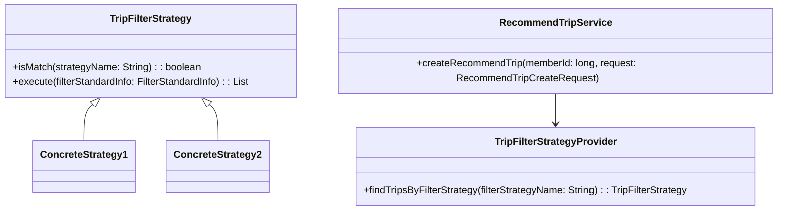
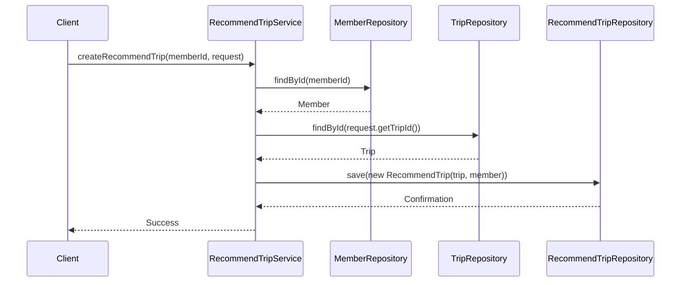

# Comprehensive Documentation for RecommendTripService Code

## 1. Overall Structure

### High-Level Overview
The codebase is structured into several packages, each serving a specific purpose within the application. The main components include domain models, repositories, services, and DTOs (Data Transfer Objects). The `RecommendTripService` class is responsible for managing the recommendation of trips based on various strategies.

### Purpose and Function of Service Code
The `RecommendTripService` class provides methods to create and save recommended trips for members. It interacts with various repositories to fetch data related to members, trips, and trip keywords. The service also utilizes the Strategy Pattern to apply different filtering strategies for trip recommendations.

### Interaction Between Components
- **Repositories**: The service interacts with `RecommendTripRepository`, `MemberRepository`, `TripRepository`, and `TripKeywordRepository` to perform CRUD operations.
- **Domain Models**: The service uses domain models like `Member`, `Trip`, and `RecommendTrip` to encapsulate the business logic.
- **DTOs**: The `RecommendTripCreateRequest` DTO is used to transfer data when creating a recommended trip.
- **Strategy Pattern**: The service uses `TripFilterStrategyProvider` to obtain the appropriate filtering strategy based on the provided strategy name.

### Mermaid Diagram


## 2. Strategy Pattern Implementation

### Strategy Pattern Overview
The Strategy Pattern is implemented to allow the `RecommendTripService` to use different filtering strategies for recommending trips. This design pattern enables the selection of an algorithm's behavior at runtime.

### Strategy Interface and Concrete Strategy Classes
- **Interface**: `TripFilterStrategy`
  - Method `isMatch(String strategyName)`: Determines if the strategy matches the given name.
  - Method `execute(FilterStandardInfo filterStandardInfo)`: Executes the filtering logic based on the provided information.

- **Concrete Strategies**: Various classes implementing `TripFilterStrategy` can be created to handle different filtering criteria.

### Context Class
- **Context**: `RecommendTripService`
  - Uses `TripFilterStrategyProvider` to obtain the appropriate strategy based on the strategy name and delegates the filtering logic to the selected strategy.

### Class Diagram


## 3. Detailed Component Documentation

### a. Classes

#### 1. RecommendTripService
- **Purpose**: Manages the recommendation of trips for members.
- **Attributes**:
  - `tripFilterStrategyProvider`: Provides the appropriate trip filter strategy.
  - `recommendTripRepository`: Repository for managing recommended trips.
  - `memberRepository`: Repository for managing members.
  - `tripRepository`: Repository for managing trips.
  - `tripKeywordRepository`: Repository for managing trip keywords.
- **Role**: Acts as a service layer to handle business logic related to trip recommendations.
- **Relationships**: Depends on multiple repositories and the strategy provider.

#### 2. RecommendTripCreateRequest
- **Purpose**: DTO for creating a recommended trip.
- **Attributes**:
  - `tripId`: ID of the trip to be recommended.
- **Role**: Transfers data between the client and the service.
- **Relationships**: Used as a parameter in the `createRecommendTrip` method.

### b. Methods and Functions

#### 1. `saveByRank`
- **Purpose**: Saves a recommended trip with a specific ranking.
- **Parameters**:
  - `trip`: Trip - The trip to be recommended.
  - `member`: Member - The member for whom the trip is recommended.
  - `rank`: long - The ranking of the recommendation.
- **Return Value**: void
- **Code Example**:
```java
recommendTripService.saveByRank(trip, member, 1L);
```

#### 2. `createRecommendTrip`
- **Purpose**: Creates a recommended trip for a member.
- **Parameters**:
  - `memberId`: long - The ID of the member.
  - `request`: RecommendTripCreateRequest - The request containing trip ID.
- **Return Value**: void
- **Code Example**:
```java
recommendTripService.createRecommendTrip(memberId, new RecommendTripCreateRequest(tripId));
```

## 4. Implementation Flow

### Sequence Diagram


This documentation provides a comprehensive overview of the `RecommendTripService` code, detailing its structure, strategy pattern implementation, component documentation, and flow of execution. It serves as a guide for both new and experienced developers to understand and work with the code effectively.
