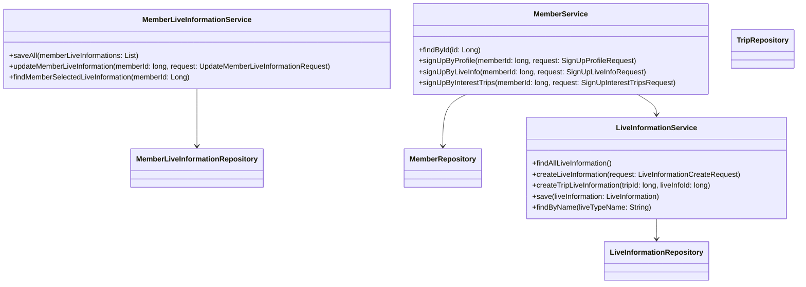
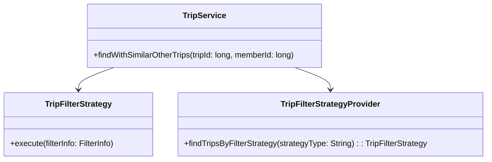
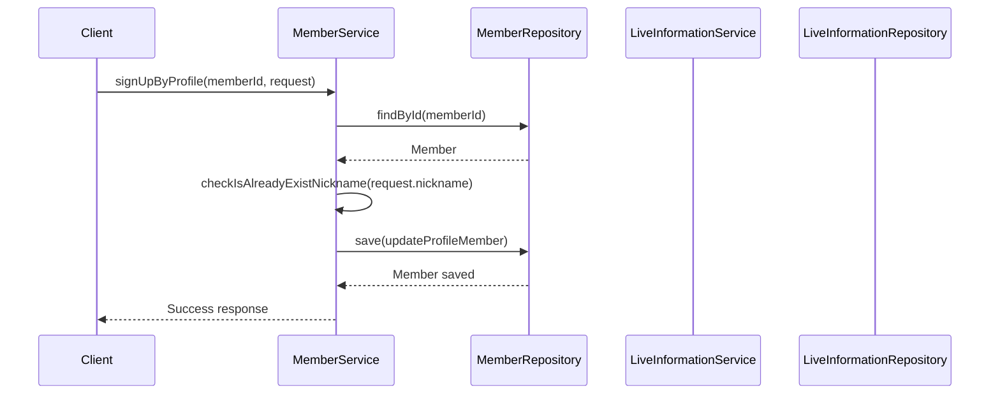

# Comprehensive Documentation for the Service Code

## 1. Overall Structure

### High-Level Overview
The codebase is structured into several packages, each serving a specific purpose within the application. The main packages include:

- **Domain**: Contains the core business entities and their relationships.
- **Application**: Contains service classes that implement business logic and interact with repositories.
- **Repository**: Interfaces for data access, extending Spring Data JPA's `JpaRepository`.
- **DTO**: Data Transfer Objects for communication between layers.
- **Exception**: Custom exceptions for error handling.

### Purpose and Function of Service Code
The service code is responsible for implementing the business logic of the application. It acts as an intermediary between the controllers (or other entry points) and the data repositories. The services handle operations such as creating, updating, and retrieving data, while also enforcing business rules and validations.

### Interaction Between Components
- **Services** interact with **Repositories** to perform CRUD operations on the entities.
- **DTOs** are used to transfer data between the service layer and the presentation layer.
- **Exceptions** are thrown to handle error scenarios gracefully.

### Mermaid Diagram


## 2. Strategy Pattern Implementation

### Strategy Pattern Overview
The strategy pattern is implemented to allow different filtering strategies for trips. This enables the application to choose a filtering algorithm at runtime based on the context.

### Strategy Interface and Concrete Strategy Classes
- **TripFilterStrategy**: An interface defining the method `execute(FilterInfo filterInfo)`.
- **Concrete Strategies**: Implementations of the `TripFilterStrategy` interface that provide specific filtering logic.

### Context Class
- **TripService**: This class acts as the context that uses the strategies. It retrieves the appropriate strategy from the `TripFilterStrategyProvider` and delegates the filtering task to the selected strategy.

### Class Diagram


## 3. Detailed Component Documentation

### a. Classes

#### 1. LiveInformationService
- **Purpose**: Manages live information entities and their interactions.
- **Attributes**:
  - `liveInformationRepository`: Repository for LiveInformation.
  - `tripLiveInformationRepository`: Repository for TripLiveInformation.
  - `tripRepository`: Repository for Trip.
- **Role**: Provides methods to create and retrieve live information.
- **Relationships**: Uses repositories to perform data operations.

#### 2. MemberService
- **Purpose**: Manages member-related operations.
- **Attributes**:
  - `memberRepository`: Repository for Member.
  - `memberLiveInformationService`: Service for managing member live information.
  - `tripService`: Service for managing trips.
  - `recommendTripService`: Service for managing recommended trips.
  - `liveInformationRepository`: Repository for LiveInformation.
  - `memberTripRepository`: Repository for MemberTrip.
- **Role**: Provides methods for member registration, profile updates, and managing interests.
- **Relationships**: Interacts with multiple repositories and services.

### b. Methods and Functions

#### 1. `findAllLiveInformation()`
- **Purpose**: Retrieves all live information.
- **Parameters**: None.
- **Return Value**: `FindAllLiveInformationResponse` containing a list of live information.
- **Example**:
  ```java
  FindAllLiveInformationResponse response = liveInformationService.findAllLiveInformation();
  ```

#### 2. `signUpByProfile(long memberId, SignUpProfileRequest request)`
- **Purpose**: Updates member profile information.
- **Parameters**:
  - `memberId`: `long` - ID of the member.
  - `request`: `SignUpProfileRequest` - DTO containing profile information.
- **Return Value**: None.
- **Example**:
  ```java
  memberService.signUpByProfile(memberId, new SignUpProfileRequest("nickname", birthday, genderType));
  ```

## 4. Implementation Flow

### Sequence Diagram


This documentation provides a comprehensive overview of the service code, detailing its structure, the strategy pattern implementation, and the functionality of its components. It serves as a guide for both new and experienced developers to understand and work with the code effectively.
