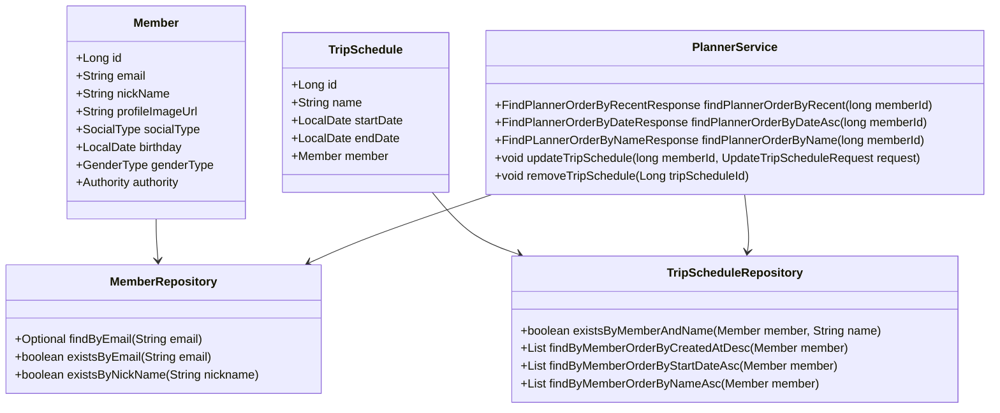
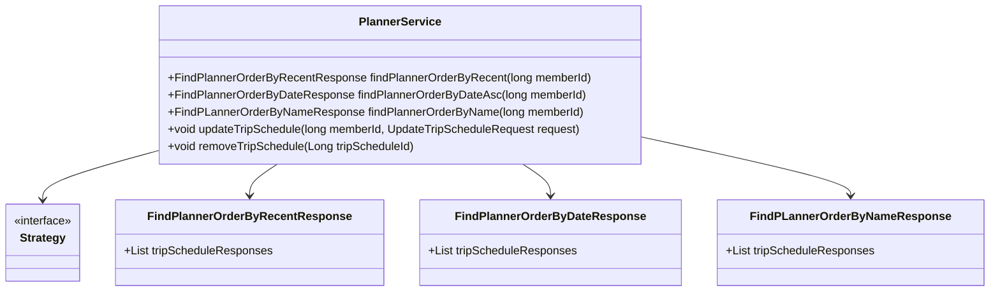
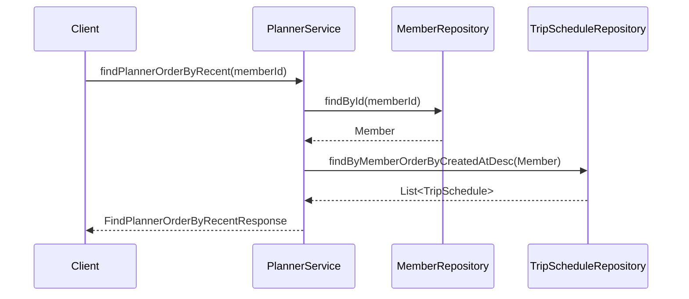

# Comprehensive Documentation for the Service Code

## 1. Overall Structure

### High-Level Overview
The codebase is structured into several packages, primarily focusing on the domain of members and planners. The main components include entities, repositories, exceptions, and service classes that handle business logic. The `PlannerService` class is responsible for managing trip schedules associated with members.

### Purpose and Function of Service Code
The `PlannerService` class provides methods to manage trip schedules for members. It allows for retrieving trip schedules in various orders (recent, by date, by name), updating existing schedules, and removing schedules. The service interacts with repositories to perform CRUD operations on the underlying database.

### Interaction Between Components
- **Entities**: `Member` and `TripSchedule` represent the core data models.
- **Repositories**: `MemberRepository` and `TripScheduleRepository` provide data access methods for the entities.
- **Exceptions**: Custom exceptions handle error scenarios, such as non-existent members or trip schedules.
- **Service**: `PlannerService` orchestrates the interaction between repositories and handles business logic.

### Mermaid Diagram


## 2. Strategy Pattern Implementation

### Strategy Pattern Overview
The strategy pattern is not explicitly implemented in the provided code. However, the service class can be seen as a context that utilizes different strategies (methods) to handle various operations related to trip schedules.

### Context Class
The `PlannerService` class acts as the context that uses different methods to perform operations based on the member's request.

### Class Diagram


## 3. Detailed Component Documentation

### a. Classes

#### 1. `PlannerService`
- **Purpose**: Manages trip schedules for members.
- **Attributes**:
  - `TripScheduleRepository tripScheduleRepository`: Repository for trip schedules.
  - `MemberRepository memberRepository`: Repository for members.
  - `TripScheduleRegistryRepository tripScheduleRegistryRepository`: Repository for trip schedule registries.
- **Role**: Acts as a service layer to handle business logic related to trip schedules.
- **Relationships**: 
  - Uses `MemberRepository` and `TripScheduleRepository` for data access.

### b. Methods and Functions

#### 1. `findPlannerOrderByRecent`
- **Purpose**: Retrieves trip schedules for a member ordered by creation date (most recent first).
- **Parameters**:
  - `long memberId`: The ID of the member whose schedules are to be retrieved.
- **Return Value**: `FindPlannerOrderByRecentResponse` containing the list of trip schedules.
- **Code Example**:
  ```java
  FindPlannerOrderByRecentResponse response = plannerService.findPlannerOrderByRecent(memberId);
  ```

#### 2. `findPlannerOrderByDateAsc`
- **Purpose**: Retrieves trip schedules for a member ordered by start date (ascending).
- **Parameters**:
  - `long memberId`: The ID of the member whose schedules are to be retrieved.
- **Return Value**: `FindPlannerOrderByDateResponse` containing the list of trip schedules.
- **Code Example**:
  ```java
  FindPlannerOrderByDateResponse response = plannerService.findPlannerOrderByDateAsc(memberId);
  ```

#### 3. `findPlannerOrderByName`
- **Purpose**: Retrieves trip schedules for a member ordered by name.
- **Parameters**:
  - `long memberId`: The ID of the member whose schedules are to be retrieved.
- **Return Value**: `FindPLannerOrderByNameResponse` containing the list of trip schedules.
- **Code Example**:
  ```java
  FindPLannerOrderByNameResponse response = plannerService.findPlannerOrderByName(memberId);
  ```

#### 4. `updateTripSchedule`
- **Purpose**: Updates an existing trip schedule for a member.
- **Parameters**:
  - `long memberId`: The ID of the member.
  - `UpdateTripScheduleRequest updateTripScheduleRequest`: The request object containing updated schedule details.
- **Return Value**: `void`
- **Code Example**:
  ```java
  plannerService.updateTripSchedule(memberId, updateRequest);
  ```

#### 5. `removeTripSchedule`
- **Purpose**: Removes a trip schedule by its ID.
- **Parameters**:
  - `Long tripScheduleId`: The ID of the trip schedule to be removed.
- **Return Value**: `void`
- **Code Example**:
  ```java
  plannerService.removeTripSchedule(tripScheduleId);
  ```

## 4. Implementation Flow

### Sequence Diagram


### Explanation of Sequence
1. The client calls `findPlannerOrderByRecent` on the `PlannerService`.
2. The service retrieves the member using `MemberRepository`.
3. The service then fetches the trip schedules ordered by creation date from `TripScheduleRepository`.
4. Finally, the service returns the response to the client.

This documentation provides a comprehensive overview of the service code, its structure, and its components, making it easier for developers to understand and work with the code effectively.
