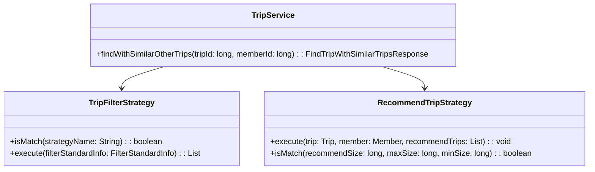
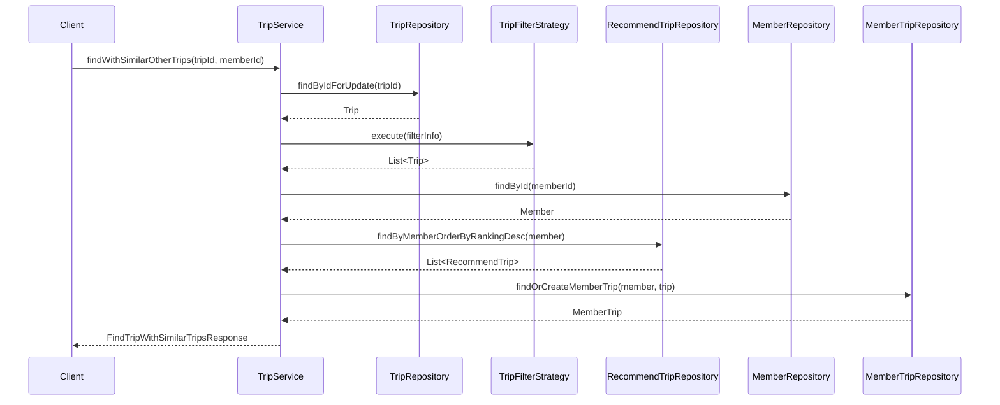

# Trip Service Documentation

## 1. Overall Structure

### High-Level Overview
The Trip Service codebase is structured to manage trip-related functionalities, including trip creation, retrieval, and recommendations based on user interactions. It interacts with various domain models, repositories, and strategies to provide a cohesive service layer for trip management.

### Purpose and Function of Service Code
The `TripService` class serves as the primary service layer for handling trip-related operations. It encapsulates business logic and interacts with repositories to perform CRUD operations on trips, manage recommendations, and filter trips based on specific criteria.

### Interaction Between Components
- **Repositories**: The service interacts with multiple repositories (`TripRepository`, `RecommendTripRepository`, `MemberRepository`, `MemberTripRepository`, and `TripKeywordRepository`) to perform data access operations.
- **Strategies**: The service utilizes strategy patterns (`TripFilterStrategy` and `RecommendTripStrategy`) to apply different filtering and recommendation algorithms dynamically.
- **Entities**: The service operates on various entities such as `Trip`, `Member`, `RecommendTrip`, and `TripKeyword`, managing their relationships and data integrity.

### Mermaid Diagram

```mermaid
classDiagram
    class TripService {
        +findWithSimilarOtherTrips(tripId: long, memberId: long): FindTripWithSimilarTripsResponse
        +createTrip(tripCreateRequest: TripCreateRequest): void
        +findById(tripId: Long): Trip
    }

    class TripRepository {
        +findByIdForUpdate(tripId: Long): Optional<Trip>
        +save(trip: Trip): void
    }

    class RecommendTripRepository {
        +findByMemberOrderByRankingDesc(member: Member): List<RecommendTrip>
    }

    class MemberRepository {
        +findById(memberId: Long): Optional<Member>
    }

    class MemberTripRepository {
        +existsByMemberAndTrip(member: Member, trip: Trip): boolean
        +save(memberTrip: MemberTrip): void
    }

    class TripKeywordRepository {
        +findByTrip(trip: Trip): List<TripKeyword>
    }

    class TripFilterStrategyProvider {
        +findTripsByFilterStrategy(strategyName: String): TripFilterStrategy
    }

    class SaveRecommendTripStrategyProvider {
        +findRecommendTripStrategy(recommendSize: long): RecommendTripStrategy
    }

    TripService --> TripRepository
    TripService --> RecommendTripRepository
    TripService --> MemberRepository
    TripService --> MemberTripRepository
    TripService --> TripKeywordRepository
    TripService --> TripFilterStrategyProvider
    TripService --> SaveRecommendTripStrategyProvider
```


## 2. Strategy Pattern Implementation

### Strategy Pattern Overview
The strategy pattern is implemented to allow dynamic selection of filtering and recommendation strategies based on specific criteria. This enables the `TripService` to apply different algorithms without altering its core logic.

### Strategy Interface and Concrete Strategy Classes
- **TripFilterStrategy**: An interface defining the contract for trip filtering strategies.
  - **Methods**:
    - `boolean isMatch(final String strategyName)`: Determines if the strategy matches the given name.
    - `List<Trip> execute(final FilterStandardInfo filterStandardInfo)`: Executes the filtering logic based on the provided information.

- **RecommendTripStrategy**: An interface for recommendation strategies.
  - **Methods**:
    - `void execute(final Trip trip, final Member member, final List<RecommendTrip> recommendTrips)`: Executes the recommendation logic.
    - `boolean isMatch(final long recommendSize, final long maxSize, final long minSize)`: Checks if the strategy matches the size criteria.

### Context Class
- **TripService**: The context class that utilizes the strategies to filter trips and manage recommendations. It delegates the filtering and recommendation logic to the appropriate strategy based on the current operation.

### Class Diagram


## 3. Detailed Component Documentation

### a. Classes

#### TripService
- **Purpose**: Manages trip-related operations, including retrieval, creation, and recommendations.
- **Attributes**:
  - `TripFilterStrategyProvider tripFilterStrategyProvider`: Provides filtering strategies.
  - `SaveRecommendTripStrategyProvider saveRecommendTripStrategyProvider`: Provides recommendation strategies.
  - `TripRepository tripRepository`: Repository for trip data.
  - `RecommendTripRepository recommendTripRepository`: Repository for recommended trips.
  - `MemberRepository memberRepository`: Repository for member data.
  - `MemberTripRepository memberTripRepository`: Repository for member-trip relationships.
  - `TripKeywordRepository tripKeywordRepository`: Repository for trip keywords.
- **Role**: Acts as a service layer to encapsulate business logic and interact with repositories.
- **Relationships**: Collaborates with various repositories and strategy providers.

#### TripFilterStrategy
- **Purpose**: Interface for filtering strategies.
- **Methods**:
  - `boolean isMatch(final String strategyName)`: Checks if the strategy matches the given name.
  - `List<Trip> execute(final FilterStandardInfo filterStandardInfo)`: Executes the filtering logic.

#### RecommendTripStrategy
- **Purpose**: Interface for recommendation strategies.
- **Methods**:
  - `void execute(final Trip trip, final Member member, final List<RecommendTrip> recommendTrips)`: Executes the recommendation logic.
  - `boolean isMatch(final long recommendSize, final long maxSize, final long minSize)`: Checks if the strategy matches the size criteria.

### b. Methods and Functions

#### findWithSimilarOtherTrips
- **Purpose**: Finds a trip by ID and retrieves similar trips based on a filtering strategy.
- **Parameters**:
  - `tripId: long`: The ID of the trip to find.
  - `memberId: long`: The ID of the member requesting the trip.
- **Return Value**: `FindTripWithSimilarTripsResponse`: Contains the found trip and similar trips.
- **Code Example**:
```java
FindTripWithSimilarTripsResponse response = tripService.findWithSimilarOtherTrips(tripId, memberId);
```

#### createTrip
- **Purpose**: Creates a new trip based on the provided request data.
- **Parameters**:
  - `tripCreateRequest: TripCreateRequest`: The request object containing trip details.
- **Return Value**: `void`
- **Code Example**:
```java
tripService.createTrip(new TripCreateRequest("Trip Name", "Place Name", 1L, "Description", "Image URL"));
```

#### findById
- **Purpose**: Retrieves a trip by its ID.
- **Parameters**:
  - `tripId: Long`: The ID of the trip to retrieve.
- **Return Value**: `Trip`: The found trip.
- **Code Example**:
```java
Trip trip = tripService.findById(tripId);
```

## 4. Implementation Flow

### Sequence Diagram


This documentation provides a comprehensive overview of the `TripService` code, detailing its structure, strategy pattern implementation, component documentation, and implementation flow. It serves as a guide for both new and experienced developers to understand and work with the code effectively.
