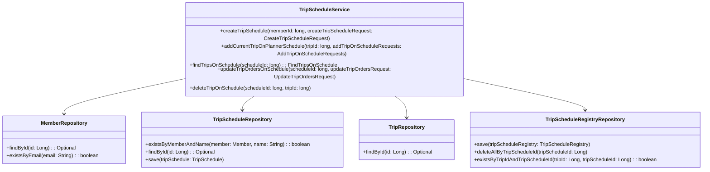
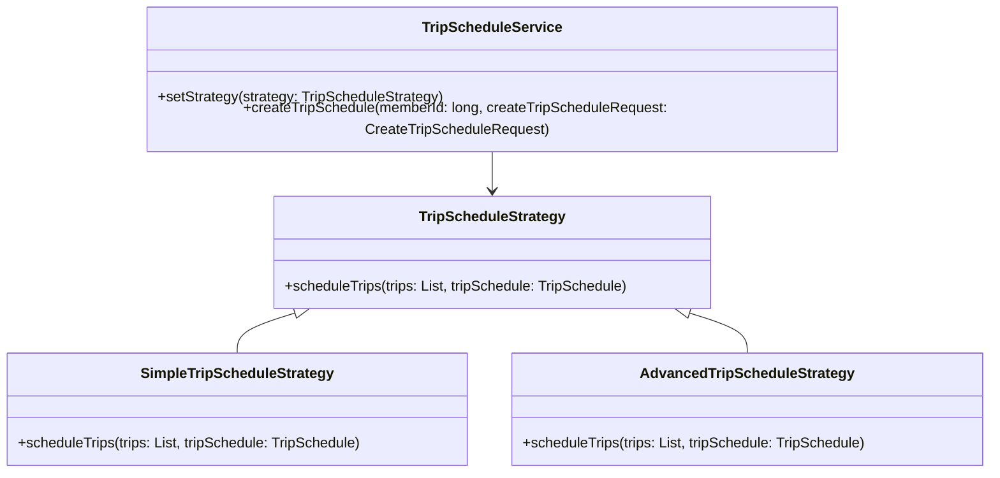
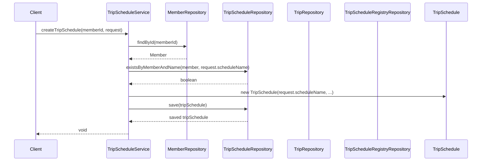

# Comprehensive Documentation for the Service Code

## 1. Overall Structure

### High-Level Overview
The codebase is structured into several packages, each serving a specific purpose within the application. The primary packages include:

- **Domain**: Contains the core business entities such as `Member`, `TripSchedule`, and `Trip`.
- **Repository**: Interfaces for data access, extending `JpaRepository` for CRUD operations.
- **Exception**: Custom exceptions for handling specific error scenarios.
- **Application**: Contains service classes that implement business logic, such as `TripScheduleService`.

### Purpose and Function of Service Code
The `TripScheduleService` class is responsible for managing trip schedules. It provides methods to create, update, and delete trip schedules, as well as to add trips to existing schedules. The service interacts with repositories to perform database operations and handles exceptions related to members, trip schedules, and trips.

### Interaction Between Components
- The `TripScheduleService` interacts with the `MemberRepository`, `TripScheduleRepository`, `TripRepository`, and `TripScheduleRegistryRepository` to perform its operations.
- It uses the `Member` entity to validate user existence and the `TripSchedule` entity to manage trip schedules.
- The service methods handle exceptions that may arise during these operations, ensuring that the application behaves predictably.

### Mermaid Diagram


## 2. Strategy Pattern Implementation

### Strategy Pattern Overview
The strategy pattern is not explicitly implemented in the provided code. However, if we were to implement it, we would define a strategy interface for trip scheduling strategies, with concrete implementations for different scheduling algorithms.

### Strategy Interface and Concrete Strategy Classes
- **Strategy Interface**: `TripScheduleStrategy`
- **Concrete Strategies**: `SimpleTripScheduleStrategy`, `AdvancedTripScheduleStrategy`

### Context Class
- **Context Class**: `TripScheduleService` would act as the context that uses the strategies to manage trip schedules.

### Class Diagram


## 3. Detailed Component Documentation

### a. Classes

#### TripScheduleService
- **Purpose**: Manages trip schedules and interactions with repositories.
- **Attributes**:
  - `memberRepository`: Repository for member data.
  - `tripScheduleRepository`: Repository for trip schedule data.
  - `tripRepository`: Repository for trip data.
  - `tripScheduleRegistryRepository`: Repository for trip schedule registry data.
- **Role**: Acts as a service layer to encapsulate business logic related to trip schedules.
- **Relationships**: Uses multiple repositories to perform CRUD operations.

### b. Methods and Functions

#### createTripSchedule
- **Purpose**: Creates a new trip schedule for a member.
- **Parameters**:
  - `memberId` (long): The ID of the member creating the schedule.
  - `createTripScheduleRequest` (CreateTripScheduleRequest): DTO containing schedule details.
- **Return Value**: None.
- **Code Example**:
  ```java
  tripScheduleService.createTripSchedule(memberId, new CreateTripScheduleRequest("My Trip", startDate, endDate));
  ```

#### addCurrentTripOnPlannerSchedule
- **Purpose**: Adds a trip to an existing trip schedule.
- **Parameters**:
  - `tripId` (long): The ID of the trip to add.
  - `addTripOnScheduleRequests` (AddTripOnScheduleRequests): DTO containing schedule IDs.
- **Return Value**: None.
- **Code Example**:
  ```java
  tripScheduleService.addCurrentTripOnPlannerSchedule(tripId, new AddTripOnScheduleRequests(Arrays.asList(scheduleId1, scheduleId2)));
  ```

#### findTripsOnSchedule
- **Purpose**: Retrieves trips associated with a specific schedule.
- **Parameters**:
  - `scheduleId` (long): The ID of the trip schedule.
- **Return Value**: `FindTripsOnSchedule`: DTO containing the trip schedule and associated trips.
- **Code Example**:
  ```java
  FindTripsOnSchedule tripsOnSchedule = tripScheduleService.findTripsOnSchedule(scheduleId);
  ```

#### updateTripOrdersOnSchedule
- **Purpose**: Updates the order of trips in a schedule.
- **Parameters**:
  - `scheduleId` (long): The ID of the trip schedule.
  - `updateTripOrdersRequest` (UpdateTripOrdersRequest): DTO containing new trip order.
- **Return Value**: None.
- **Code Example**:
  ```java
  tripScheduleService.updateTripOrdersOnSchedule(scheduleId, new UpdateTripOrdersRequest(Arrays.asList(tripId1, tripId2)));
  ```

#### deleteTripOnSchedule
- **Purpose**: Deletes a trip from a schedule.
- **Parameters**:
  - `scheduleId` (long): The ID of the trip schedule.
  - `tripId` (long): The ID of the trip to delete.
- **Return Value**: None.
- **Code Example**:
  ```java
  tripScheduleService.deleteTripOnSchedule(scheduleId, tripId);
  ```

## 4. Implementation Flow

### Sequence Diagram


### Explanation of Sequence Diagram
1. The client calls `createTripSchedule` on the `TripScheduleService`.
2. The service checks if the member exists using `MemberRepository`.
3. It verifies if a trip schedule with the same name already exists.
4. If not, it creates a new `TripSchedule` and saves it using `TripScheduleRepository`.
5. Finally, the service returns control to the client.

This documentation provides a comprehensive overview of the service code, its structure, and its components, making it easier for developers to understand and work with the code effectively.
