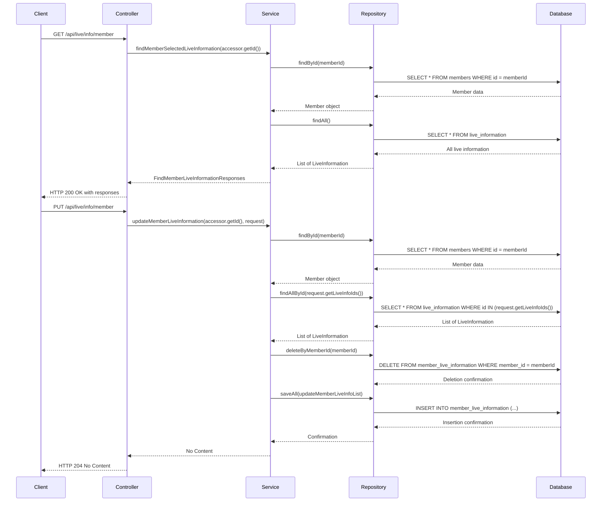

# API 상세 분석 및 흐름 다이어그램 가이드

## API 이름
회원 생활 정보 API

### API 엔드포인트 상세 분석
- **엔드포인트 URL**: `/api/live/info/member`
- **HTTP 메서드**: 
  - `GET`: 회원의 생활 정보를 조회
  - `PUT`: 회원의 생활 정보를 업데이트
- **요청 파라미터/본문**:
  - `GET`: `Authentication` 어노테이션을 통해 `Accessor` 객체에서 회원 ID를 가져옴
  - `PUT`: 요청 본문에 `UpdateMemberLiveInformationRequest` 객체가 포함됨
- **응답 구조**:
  - `GET`: `FindMemberLiveInformationResponses` 객체
  - `PUT`: HTTP 204 No Content

### 각 API 흐름 분석 템플릿

#### 1. 컨트롤러(Controller) 계층 분석
- **메서드 시그니처**:
  - `findAllLiveInformationByMember(@Authentication final Accessor accessor)`
  - `updateMemberLiveInformation(@Authentication final Accessor accessor, @RequestBody final UpdateMemberLiveInformationRequest request)`
- **HTTP 매핑 어노테이션**:
  - `@GetMapping` (GET 요청)
  - `@PutMapping` (PUT 요청)
- **요청 데이터 처리**:
  - `Accessor` 객체를 통해 회원 ID를 추출
  - `UpdateMemberLiveInformationRequest` 객체를 통해 업데이트할 생활 정보 ID 목록을 수신
- **호출되는 서비스 메서드**:
  - `findMemberSelectedLiveInformation` (GET 요청)
  - `updateMemberLiveInformation` (PUT 요청)

#### 2. 서비스(Service) 계층 분석
- **비즈니스 로직 상세**:
  - `findMemberSelectedLiveInformation`: 회원 ID에 해당하는 생활 정보를 조회
  - `updateMemberLiveInformation`: 회원의 생활 정보를 업데이트
- **데이터 변환 로직**:
  - `findMemberSelectedLiveInfos`: 모든 생활 정보와 선택된 생활 정보 ID를 비교하여 응답 객체 생성
- **호출되는 리포지토리 메서드**:
  - `memberRepository.findById`
  - `liveInformationRepository.findAllById`
  - `memberLiveInformationRepository.deleteByMemberId`
  - `memberLiveInformationRepository.saveAll`

#### 3. 리포지토리(Repository) 계층 분석
- **수행되는 데이터베이스 작업**:
  - 회원 ID로 회원 조회
  - 요청된 생활 정보 ID로 생활 정보 조회
  - 기존 회원의 생활 정보 삭제
  - 새로운 생활 정보 저장
- **쿼리 메서드 상세**:
  - `findById` (회원 조회)
  - `findAllById` (생활 정보 조회)
  - `deleteByMemberId` (회원의 생활 정보 삭제)
  - `saveAll` (생활 정보 저장)
- **데이터 조회/변환 방식**:
  - JPA를 사용하여 데이터베이스와 상호작용

#### 4. Mermaid 흐름 다이어그램

#### 5. 예외 시나리오

- **가능한 예외 유형**:
  - `NoExistMemberException`: 요청한 회원이 존재하지 않을 경우
  - `NoExistLiveInformationException`: 요청한 생활 정보 중 일부가 존재하지 않을 경우
- **예외 처리 방식**:
  - 각 서비스 메서드에서 예외를 발생시키고, 이를 통해 클라이언트에게 적절한 오류 메시지를 전달

이 분석을 통해 API의 구조와 흐름을 명확히 이해할 수 있습니다.
