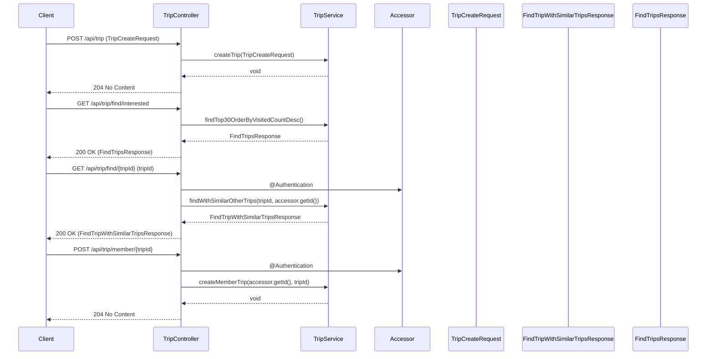
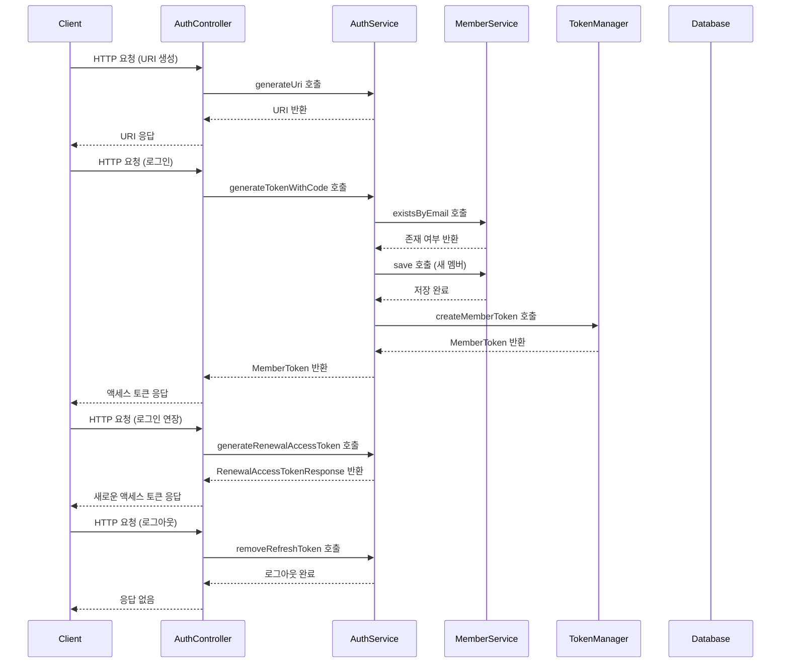

The provided code consists of several Java classes that are part of a travel application. Below is a detailed analysis of the classes, their relationships, and a flow diagram that illustrates how they interact with each other.

### Class Overview

1. **Accessor**: 
   - A Data Transfer Object (DTO) that holds an `id` of type `Long`.
   - It has a private constructor and a public constructor for initialization.

2. **Authentication**: 
   - A custom annotation used to mark parameters that require authentication in controller methods.

3. **TripService**: 
   - A service class that contains business logic related to trips.
   - It interacts with various repositories to perform CRUD operations on trips and manage member trips.
   - It includes methods to find trips, create trips, and manage recommendations based on user interactions.

4. **FindTripWithSimilarTripsResponse**: 
   - A DTO that encapsulates the response for finding a trip along with similar trips.
   - It contains a `FindTripResponse` and `SimilarTripResponses`.

5. **FindTripsResponse**: 
   - A DTO that encapsulates a list of trips along with their associated keywords.

6. **TripCreateRequest**: 
   - A DTO used for creating a new trip, containing fields like `name`, `placeName`, `contentId`, `description`, and `tripImageUrl`.

7. **TripController**: 
   - A REST controller that handles HTTP requests related to trips.
   - It defines endpoints for creating trips, finding trips by ID, and managing member trips.

### Flow Diagram

The following Mermaid diagram illustrates the flow of data and interactions between the classes when a user interacts with the TripController:

### Detailed Analysis of Key Components

#### TripService
- **Methods**:
  - `findWithSimilarOtherTrips(long tripId, long memberId)`: Finds a trip by ID and retrieves similar trips based on a filter strategy. It also increments the visit count and logs the recommendation.
  - `createTrip(TripCreateRequest tripCreateRequest)`: Creates a new trip based on the provided request.
  - `createMemberTrip(long memberId, long tripId)`: Associates a member with a trip.

#### TripController
- **Endpoints**:
  - `POST /api/trip`: Creates a new trip.
  - `GET /api/trip/find/interested`: Retrieves the top 30 trips ordered by visit count.
  - `GET /api/trip/find/{tripId}`: Retrieves a trip and its similar trips.
  - `POST /api/trip/member/{tripId}`: Associates a member with a trip.

### Exception Handling
- The `TripService` class includes exception handling for cases where a trip or member does not exist, and for pessimistic locking issues.

### Conclusion
This code structure provides a clear separation of concerns, with DTOs for data transfer, a service layer for business logic, and a controller layer for handling HTTP requests. The use of annotations for authentication and the handling of exceptions enhances the robustness of the application. The flow diagram visually represents how these components interact during various operations.

