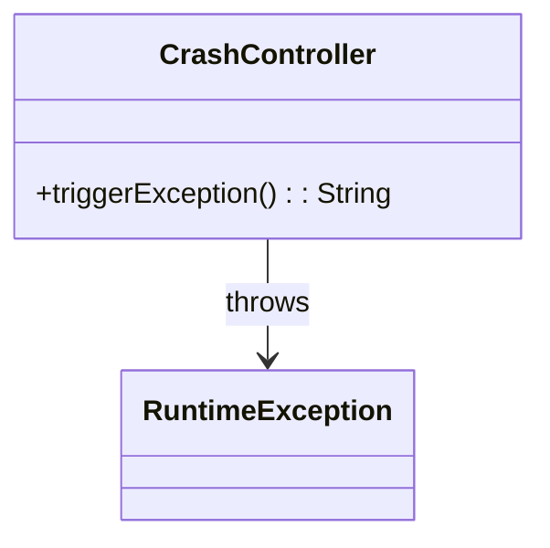
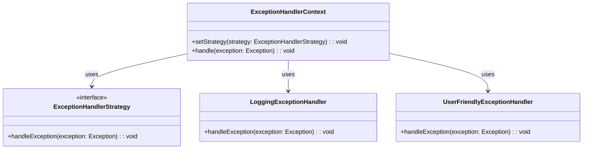
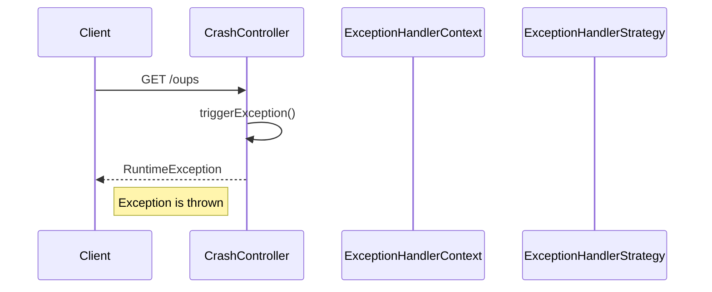

# Service Code Documentation

## 1. Overall Structure

### High-Level Overview
The provided code is part of a Spring-based web application, specifically a controller that demonstrates exception handling. The `CrashController` class is responsible for triggering a runtime exception when a specific endpoint is accessed.

### Purpose and Function of Service Code
The primary purpose of the `CrashController` is to showcase how the application behaves when an exception is thrown. This is useful for testing error handling mechanisms and ensuring that the application can gracefully handle unexpected situations.

### Interaction Between Parts of the Code
- The `CrashController` class is annotated with `@Controller`, indicating that it is a Spring MVC controller.
- The `@GetMapping("/oups")` annotation maps HTTP GET requests to the `triggerException` method.
- When the `/oups` endpoint is accessed, the `triggerException` method is invoked, which throws a `RuntimeException`.

### Mermaid Diagram


## 2. Strategy Pattern Implementation

### Strategy Pattern Overview
The provided code does not implement the Strategy Pattern. However, if we were to extend this codebase to include a strategy for handling different types of exceptions, we would define a strategy interface and concrete strategy classes.

### Strategy Interface and Concrete Strategy Classes
- **Strategy Interface**: `ExceptionHandlerStrategy`
- **Concrete Strategies**: `LoggingExceptionHandler`, `UserFriendlyExceptionHandler`

### Context Class
- **Context Class**: `ExceptionHandlerContext`
  - This class would use the strategies to handle exceptions based on the type of exception thrown.

### Class Diagram


## 3. Detailed Component Documentation

### a. Classes

#### Class: CrashController
- **Purpose**: Demonstrates exception handling in a Spring MVC application.
- **Attributes**: None
- **Role in System**: Acts as a controller that triggers an exception for testing purposes.
- **Relationships**: None

### b. Methods and Functions

#### Method: triggerException
- **Purpose**: Triggers a runtime exception when the `/oups` endpoint is accessed.
- **Parameters**: None
- **Return Value**: 
  - Type: `String`
  - Description: This method does not return a valid string as it throws an exception.
- **Code Example**:
```java
// Accessing the endpoint
// GET /oups
// This will trigger the RuntimeException
```

## 4. Implementation Flow

### Sequence Diagram


### Explanation of Sequence Diagram
1. The client sends a GET request to the `/oups` endpoint.
2. The `CrashController` receives the request and calls the `triggerException` method.
3. The method throws a `RuntimeException`, which is returned to the client.
4. The client receives the exception, demonstrating how the application handles errors.

This documentation provides a comprehensive overview of the `CrashController` class and its role in the application, as well as a conceptual framework for extending the codebase with the Strategy Pattern for better exception handling.