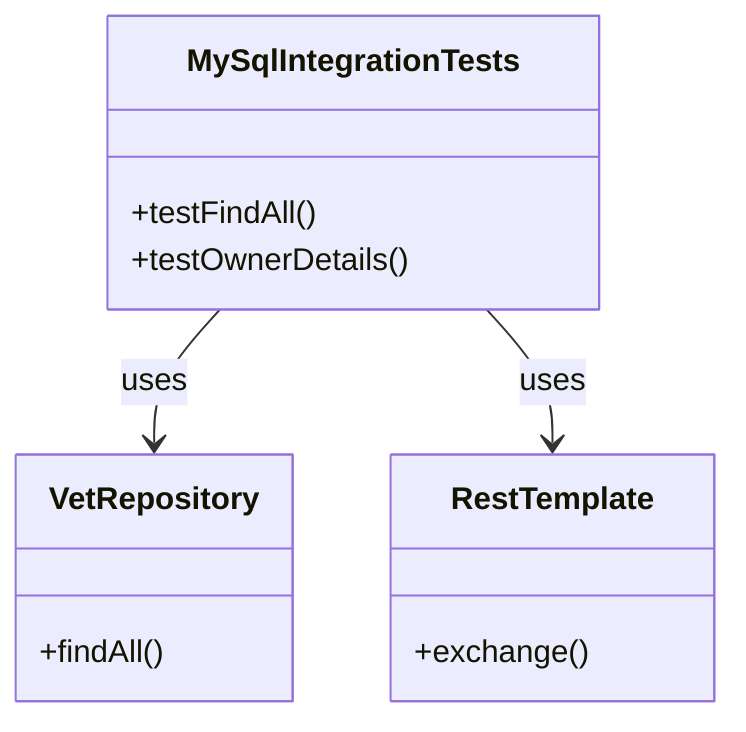
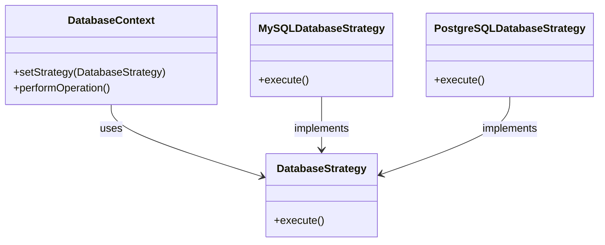
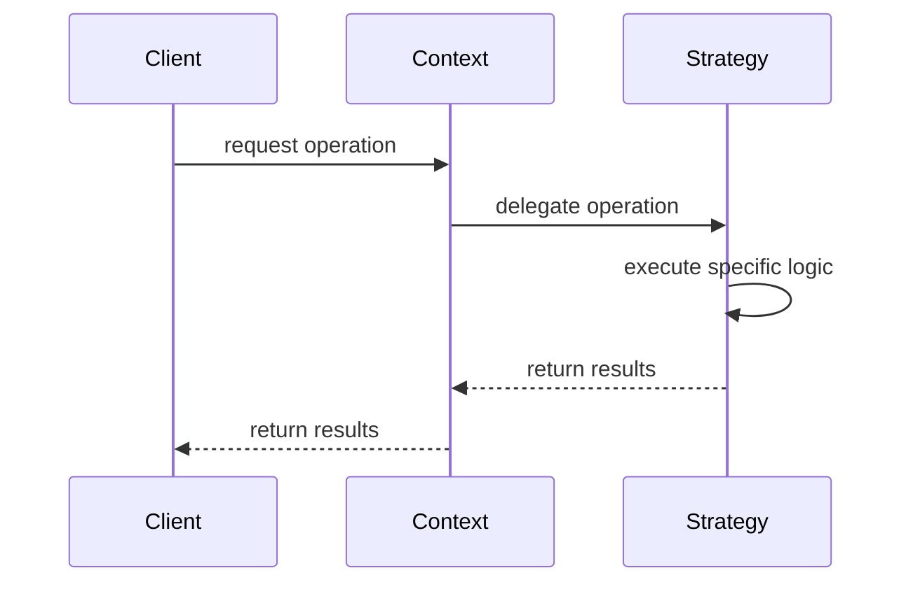

# Service Code Documentation

## 1. Overall Structure

### High-Level Overview
The provided service code is part of a Spring Boot application that integrates with a MySQL database. It includes a test class designed to validate the functionality of the application, specifically focusing on the `VetRepository` and the RESTful services for managing pet owners.

### Purpose and Function
The primary purpose of this code is to perform integration testing for the application's interaction with a MySQL database. It verifies that the repository methods work correctly and that the REST API responds as expected.

### Interaction of Different Parts
- **MySqlIntegrationTests**: This is the main test class that contains various test methods to validate the functionality of the application.
- **VetRepository**: This is a Spring Data repository that interacts with the database to perform CRUD operations on vet entities.
- **RestTemplate**: This is used to make HTTP requests to the REST API endpoints of the application.

### Mermaid Diagram


## 2. Strategy Pattern Implementation

### Strategy Pattern Overview
The strategy pattern is not explicitly implemented in the provided code. However, if we were to extend this codebase, we could implement a strategy pattern for different types of database interactions or REST API calls.

### Strategy Interface and Concrete Strategy Classes
- **Strategy Interface**: This would define a common interface for various strategies (e.g., `DatabaseStrategy`).
- **Concrete Strategy Classes**: These would implement the strategy interface for specific database operations (e.g., `MySQLDatabaseStrategy`, `PostgreSQLDatabaseStrategy`).

### Context Class
- **Context Class**: This would be a class that uses the strategy interface to perform operations based on the selected strategy.

### Class Diagram


## 3. Detailed Component Documentation

### a. Classes

#### Class: MySqlIntegrationTests
- **Purpose**: This class contains integration tests for the application, specifically testing the interaction with the MySQL database and the REST API.
- **Attributes**:
  - `port`: The local server port assigned for the test.
  - `vets`: An instance of `VetRepository` used to interact with the vet data.
  - `builder`: A `RestTemplateBuilder` used to create `RestTemplate` instances.
- **Role in the System**: It validates the functionality of the application by running tests against the database and REST API.
- **Relationships**: 
  - Uses `VetRepository` to perform database operations.
  - Uses `RestTemplate` to make HTTP requests.

### b. Methods and Functions

#### Method: testFindAll
- **Purpose**: Tests the `findAll` method of the `VetRepository`.
- **Parameters**: None
- **Return Value**: None
- **Code Example**:
  ```java
  @Test
  void testFindAll() {
      vets.findAll();
      vets.findAll(); // served from cache
  }
  ```

#### Method: testOwnerDetails
- **Purpose**: Tests the REST API endpoint for retrieving owner details.
- **Parameters**: None
- **Return Value**: None
- **Code Example**:
  ```java
  @Test
  void testOwnerDetails() {
      RestTemplate template = builder.rootUri("http://localhost:" + port).build();
      ResponseEntity<String> result = template.exchange(RequestEntity.get("/owners/1").build(), String.class);
      assertThat(result.getStatusCode()).isEqualTo(HttpStatus.OK);
  }
  ```

## 4. Implementation Flow

### Sequence Diagram


This documentation provides a comprehensive overview of the service code, detailing its structure, strategy pattern implementation, and the flow of execution. It serves as a guide for both new and experienced developers to understand and work with the code effectively.