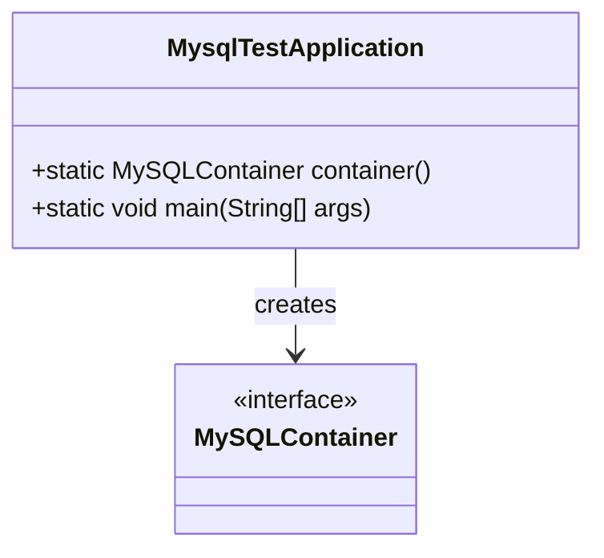
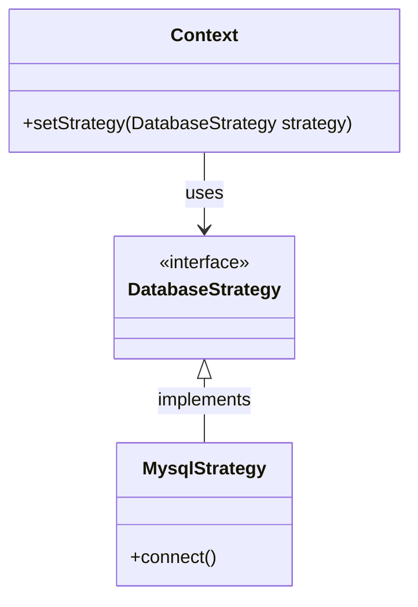
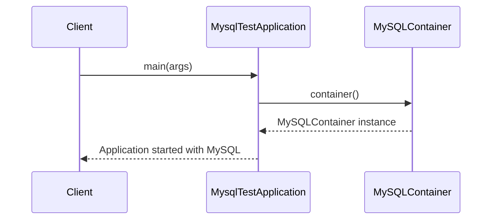

# Service Code Documentation

## 1. Overall Structure

### High-Level Overview
The provided code is part of a Spring Boot application for a pet clinic, specifically designed to run with a MySQL database in a test environment. The code is structured to facilitate easy configuration and deployment of the application using Testcontainers, which allows for the creation of a MySQL container for testing purposes.

### Purpose and Function of Service Code
The primary purpose of this service code is to configure a MySQL database connection for the PetClinic application when running in a specific profile (`mysql`). It sets up a MySQL container that will be used during integration tests, ensuring that the application can interact with a real database environment.

### Interaction Between Parts
- The `MysqlTestApplication` class is annotated with `@Configuration`, indicating that it provides Spring configuration.
- The `container()` method is annotated with `@Bean`, which tells Spring to manage the lifecycle of the MySQL container.
- The `main` method serves as the entry point for the application, launching the Spring context with the specified profile.

### Mermaid Diagram


## 2. Strategy Pattern Implementation

### Strategy Pattern Overview
The strategy pattern is a behavioral design pattern that enables selecting an algorithm's behavior at runtime. In this codebase, the strategy pattern is not explicitly implemented, but the configuration allows for different database strategies (like MySQL) to be used based on the active profile.

### Strategy Interface and Concrete Strategy Classes
In this specific code, there is no defined strategy interface or concrete strategy classes. However, if we were to extend this codebase, we could create interfaces for different database strategies (e.g., `DatabaseStrategy`) and implement them for MySQL, PostgreSQL, etc.

### Context Class
The `MysqlTestApplication` class acts as a context that configures the application to use a specific database strategy based on the active profile.

### Class Diagram


## 3. Detailed Component Documentation

### a. Classes

#### Class: `MysqlTestApplication`
- **Purpose**: Configures the MySQL database connection for the PetClinic application in a test environment.
- **Attributes**: None
- **Role in System**: Acts as the main configuration class for setting up the MySQL container.
- **Relationships**: Uses `MySQLContainer` to create a database connection.

### b. Methods and Functions

#### Method: `container()`
- **Purpose**: Creates and configures a MySQL container for the application.
- **Parameters**: None
- **Return Value**: `MySQLContainer<?>` - A configured MySQL container instance.
- **Code Example**:
    ```java
    MySQLContainer<?> mysqlContainer = MysqlTestApplication.container();
    ```

#### Method: `main(String[] args)`
- **Purpose**: Entry point for the Spring Boot application, launching the application with the MySQL profile.
- **Parameters**:
  - `args` (String[]) - Command-line arguments passed to the application.
- **Return Value**: void
- **Code Example**:
    ```java
    public static void main(String[] args) {
        MysqlTestApplication.main(new String[]{"--spring.profiles.active=mysql"});
    }
    ```

## 4. Implementation Flow

### Sequence Diagram


This documentation provides a comprehensive overview of the service code, detailing its structure, purpose, and implementation of the strategy pattern, along with detailed component documentation and flow diagrams. This should assist both new and experienced developers in understanding and working with the code effectively.