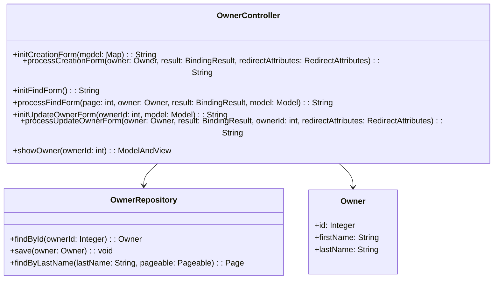
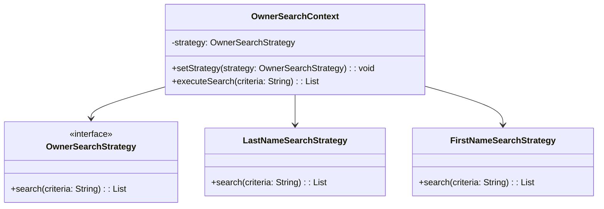
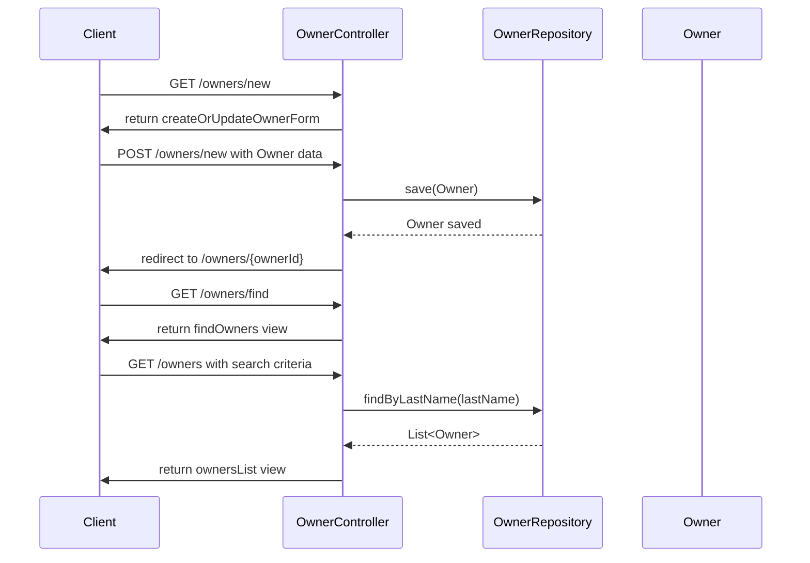

# Service Code Documentation

## 1. Overall Structure

### High-Level Overview
The provided code is part of a Spring MVC application that manages pet owners in a veterinary clinic. The `OwnerController` class handles HTTP requests related to owner management, including creating, updating, and retrieving owner information.

### Purpose and Function
The `OwnerController` serves as the interface between the user and the underlying data model for pet owners. It processes incoming requests, interacts with the `OwnerRepository` to perform CRUD operations, and returns appropriate views to the user.

### Interaction Between Parts
- **Controller**: The `OwnerController` processes HTTP requests and returns views.
- **Repository**: The `OwnerRepository` is used to interact with the database for owner data.
- **Model**: The `Owner` class represents the owner entity and is used to transfer data between the controller and the view.

### Mermaid Diagram


## 2. Strategy Pattern Implementation

### Strategy Pattern Overview
The strategy pattern is not explicitly implemented in the provided code. However, if we were to introduce a strategy for different owner search algorithms, we could define a strategy interface and concrete implementations for various search methods.

### Strategy Interface and Concrete Classes
- **Strategy Interface**: `OwnerSearchStrategy`
    - Method: `List<Owner> search(String criteria)`

- **Concrete Strategies**:
    - `LastNameSearchStrategy`: Searches owners by last name.
    - `FirstNameSearchStrategy`: Searches owners by first name.

### Context Class
- **Context Class**: `OwnerSearchContext`
    - Uses an `OwnerSearchStrategy` to perform searches based on the selected strategy.

### Class Diagram


## 3. Detailed Component Documentation

### a. Classes

#### Class: `OwnerController`
- **Purpose**: Manages HTTP requests related to pet owners.
- **Attributes**:
  - `owners`: An instance of `OwnerRepository` for database operations.
- **Role**: Acts as a mediator between the view and the model, handling user input and returning appropriate views.
- **Relationships**: 
  - Uses `OwnerRepository` to perform CRUD operations on `Owner` entities.

### b. Methods and Functions

#### Method: `initCreationForm`
- **Purpose**: Initializes the form for creating a new owner.
- **Parameters**:
  - `model`: `Map<String, Object>` - The model to be populated with the new owner.
- **Return Value**: `String` - The view name for the creation form.
- **Example**:
  ```java
  @GetMapping("/owners/new")
  public String initCreationForm(Map<String, Object> model) {
      Owner owner = new Owner();
      model.put("owner", owner);
      return VIEWS_OWNER_CREATE_OR_UPDATE_FORM;
  }
  ```

#### Method: `processCreationForm`
- **Purpose**: Processes the form submission for creating a new owner.
- **Parameters**:
  - `owner`: `Owner` - The owner object to be created.
  - `result`: `BindingResult` - Holds validation results.
  - `redirectAttributes`: `RedirectAttributes` - Used to pass flash attributes.
- **Return Value**: `String` - Redirect URL or view name.
- **Example**:
  ```java
  @PostMapping("/owners/new")
  public String processCreationForm(@Valid Owner owner, BindingResult result, RedirectAttributes redirectAttributes) {
      if (result.hasErrors()) {
          redirectAttributes.addFlashAttribute("error", "There was an error in creating the owner.");
          return VIEWS_OWNER_CREATE_OR_UPDATE_FORM;
      }
      this.owners.save(owner);
      redirectAttributes.addFlashAttribute("message", "New Owner Created");
      return "redirect:/owners/" + owner.getId();
  }
  ```

#### Method: `processFindForm`
- **Purpose**: Processes the search form for finding owners.
- **Parameters**:
  - `page`: `int` - The page number for pagination.
  - `owner`: `Owner` - The owner object containing search criteria.
  - `result`: `BindingResult` - Holds validation results.
  - `model`: `Model` - The model to be populated with search results.
- **Return Value**: `String` - View name for displaying results.
- **Example**:
  ```java
  @GetMapping("/owners")
  public String processFindForm(@RequestParam(defaultValue = "1") int page, Owner owner, BindingResult result,
          Model model) {
      // Implementation...
  }
  ```

## 4. Implementation Flow

### Sequence Diagram


This documentation provides a comprehensive overview of the `OwnerController` service code, detailing its structure, strategy pattern implementation, and the flow of operations. It serves as a guide for both new and experienced developers to understand and work with the code effectively.