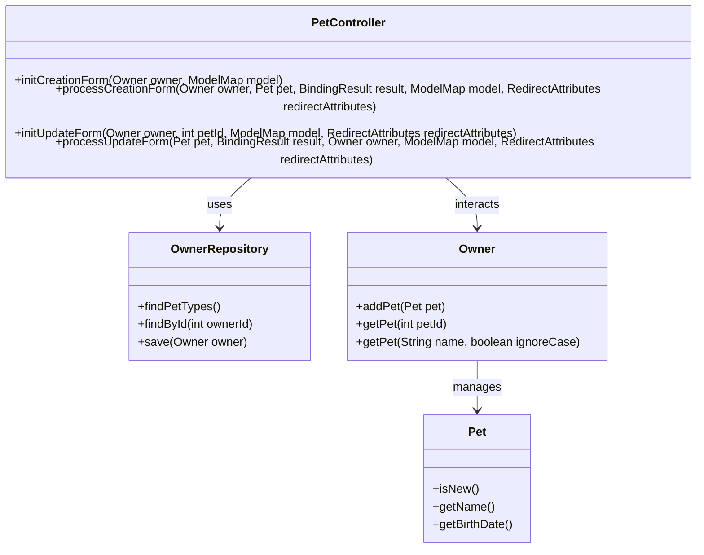
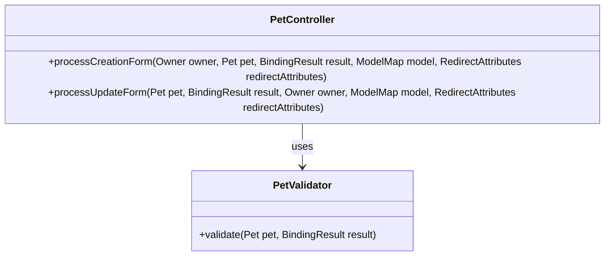
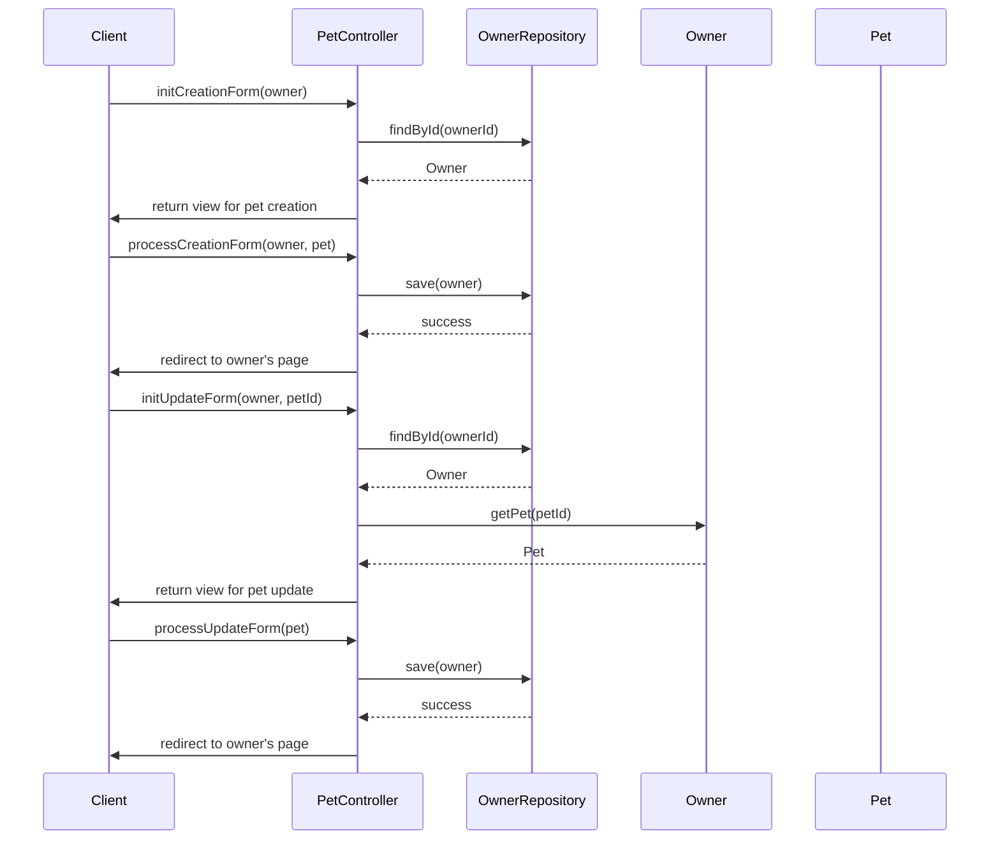

# Service Code Documentation

## 1. Overall Structure

### High-Level Overview
The provided code is part of a Spring MVC application that manages pet owners and their pets. The `PetController` class handles HTTP requests related to pets for a specific owner, allowing for the creation, updating, and retrieval of pet information.

### Purpose and Function of Service Code
The `PetController` class serves as a controller in the MVC architecture, managing the interaction between the user interface and the underlying data model. It processes incoming requests, validates data, and interacts with the `OwnerRepository` to perform CRUD operations on pets.

### Interaction Between Different Parts
- **Controller**: The `PetController` handles HTTP requests and responses.
- **Model**: The controller uses the `Owner` and `Pet` models to represent the data.
- **Repository**: The `OwnerRepository` is used to fetch and save owner and pet data.
- **Validation**: The `PetValidator` is used to validate pet data before processing.

### Mermaid Diagram


## 2. Strategy Pattern Implementation

### Strategy Pattern Overview
The strategy pattern is a behavioral design pattern that enables selecting an algorithm's behavior at runtime. In this codebase, the strategy pattern is not explicitly implemented; however, the validation of pets can be seen as a potential candidate for this pattern.

### Strategy Interface and Concrete Strategy Classes
- **Strategy Interface**: `PetValidator` can be considered a strategy interface that defines the validation behavior for pets.
- **Concrete Strategy Classes**: Different implementations of `PetValidator` could be created to handle various validation rules.

### Context Class
The `PetController` acts as the context class that uses the `PetValidator` strategy to validate pet data during the creation and update processes.

### Class Diagram


## 3. Detailed Component Documentation

### a. Classes

#### Class: `PetController`
- **Purpose**: Manages HTTP requests related to pets for a specific owner.
- **Attributes**:
  - `owners`: An instance of `OwnerRepository` used to interact with the data layer.
- **Role in System**: Acts as a bridge between the user interface and the data model, handling the logic for creating and updating pets.
- **Relationships**: 
  - Uses `OwnerRepository` to fetch and save data.
  - Interacts with `Owner` and `Pet` classes.

### b. Methods and Functions

#### Method: `initCreationForm`
- **Purpose**: Initializes the form for creating a new pet.
- **Parameters**:
  - `Owner owner`: The owner to whom the pet will be added.
  - `ModelMap model`: The model to hold attributes for the view.
- **Return Value**: `String` - The view name for the pet creation form.
- **Code Example**:
  ```java
  String viewName = petController.initCreationForm(owner, model);
  ```

#### Method: `processCreationForm`
- **Purpose**: Processes the form submission for creating a new pet.
- **Parameters**:
  - `Owner owner`: The owner to whom the pet will be added.
  - `@Valid Pet pet`: The pet data submitted from the form.
  - `BindingResult result`: Holds validation results.
  - `ModelMap model`: The model to hold attributes for the view.
  - `RedirectAttributes redirectAttributes`: Used to pass flash attributes.
- **Return Value**: `String` - Redirects to the owner's page or returns to the form in case of errors.
- **Code Example**:
  ```java
  String redirectView = petController.processCreationForm(owner, newPet, result, model, redirectAttributes);
  ```

#### Method: `initUpdateForm`
- **Purpose**: Initializes the form for updating an existing pet.
- **Parameters**:
  - `Owner owner`: The owner of the pet.
  - `int petId`: The ID of the pet to be updated.
  - `ModelMap model`: The model to hold attributes for the view.
  - `RedirectAttributes redirectAttributes`: Used to pass flash attributes.
- **Return Value**: `String` - The view name for the pet update form.
- **Code Example**:
  ```java
  String viewName = petController.initUpdateForm(owner, petId, model, redirectAttributes);
  ```

#### Method: `processUpdateForm`
- **Purpose**: Processes the form submission for updating an existing pet.
- **Parameters**:
  - `@Valid Pet pet`: The updated pet data.
  - `BindingResult result`: Holds validation results.
  - `Owner owner`: The owner of the pet.
  - `ModelMap model`: The model to hold attributes for the view.
  - `RedirectAttributes redirectAttributes`: Used to pass flash attributes.
- **Return Value**: `String` - Redirects to the owner's page or returns to the form in case of errors.
- **Code Example**:
  ```java
  String redirectView = petController.processUpdateForm(updatedPet, result, owner, model, redirectAttributes);
  ```

## 4. Implementation Flow

### Sequence Diagram


This documentation provides a comprehensive overview of the `PetController` class, its methods, and how it interacts with other components in the system. It serves as a guide for both new and experienced developers to understand the codebase effectively.