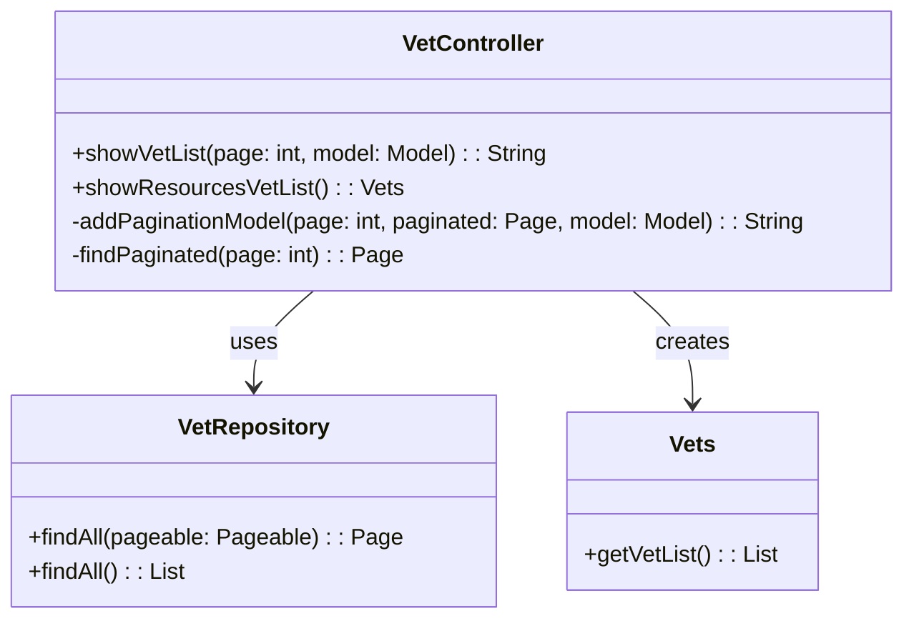
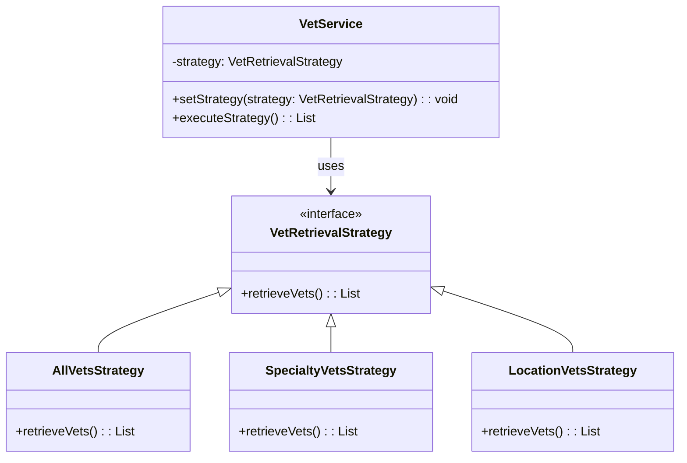
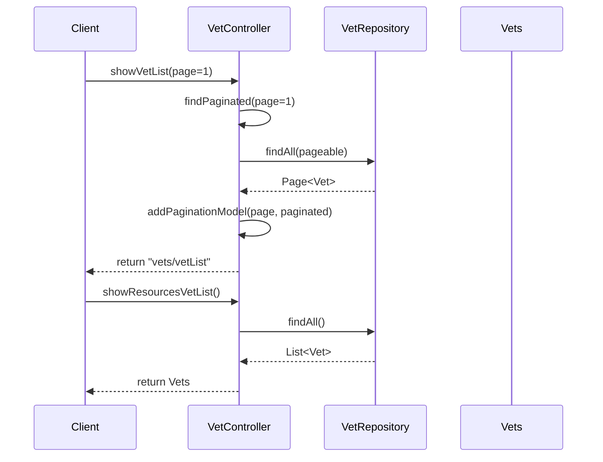

# Service Code Documentation

## 1. Overall Structure

### High-Level Overview
The provided service code is part of a Spring MVC application that manages veterinary information. It primarily consists of a controller class, `VetController`, which handles HTTP requests related to veterinarians. The controller interacts with a repository, `VetRepository`, to fetch and manipulate data related to vets.

### Purpose and Function
The `VetController` class serves as the entry point for web requests concerning veterinarians. It provides endpoints to display a paginated list of vets and to return a complete list of vets in JSON format. The controller leverages Spring's MVC framework to handle requests and responses.

### Interaction Between Parts
- **VetController**: Handles incoming HTTP requests and interacts with the `VetRepository` to retrieve vet data.
- **VetRepository**: A Spring Data repository that abstracts the data access layer, allowing the controller to fetch vet data without dealing with the underlying database operations.
- **Model**: Used to pass data to the view layer for rendering.

### Mermaid Diagram


## 2. Strategy Pattern Implementation

### Strategy Pattern Overview
The strategy pattern is not explicitly implemented in the provided code. However, if we were to extend this codebase to include different strategies for vet retrieval (e.g., by specialty, by location), we could define a strategy interface and concrete strategy classes.

### Strategy Interface and Concrete Strategy Classes
- **Strategy Interface**: `VetRetrievalStrategy`
  - Method: `List<Vet> retrieveVets()`
  
- **Concrete Strategy Classes**:
  - `AllVetsStrategy`: Retrieves all vets.
  - `SpecialtyVetsStrategy`: Retrieves vets by specialty.
  - `LocationVetsStrategy`: Retrieves vets by location.

### Context Class
- **Context Class**: `VetService`
  - Uses a `VetRetrievalStrategy` to retrieve vets based on the selected strategy.

### Class Diagram


## 3. Detailed Component Documentation

### a. Classes

#### Class: VetController
- **Purpose**: Handles HTTP requests related to veterinarians.
- **Attributes**:
  - `vetRepository`: An instance of `VetRepository` used to access vet data.
- **Role in System**: Acts as a bridge between the web layer and the data layer, processing requests and returning appropriate views or data.
- **Relationships**: 
  - Uses `VetRepository` to fetch vet data.
  - Creates instances of `Vets` to return data.

#### Class: VetRepository
- **Purpose**: Data access layer for veterinarians.
- **Attributes**: None (interface).
- **Role in System**: Provides methods to retrieve vet data from the database.
- **Relationships**: 
  - Used by `VetController`.

#### Class: Vets
- **Purpose**: A wrapper class for a list of `Vet` objects.
- **Attributes**:
  - `vetList`: A list that holds `Vet` objects.
- **Role in System**: Simplifies the mapping of vet data for JSON/XML responses.
- **Relationships**: 
  - Contains a list of `Vet` objects.

### b. Methods and Functions

#### Method: showVetList
- **Purpose**: Displays a paginated list of veterinarians.
- **Parameters**:
  - `page` (int): The page number to display (default is 1).
  - `model` (Model): The model to hold attributes for the view.
- **Return Value**: String - the name of the view to render.
- **Code Example**:
  ```java
  String viewName = vetController.showVetList(1, model);
  ```

#### Method: addPaginationModel
- **Purpose**: Adds pagination attributes to the model.
- **Parameters**:
  - `page` (int): The current page number.
  - `paginated` (Page<Vet>): The paginated list of vets.
  - `model` (Model): The model to hold attributes for the view.
- **Return Value**: String - the name of the view to render.
- **Code Example**:
  ```java
  String viewName = vetController.addPaginationModel(1, paginated, model);
  ```

#### Method: findPaginated
- **Purpose**: Retrieves a paginated list of veterinarians.
- **Parameters**:
  - `page` (int): The page number to retrieve.
- **Return Value**: Page<Vet> - a page containing a list of vets.
- **Code Example**:
  ```java
  Page<Vet> paginatedVets = vetController.findPaginated(1);
  ```

#### Method: showResourcesVetList
- **Purpose**: Returns a JSON representation of all veterinarians.
- **Parameters**: None.
- **Return Value**: Vets - an object containing a list of all vets.
- **Code Example**:
  ```java
  Vets allVets = vetController.showResourcesVetList();
  ```

## 4. Implementation Flow

### Sequence Diagram


This documentation provides a comprehensive overview of the service code, detailing its structure, strategy pattern implementation, component details, and the flow of execution. It aims to assist developers in understanding and working with the code effectively.