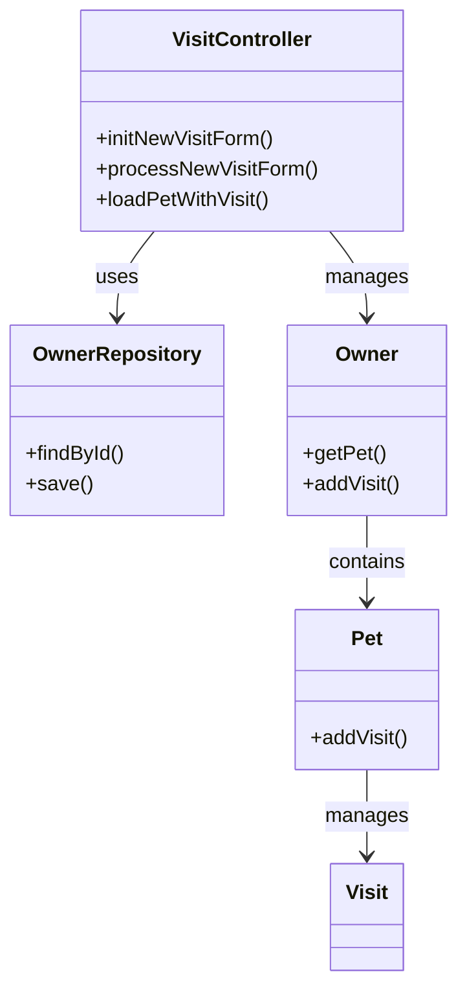
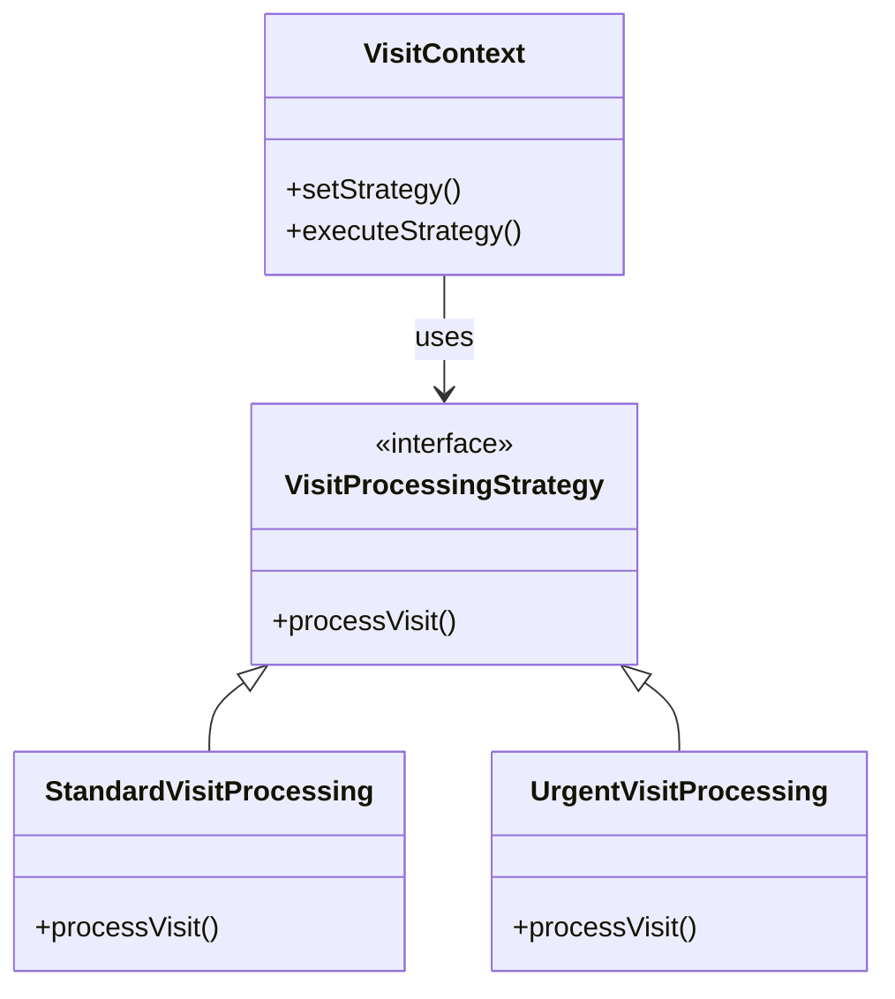
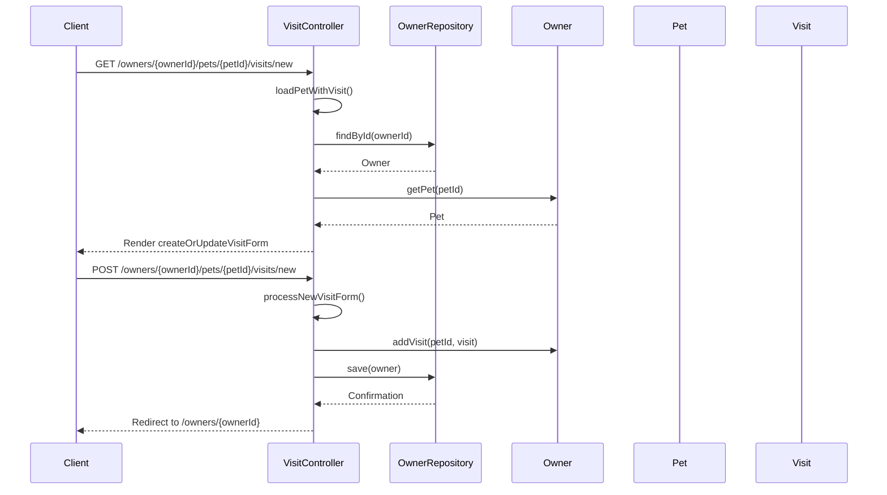

# Service Code Documentation

## 1. Overall Structure

### High-Level Overview
The provided code is part of a Spring MVC application that manages pet visits in a veterinary clinic. The `VisitController` class handles HTTP requests related to creating and processing visits for pets owned by clients. It interacts with the `OwnerRepository` to retrieve and save owner and pet data.

### Purpose and Function
The `VisitController` is responsible for:
- Initializing forms for new visits.
- Processing the submission of visit forms.
- Validating input data and managing the relationships between owners, pets, and visits.

### Interaction Between Parts
- The `VisitController` uses the `OwnerRepository` to access owner data.
- It employs Spring's `@ModelAttribute` to prepare data for the view before rendering forms.
- The controller methods handle GET and POST requests to manage the visit creation process.

### Mermaid Diagram


## 2. Strategy Pattern Implementation

### Strategy Pattern Overview
The strategy pattern is not explicitly implemented in the provided code. However, if we were to extend this functionality, we could define different strategies for processing visits based on various criteria (e.g., visit type, urgency).

### Strategy Interface and Concrete Strategy Classes
- **Strategy Interface**: `VisitProcessingStrategy`
- **Concrete Strategies**: `StandardVisitProcessing`, `UrgentVisitProcessing`

### Context Class
- **Context Class**: `VisitContext`
  - Uses the strategy interface to delegate the processing of visits based on the selected strategy.

### Class Diagram


## 3. Detailed Component Documentation

### a. Classes

#### Class: VisitController
- **Purpose**: Manages visit-related HTTP requests.
- **Attributes**:
  - `owners`: An instance of `OwnerRepository` used to access owner data.
- **Role**: Acts as a controller in the MVC pattern, coordinating between the view and the model.
- **Relationships**: 
  - Uses `OwnerRepository` to retrieve and save owner data.

#### Class: OwnerRepository
- **Purpose**: Interface for accessing owner data.
- **Methods**:
  - `findById(int id)`: Retrieves an owner by their ID.
  - `save(Owner owner)`: Saves the updated owner data.

#### Class: Owner
- **Purpose**: Represents a pet owner.
- **Methods**:
  - `getPet(int petId)`: Retrieves a pet by its ID.
  - `addVisit(int petId, Visit visit)`: Adds a visit to a specific pet.

#### Class: Pet
- **Purpose**: Represents a pet owned by an owner.
- **Methods**:
  - `addVisit(Visit visit)`: Adds a visit to the pet's visit history.

#### Class: Visit
- **Purpose**: Represents a visit for a pet.

### b. Methods and Functions

#### Method: initNewVisitForm
- **Purpose**: Initializes the form for creating a new visit.
- **Parameters**: None
- **Return Value**: `String` - the view name for the visit form.
- **Code Example**:
  ```java
  @GetMapping("/owners/{ownerId}/pets/{petId}/visits/new")
  public String initNewVisitForm() {
      return "pets/createOrUpdateVisitForm";
  }
  ```

#### Method: processNewVisitForm
- **Purpose**: Processes the submitted visit form.
- **Parameters**:
  - `@ModelAttribute Owner owner`: The owner associated with the visit.
  - `@PathVariable int petId`: The ID of the pet.
  - `@Valid Visit visit`: The visit object to be validated.
  - `BindingResult result`: Holds validation results.
  - `RedirectAttributes redirectAttributes`: Used to pass flash attributes.
- **Return Value**: `String` - the redirect URL after processing.
- **Code Example**:
  ```java
  @PostMapping("/owners/{ownerId}/pets/{petId}/visits/new")
  public String processNewVisitForm(@ModelAttribute Owner owner, @PathVariable int petId, 
                                     @Valid Visit visit, BindingResult result, 
                                     RedirectAttributes redirectAttributes) {
      if (result.hasErrors()) {
          return "pets/createOrUpdateVisitForm";
      }
      owner.addVisit(petId, visit);
      this.owners.save(owner);
      redirectAttributes.addFlashAttribute("message", "Your visit has been booked");
      return "redirect:/owners/{ownerId}";
  }
  ```

## 4. Implementation Flow

### Sequence Diagram


This documentation provides a comprehensive overview of the `VisitController` class and its interactions within the Spring MVC application, including the potential for implementing the strategy pattern for visit processing.