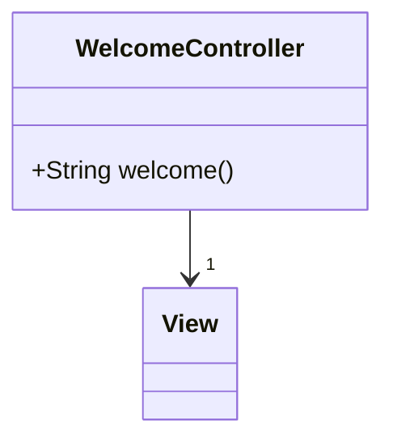
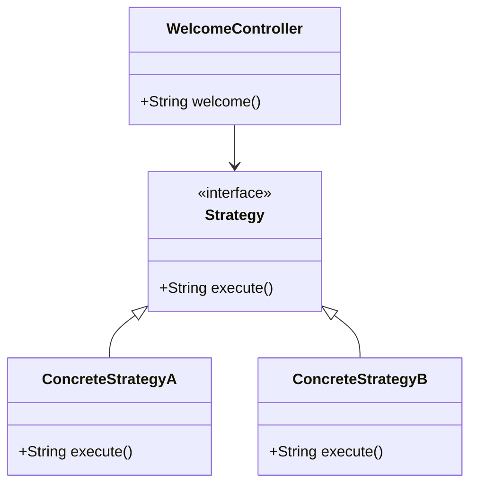
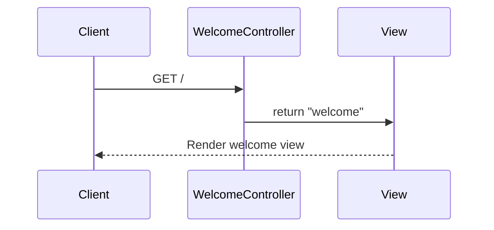

# Service Code Documentation

## 1. Overall Structure

### High-Level Overview
The provided codebase is a simple Spring MVC application that serves as a welcome page for a web application. It utilizes the Spring Framework's capabilities to handle HTTP requests and responses.

### Purpose and Function of Service Code
The primary purpose of the `WelcomeController` class is to handle HTTP GET requests directed at the root URL ("/"). When a user accesses this URL, the controller responds by returning a view named "welcome". This is a common pattern in web applications where controllers manage the flow of data between the user interface and the backend logic.

### Interaction Between Different Parts of the Code
- The `WelcomeController` class is annotated with `@Controller`, indicating that it is a Spring MVC controller.
- The `@GetMapping("/")` annotation maps HTTP GET requests for the root URL to the `welcome()` method.
- The `welcome()` method returns a string that corresponds to the name of the view to be rendered, which in this case is "welcome".

### Mermaid Diagram


## 2. Strategy Pattern Implementation

### Strategy Pattern Overview
The provided code does not explicitly implement the Strategy Pattern. However, if we were to extend this application to include different strategies for handling various types of requests or responses, we could define a strategy interface and concrete strategy classes.

### Strategy Interface and Concrete Strategy Classes
- **Strategy Interface**: This would define a method that all concrete strategies must implement.
- **Concrete Strategy Classes**: These classes would implement the strategy interface, providing specific behaviors for different scenarios.

### Context Class
The context class would be the `WelcomeController`, which would use the strategies to determine how to respond to requests.

### Class Diagram


## 3. Detailed Component Documentation

### a. Classes

#### Class: WelcomeController
- **Purpose**: Handles HTTP GET requests for the root URL and returns the welcome view.
- **Attributes**: None (stateless controller).
- **Role in the Larger System**: Acts as the entry point for users accessing the application, directing them to the welcome page.
- **Relationships**: None directly, but it interacts with the view layer.

### b. Methods and Functions

#### Method: welcome
- **Purpose**: Responds to GET requests at the root URL by returning the welcome view.
- **Parameters**: None.
- **Return Value**: `String` - the name of the view to be rendered ("welcome").
- **Code Example**:
```java
@GetMapping("/")
public String welcome() {
    return "welcome";
}
```

## 4. Implementation Flow

### Sequence Diagram


### Explanation of the Sequence Diagram
1. The client sends a GET request to the root URL ("/").
2. The `WelcomeController` receives the request and invokes the `welcome()` method.
3. The `welcome()` method returns the string "welcome", indicating the view to be rendered.
4. The view layer processes this string and renders the welcome page back to the client.

This documentation provides a comprehensive overview of the service code, its structure, and its functionality, making it easier for both new and experienced developers to understand and work with the code effectively.