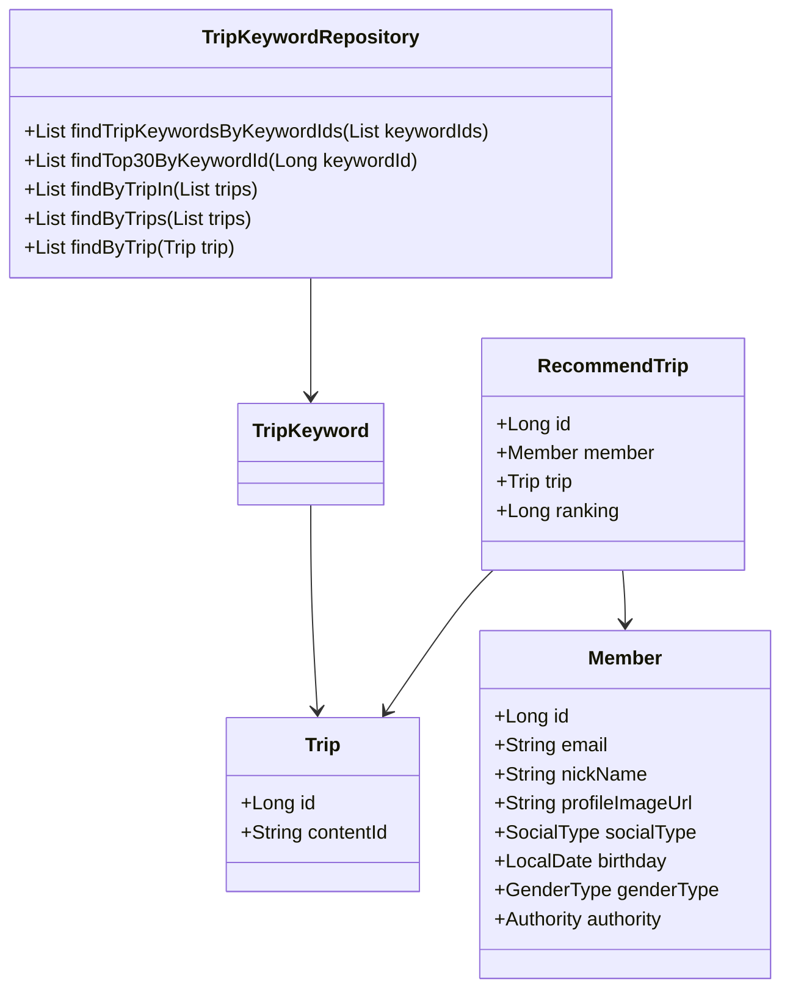
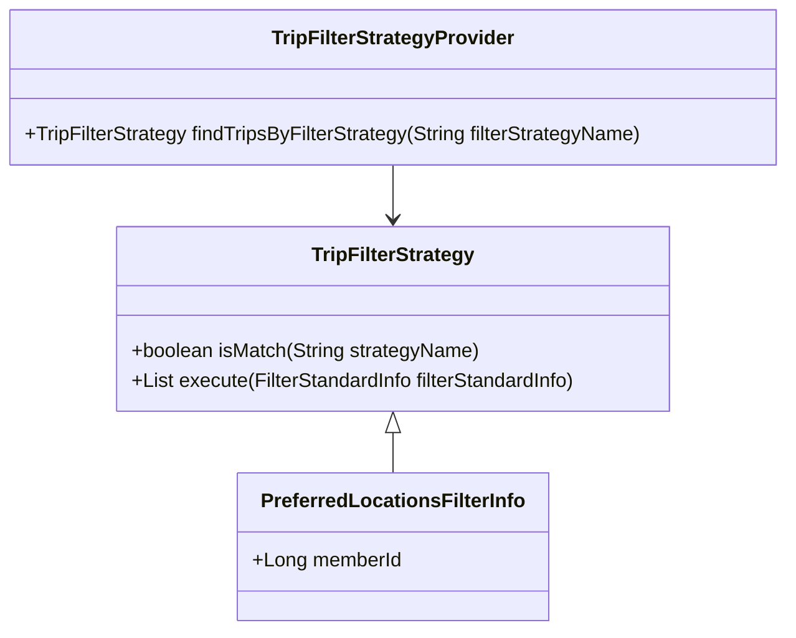
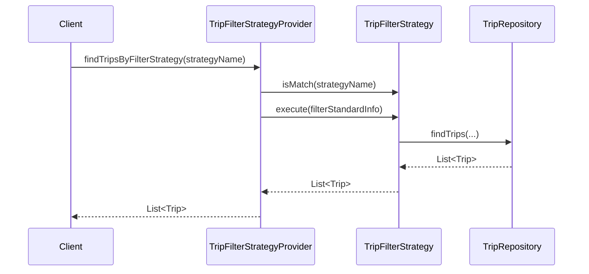
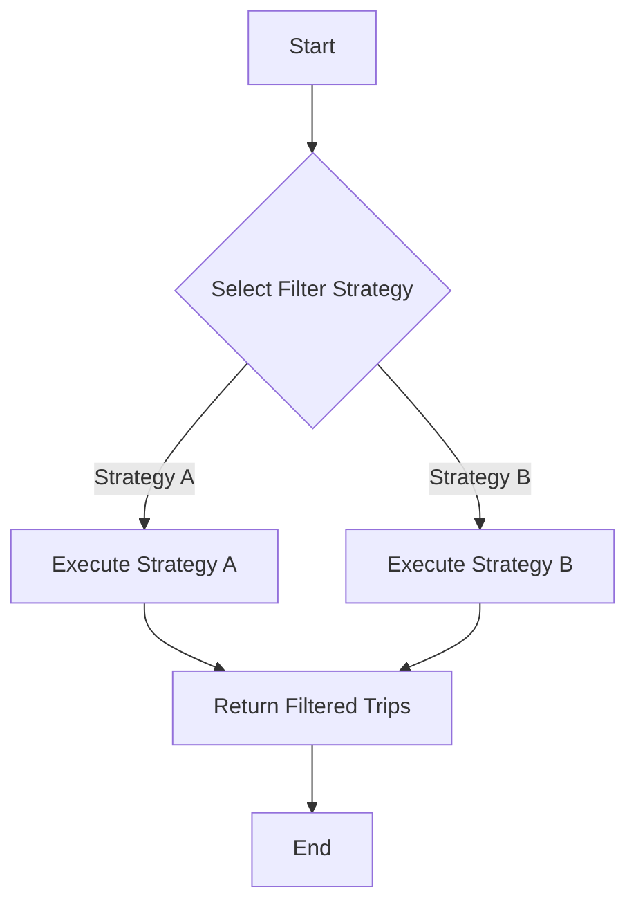

# Comprehensive Documentation for the Codebase

## 1. Overall Structure

### High-Level Overview
The codebase is structured around a travel recommendation system, utilizing Spring Data JPA for database interactions. It consists of several modules, each responsible for different aspects of the application, including domain models, repositories, exceptions, and DTOs (Data Transfer Objects).

### Purpose and Function of Each File/Module
- **Domain Models**: Represent the core entities of the application, such as `Member`, `Trip`, `RecommendTrip`, and `TripKeyword`.
- **Repositories**: Interfaces that extend `JpaRepository` to provide CRUD operations and custom queries for the domain models.
- **DTOs**: Classes used to transfer data between the client and server, such as `RecommendTripCreateRequest` and `FindTripsResponse`.
- **Exceptions**: Custom exceptions to handle specific error scenarios, such as `NoExistMemberException` and `NoExistTripException`.
- **Filter Strategies**: Interfaces and classes implementing the Strategy pattern to filter trips based on different criteria.

### Interaction Between Components
- The `Member`, `Trip`, and `RecommendTrip` entities are interconnected through relationships defined in their respective classes.
- Repositories interact with the database to perform operations on these entities.
- The `TripFilterStrategy` interface and its implementations allow for dynamic filtering of trips based on user preferences.

### Mermaid Diagram


## 2. Strategy Pattern Implementation

### Strategy Pattern Overview
The strategy pattern is implemented to allow dynamic selection of trip filtering strategies based on user preferences. This enables the application to adapt to different filtering criteria without modifying the core logic.

### Strategy Interface and Concrete Strategy Classes
- **TripFilterStrategy**: An interface defining the contract for filtering strategies.
    - **Methods**:
        - `boolean isMatch(final String strategyName)`: Checks if the strategy matches the given name.
        - `List<Trip> execute(final FilterStandardInfo filterStandardInfo)`: Executes the filtering logic based on the provided information.

### Context Class
- **TripFilterStrategyProvider**: This class acts as a context that holds a list of strategies and provides a method to find the appropriate strategy based on the filter name.

### Class Diagram


## 3. Detailed Component Documentation

### a. Classes

#### TripKeywordRepository
- **Purpose**: Interface for CRUD operations on `TripKeyword` entities.
- **Attributes**: None (inherited from `JpaRepository`).
- **Role**: Provides methods to retrieve trip keywords based on various criteria.
- **Relationships**: Interacts with `TripKeyword` and `Trip`.

#### Member
- **Purpose**: Represents a user/member in the system.
- **Attributes**:
    - `Long id`: Unique identifier for the member.
    - `String email`: Email address of the member.
    - `String nickName`: Nickname of the member.
    - `String profileImageUrl`: URL of the member's profile image.
    - `SocialType socialType`: Type of social login used.
    - `LocalDate birthday`: Member's birthday.
    - `GenderType genderType`: Member's gender.
    - `Authority authority`: Member's authority level.
- **Role**: Core entity representing a user in the system.
- **Relationships**: Related to `RecommendTrip`.

#### RecommendTrip
- **Purpose**: Represents a recommended trip for a member.
- **Attributes**:
    - `Long id`: Unique identifier for the recommendation.
    - `Member member`: The member associated with the recommendation.
    - `Trip trip`: The trip being recommended.
    - `Long ranking`: Ranking of the recommendation.
- **Role**: Holds the relationship between members and their recommended trips.
- **Relationships**: Related to `Member` and `Trip`.

### b. Methods and Functions

#### TripKeywordRepository Methods
- **findTripKeywordsByKeywordIds**
    - **Purpose**: Retrieve trip keywords by a list of keyword IDs.
    - **Parameters**: 
        - `List<Long> keywordIds`: List of keyword IDs to search for.
    - **Return Value**: `List<TripKeyword>`: List of matching trip keywords.
  
- **findTop30ByKeywordId**
    - **Purpose**: Retrieve the top 30 trip keywords by keyword ID.
    - **Parameters**: 
        - `Long keywordId`: The keyword ID to search for.
    - **Return Value**: `List<TripKeyword>`: List of top 30 trip keywords.

#### Member Methods
- **changePrivilege**
    - **Purpose**: Change the authority level of the member.
    - **Parameters**: 
        - `Authority authority`: New authority level to set.
    - **Return Value**: None.
  
- **validateEmail**
    - **Purpose**: Validate the format of the email address.
    - **Parameters**: 
        - `String email`: Email address to validate.
    - **Return Value**: None (throws exception if invalid).

### c. Usage Examples

#### Using TripKeywordRepository
```java
@Autowired
private TripKeywordRepository tripKeywordRepository;

public void exampleUsage() {
    List<Long> keywordIds = Arrays.asList(1L, 2L, 3L);
    List<TripKeyword> tripKeywords = tripKeywordRepository.findTripKeywordsByKeywordIds(keywordIds);
    // Process tripKeywords...
}
```

#### Switching Between Strategies
```java
@Autowired
private TripFilterStrategyProvider strategyProvider;

public void filterTrips(String strategyName, Long memberId) {
    FilterStandardInfo filterInfo = new PreferredLocationsFilterInfo(memberId);
    TripFilterStrategy strategy = strategyProvider.findTripsByFilterStrategy(strategyName);
    List<Trip> filteredTrips = strategy.execute(filterInfo);
    // Process filteredTrips...
}
```

### d. Important Variables

- **EMAIL_FORMAT**: Pattern used to validate email formats in the `Member` class.
- **MAX_NICK_NAME_LENGTH**: Maximum allowed length for nicknames.
- **MIN_NICK_NAME_LENGTH**: Minimum allowed length for nicknames.

## 4. Implementation Flow

### Sequence Diagram


### Activity Diagram


This documentation provides a comprehensive overview of the codebase, detailing its structure, components, and interactions, while also illustrating the strategy pattern implementation and usage examples. It serves as a guide for both new and experienced developers to understand and work with the code effectively.
