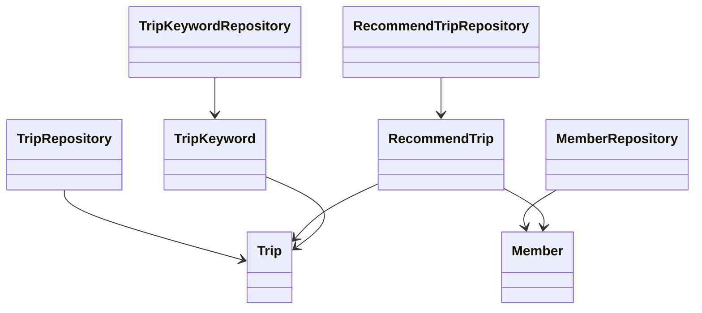
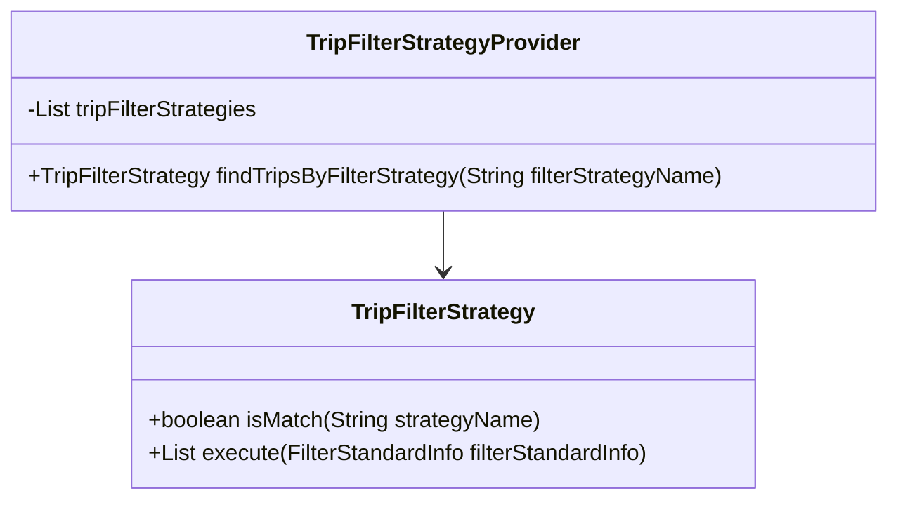
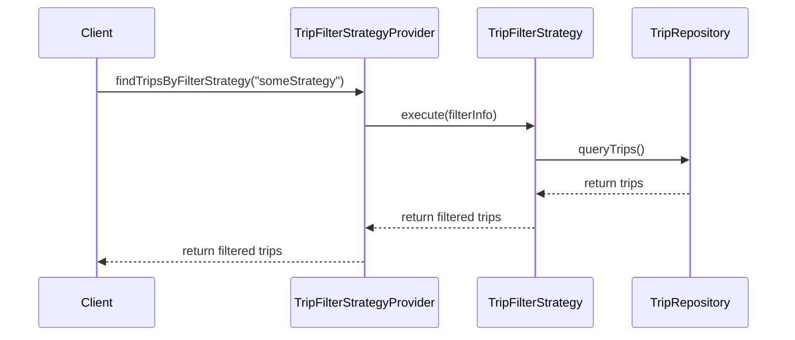

# Comprehensive Documentation for the Codebase

## 1. Overall Structure

### High-Level Overview
The codebase is structured around a domain-driven design, focusing on managing trips, members, and their interactions through various repositories and services. The main components include:

- **Domain Models**: Represent the core entities such as `Member`, `Trip`, `RecommendTrip`, and `TripKeyword`.
- **Repositories**: Interfaces for data access using Spring Data JPA, such as `TripKeywordRepository`, `MemberRepository`, and `RecommendTripRepository`.
- **DTOs**: Data Transfer Objects like `RecommendTripCreateRequest` and `FindTripsResponse` for transferring data between layers.
- **Exceptions**: Custom exceptions for handling specific error scenarios, e.g., `NoExistMemberException` and `NoExistTripException`.
- **Filter Strategies**: Implementations of the Strategy Pattern for filtering trips based on different criteria.

### Purpose and Function of Service
The service layer is responsible for implementing business logic and orchestrating interactions between the repositories and the domain models. It handles operations such as creating, retrieving, and managing trips and members, ensuring that the application adheres to business rules.

### Interaction Between Components
- **Repositories** interact with the database to perform CRUD operations on domain models.
- **Domain Models** represent the core entities and encapsulate business logic.
- **DTOs** are used to transfer data between the service layer and the presentation layer.
- **Exceptions** are thrown to handle error scenarios gracefully.
- **Filter Strategies** allow for flexible querying of trips based on various criteria.

### Class Relationships Diagram


## 2. Strategy Pattern Implementation

### Strategy Pattern Overview
The Strategy Pattern is implemented to allow dynamic selection of filtering strategies for trips. This enables the application to apply different filtering criteria without modifying the core logic.

### Strategy Interface and Concrete Strategy Classes
- **Strategy Interface**: `TripFilterStrategy`
  - Method `isMatch(String strategyName)`: Determines if the strategy matches the given name.
  - Method `execute(FilterStandardInfo filterStandardInfo)`: Executes the filtering logic based on the provided information.

- **Concrete Strategy Classes**: Various implementations of `TripFilterStrategy` can be created to handle different filtering criteria.

### Context Class
- **TripFilterStrategyProvider**: This class acts as the context that holds a list of strategies and provides a method to find the appropriate strategy based on the filter name.

### Class Diagram for Strategy Pattern


## 3. Detailed Component Documentation

### a. Classes

#### TripKeywordRepository
- **Purpose**: Interface for accessing `TripKeyword` entities.
- **Attributes**: None (inherited from `JpaRepository`).
- **Role**: Provides methods to query trip keywords based on various criteria.
- **Relationships**: Extends `JpaRepository<TripKeyword, Long>`.

#### Member
- **Purpose**: Represents a member in the system.
- **Attributes**:
  - `Long id`: Unique identifier for the member.
  - `String email`: Email address of the member.
  - `String nickName`: Nickname of the member.
  - `String profileImageUrl`: URL of the member's profile image.
  - `SocialType socialType`: Type of social login used.
  - `LocalDate birthday`: Member's birthday.
  - `GenderType genderType`: Member's gender.
  - `Authority authority`: Member's authority level.
- **Role**: Encapsulates member-related data and validation logic.
- **Relationships**: Inherits from `BaseEntity`.

#### MemberRepository
- **Purpose**: Interface for accessing `Member` entities.
- **Attributes**: None (inherited from `JpaRepository`).
- **Role**: Provides methods to find members by email and nickname.
- **Relationships**: Extends `JpaRepository<Member, Long>`.

#### RecommendTrip
- **Purpose**: Represents a recommended trip for a member.
- **Attributes**:
  - `Long id`: Unique identifier for the recommendation.
  - `Member member`: The member who made the recommendation.
  - `Trip trip`: The trip being recommended.
  - `Long ranking`: Ranking of the recommendation.
- **Role**: Encapsulates the relationship between members and their recommended trips.
- **Relationships**: Many-to-one relationship with `Member` and `Trip`.

#### TripFilterStrategy
- **Purpose**: Interface for defining trip filtering strategies.
- **Attributes**: None.
- **Role**: Provides a contract for implementing different filtering strategies.
- **Relationships**: None.

#### TripFilterStrategyProvider
- **Purpose**: Provides access to various trip filtering strategies.
- **Attributes**:
  - `List<TripFilterStrategy> tripFilterStrategies`: List of available strategies.
- **Role**: Finds and returns the appropriate strategy based on the filter name.
- **Relationships**: Aggregates `TripFilterStrategy`.

### b. Methods and Functions

#### findTripKeywordsByKeywordIds
- **Purpose**: Retrieves trip keywords based on a list of keyword IDs.
- **Parameters**:
  - `List<Long> keywordIds`: List of keyword IDs to filter by.
- **Return Value**: `List<TripKeyword>`: List of matching trip keywords.
- **Side Effects**: None.
- **Example Usage**: 
  ```java
  List<TripKeyword> keywords = tripKeywordRepository.findTripKeywordsByKeywordIds(Arrays.asList(1L, 2L, 3L));
  ```

#### changePrivilege
- **Purpose**: Changes the authority level of the member.
- **Parameters**:
  - `Authority authority`: New authority level to set.
- **Return Value**: None.
- **Side Effects**: Updates the member's authority.
- **Example Usage**: 
  ```java
  member.changePrivilege(Authority.ADMIN);
  ```

## 4. Implementation Flow

### Sequence Diagram


This documentation provides a comprehensive overview of the codebase, detailing the structure, strategy pattern implementation, and specific components, along with their interactions and usage examples. It serves as a guide for both new and experienced developers to understand and work with the code effectively.
