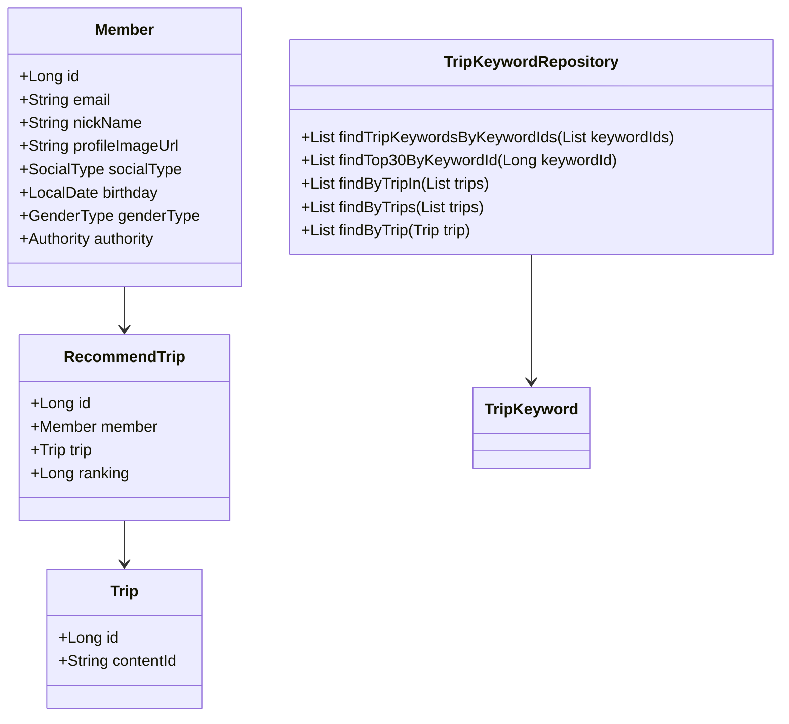
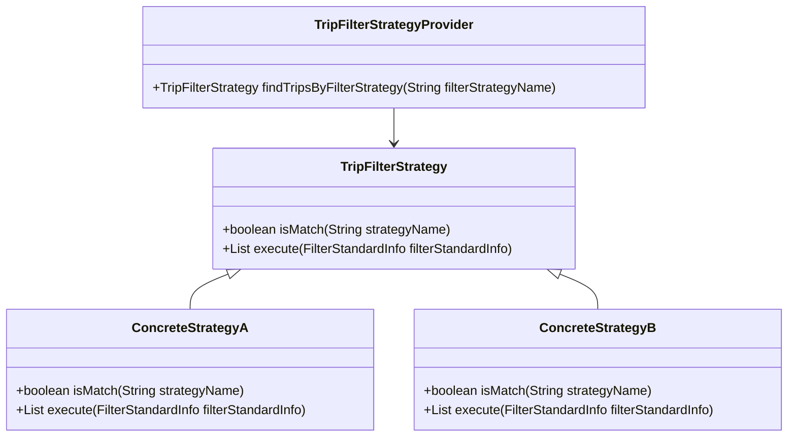
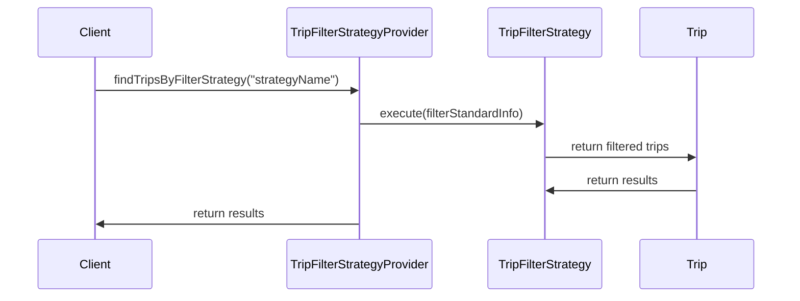

# Documentation for Codebase

## Table of Contents
1. [Overall Structure](#overall-structure)
2. [Strategy Pattern Implementation](#strategy-pattern-implementation)
3. [Detailed Component Documentation](#detailed-component-documentation)
4. [Implementation Flow](#implementation-flow)

---

## 1. Overall Structure

### High-Level Overview
The codebase is structured around a domain-driven design, focusing on various entities related to trips, members, and recommendations. It utilizes Spring Data JPA for repository management and follows a layered architecture.

### Purpose and Function of Service
The service layer is responsible for business logic and orchestrating interactions between repositories and other components. It ensures that the application adheres to business rules and manages transactions.

### Interaction Between Different Parts
- **Repositories**: Interfaces that extend `JpaRepository` to provide CRUD operations for entities like `Member`, `Trip`, `RecommendTrip`, and `TripKeyword`.
- **Entities**: Classes representing the core data model, such as `Member`, `Trip`, and `RecommendTrip`.
- **DTOs**: Data Transfer Objects like `FindTripsResponse` and `RecommendTripCreateRequest` facilitate data exchange between layers.
- **Exceptions**: Custom exceptions handle specific error scenarios, such as `NoExistMemberException` and `NoExistTripException`.

### Class Relationships

---

## 2. Strategy Pattern Implementation

### Strategy Pattern Overview
The strategy pattern is implemented to allow dynamic selection of filtering strategies for trips based on different criteria. This promotes flexibility and adherence to the Open/Closed Principle.

### Strategy Interface and Concrete Strategy Classes
- **Interface**: `TripFilterStrategy`
  - Method `isMatch(String strategyName)`: Checks if the strategy matches the given name.
  - Method `execute(FilterStandardInfo filterStandardInfo)`: Executes the filtering logic based on the provided information.

- **Concrete Strategies**: Implementations of `TripFilterStrategy` that define specific filtering logic.

### Context Class
- **TripFilterStrategyProvider**: This class acts as a context that holds a list of strategies and provides a method to find the appropriate strategy based on the name.

### Class Diagram

---

## 3. Detailed Component Documentation

### a. Classes

#### TripKeywordRepository
- **Purpose**: Interface for CRUD operations on `TripKeyword` entities.
- **Attributes**: None (inherited from `JpaRepository`).
- **Role**: Provides methods to query trip keywords based on various criteria.
- **Relationships**: Interacts with `TripKeyword` and `Trip`.

#### Member
- **Purpose**: Represents a member in the system.
- **Attributes**:
  - `Long id`: Unique identifier.
  - `String email`: Member's email.
  - `String nickName`: Member's nickname.
  - `String profileImageUrl`: URL of the member's profile image.
  - `SocialType socialType`: Type of social login.
  - `LocalDate birthday`: Member's birthday.
  - `GenderType genderType`: Member's gender.
  - `Authority authority`: Member's authority level.
- **Role**: Core entity representing a user in the system.
- **Relationships**: Related to `RecommendTrip`.

#### RecommendTrip
- **Purpose**: Represents a recommended trip for a member.
- **Attributes**:
  - `Long id`: Unique identifier.
  - `Member member`: The member who recommended the trip.
  - `Trip trip`: The trip being recommended.
  - `Long ranking`: Ranking of the recommendation.
- **Role**: Links members to their recommended trips.
- **Relationships**: Related to `Member` and `Trip`.

### b. Methods and Functions

#### findTripKeywordsByKeywordIds
- **Purpose**: Retrieves trip keywords based on a list of keyword IDs.
- **Parameters**:
  - `List<Long> keywordIds`: List of keyword IDs to search for.
- **Return Value**: `List<TripKeyword>`: List of matching trip keywords.
- **Side Effects**: None.
- **Example**: `tripKeywordRepository.findTripKeywordsByKeywordIds(Arrays.asList(1L, 2L));`

#### validateEmail
- **Purpose**: Validates the format of an email address.
- **Parameters**:
  - `String email`: Email address to validate.
- **Return Value**: None (throws exception if invalid).
- **Side Effects**: Throws `InvalidEmailFormatException` if the email format is incorrect.
- **Example**: `validateEmail("test@example.com");`

---

## 4. Implementation Flow

### Sequence Diagram

