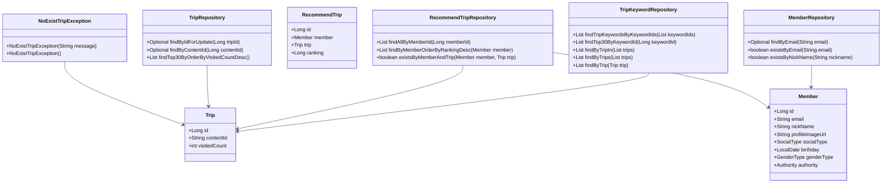
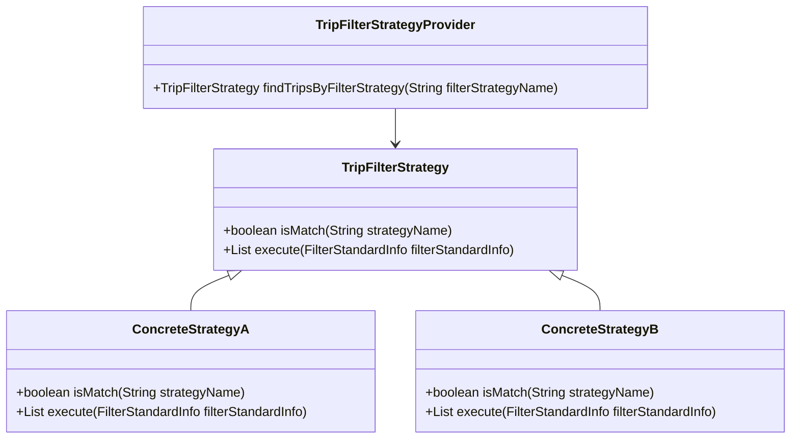
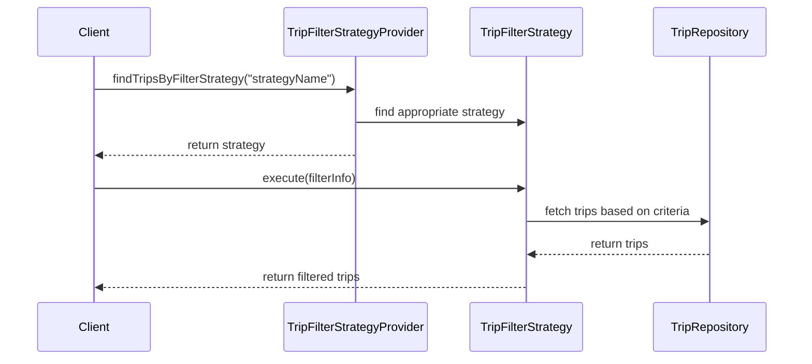

# Comprehensive Documentation for Service Code

## 1. Overall Structure

### High-Level Overview
The codebase is structured into several packages, each serving a specific domain within the application. The main packages include:
- `moheng.keyword.domain.repository`: Contains repositories related to trip keywords.
- `moheng.member.domain`: Contains member-related entities and repositories.
- `moheng.recommendtrip.domain`: Contains entities and repositories related to recommended trips.
- `moheng.trip.domain`: Contains trip-related entities and repositories.
- `moheng.trip.exception`: Contains custom exceptions related to trips.

### Purpose and Function of Service Code
The service code primarily handles the business logic related to trips, members, and recommendations. It interacts with repositories to perform CRUD operations and applies business rules to ensure data integrity and correctness.

### Interaction Between Different Parts of the Code
- **Repositories**: Interfaces that extend `JpaRepository` to provide data access methods for entities like `Trip`, `Member`, and `RecommendTrip`.
- **Entities**: Classes that represent the data model, such as `Trip`, `Member`, and `RecommendTrip`.
- **Exceptions**: Custom exceptions that handle specific error scenarios, such as `NoExistTripException` for non-existent trips.
- **DTOs**: Data Transfer Objects like `FindTripsResponse` that facilitate data exchange between layers.

### Class Relationships


## 2. Strategy Pattern Implementation

### Strategy Pattern Overview
The strategy pattern is implemented to allow dynamic selection of filtering strategies for trips based on different criteria. This pattern promotes flexibility and reusability of code.

### Strategy Interface and Concrete Strategy Classes
- **Strategy Interface**: `TripFilterStrategy`
  - Method `isMatch(String strategyName)`: Determines if the strategy matches the given name.
  - Method `execute(FilterStandardInfo filterStandardInfo)`: Executes the filtering logic based on the provided information.

- **Concrete Strategy Classes**: Implementations of `TripFilterStrategy` that define specific filtering logic.

### Context Class
- **TripFilterStrategyProvider**: This class acts as a context that holds a list of strategies and provides a method to find the appropriate strategy based on the filter strategy name.

### Class Diagram for Strategy Pattern


## 3. Detailed Component Documentation

### a. Classes

#### 1. Class: `TripKeywordRepository`
- **Purpose**: Repository interface for accessing `TripKeyword` entities.
- **Attributes**: Inherits methods from `JpaRepository`.
- **Role**: Facilitates data access for trip keywords.
- **Relationships**: Works with `TripKeyword` and `Trip` entities.

#### 2. Class: `Member`
- **Purpose**: Represents a member in the system.
- **Attributes**:
  - `Long id`: Unique identifier for the member.
  - `String email`: Email address of the member.
  - `String nickName`: Nickname of the member.
  - `String profileImageUrl`: URL of the member's profile image.
  - `SocialType socialType`: Type of social login.
  - `LocalDate birthday`: Member's birthday.
  - `GenderType genderType`: Member's gender.
  - `Authority authority`: Member's authority level.
- **Role**: Holds member-related data and validation logic.
- **Relationships**: Inherits from `BaseEntity`.

#### 3. Class: `MemberRepository`
- **Purpose**: Repository interface for accessing `Member` entities.
- **Attributes**: Inherits methods from `JpaRepository`.
- **Role**: Facilitates data access for members.

#### 4. Class: `RecommendTrip`
- **Purpose**: Represents a recommended trip for a member.
- **Attributes**:
  - `Long id`: Unique identifier for the recommendation.
  - `Member member`: The member associated with the recommendation.
  - `Trip trip`: The trip being recommended.
  - `Long ranking`: Ranking of the recommendation.
- **Role**: Holds data related to trip recommendations.

#### 5. Class: `RecommendTripRepository`
- **Purpose**: Repository interface for accessing `RecommendTrip` entities.
- **Attributes**: Inherits methods from `JpaRepository`.
- **Role**: Facilitates data access for recommended trips.

#### 6. Class: `Trip`
- **Purpose**: Represents a trip entity.
- **Attributes**: Various attributes related to the trip.
- **Role**: Holds trip-related data.

#### 7. Class: `TripRepository`
- **Purpose**: Repository interface for accessing `Trip` entities.
- **Attributes**: Inherits methods from `JpaRepository`.
- **Role**: Facilitates data access for trips.

#### 8. Class: `NoExistTripException`
- **Purpose**: Custom exception for non-existent trips.
- **Attributes**: Inherits from `RuntimeException`.
- **Role**: Handles error scenarios related to trips.

### b. Methods and Functions

#### Method: `findTripKeywordsByKeywordIds`
- **Purpose**: Retrieves trip keywords based on a list of keyword IDs.
- **Parameters**:
  - `List<Long> keywordIds`: List of keyword IDs to search for.
- **Return Value**: `List<TripKeyword>`: List of matching trip keywords.
- **Side Effects**: None.
- **Example Usage**: 
  ```java
  List<TripKeyword> keywords = tripKeywordRepository.findTripKeywordsByKeywordIds(Arrays.asList(1L, 2L));
  ```

#### Method: `findByEmail`
- **Purpose**: Finds a member by their email address.
- **Parameters**:
  - `String email`: The email address to search for.
- **Return Value**: `Optional<Member>`: The member if found, otherwise empty.
- **Side Effects**: None.
- **Example Usage**: 
  ```java
  Optional<Member> member = memberRepository.findByEmail("example@example.com");
  ```

#### Method: `execute`
- **Purpose**: Executes the filtering logic based on the provided filter information.
- **Parameters**:
  - `FilterStandardInfo filterStandardInfo`: Information used for filtering.
- **Return Value**: `List<Trip>`: List of trips that match the filter criteria.
- **Side Effects**: None.
- **Example Usage**: 
  ```java
  List<Trip> filteredTrips = tripFilterStrategy.execute(new PreferredLocationsFilterInfo(memberId));
  ```

## 4. Implementation Flow

### Sequence Diagram


This documentation provides a comprehensive overview of the service code, including its structure, strategy pattern implementation, detailed component documentation, and the implementation flow. It is designed to assist both new and experienced developers in understanding and working with the code effectively.
