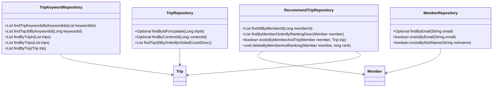
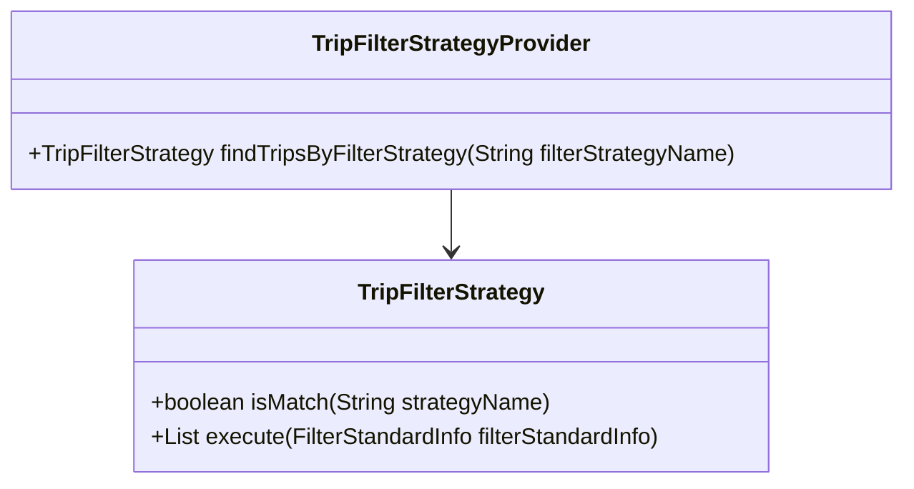
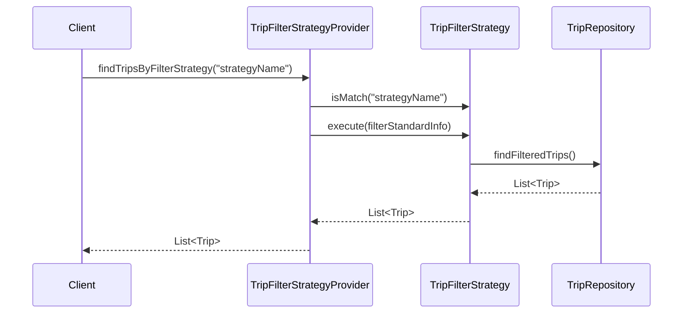

# Comprehensive Documentation for Service Code

## 1. Overall Structure

### High-Level Overview
The codebase is structured into several packages, each serving a specific domain within the application. The main packages include:
- `moheng.keyword`: Contains classes related to keywords associated with trips.
- `moheng.member`: Contains classes related to user members, including their attributes and repository interfaces.
- `moheng.recommendtrip`: Contains classes related to recommending trips based on user preferences and strategies.
- `moheng.trip`: Contains classes related to trip management, including repositories and DTOs.

### Purpose and Function of Service Code
The service code primarily focuses on managing trips and their associations with keywords and members. It provides functionalities such as:
- Retrieving trip keywords based on keyword IDs.
- Managing member information and their recommended trips.
- Implementing filtering strategies for trip recommendations.

### Interaction Between Different Parts
The various components interact through repository interfaces, entities, and DTOs. For example:
- The `TripKeywordRepository` retrieves trip keywords based on specified criteria.
- The `MemberRepository` manages member data and checks for existing members.
- The `RecommendTripRepository` handles the recommended trips for members.
- The `TripFilterStrategyProvider` provides different strategies for filtering trips based on user preferences.

### Class Relationships Diagram


## 2. Strategy Pattern Implementation

### Strategy Pattern Overview
The strategy pattern is implemented to allow dynamic selection of filtering strategies for trips based on user preferences. This enables the application to support multiple filtering criteria without modifying the core logic.

### Strategy Interface and Concrete Strategy Classes
- **Strategy Interface**: `TripFilterStrategy`
    - Method `boolean isMatch(String strategyName)`: Checks if the strategy matches the given name.
    - Method `List<Trip> execute(FilterStandardInfo filterStandardInfo)`: Executes the filtering logic based on the provided information.

- **Concrete Strategy Classes**: Various classes implementing `TripFilterStrategy` would be defined to handle specific filtering logic (not provided in the code snippet).

### Context Class
- **Context Class**: `TripFilterStrategyProvider`
    - This class holds a list of strategies and provides a method to find the appropriate strategy based on the filter name.

### Class Diagram for Strategy Pattern


## 3. Detailed Component Documentation

### a. Classes

#### TripKeywordRepository
- **Purpose**: Interface for accessing trip keywords in the database.
- **Attributes**: None (extends `JpaRepository`).
- **Role**: Provides methods to retrieve trip keywords based on various criteria.
- **Relationships**: Works with `TripKeyword` and `Trip` entities.

#### Member
- **Purpose**: Represents a user member in the system.
- **Attributes**:
  - `Long id`: Unique identifier for the member.
  - `String email`: Email address of the member.
  - `String nickName`: Nickname of the member.
  - `String profileImageUrl`: URL of the member's profile image.
  - `SocialType socialType`: Type of social login used by the member.
  - `LocalDate birthday`: Birthday of the member.
  - `GenderType genderType`: Gender of the member.
  - `Authority authority`: Authority level of the member.
- **Role**: Manages member-related data and validation.
- **Relationships**: Inherits from `BaseEntity`.

#### RecommendTrip
- **Purpose**: Represents a recommended trip for a member.
- **Attributes**:
  - `Long id`: Unique identifier for the recommendation.
  - `Member member`: The member associated with the recommendation.
  - `Trip trip`: The trip being recommended.
  - `Long ranking`: Ranking of the recommendation.
- **Role**: Holds information about recommended trips.
- **Relationships**: Many-to-one relationship with `Member` and `Trip`.

#### TripFilterStrategy
- **Purpose**: Interface for defining trip filtering strategies.
- **Attributes**: None.
- **Role**: Provides a contract for implementing various filtering strategies.
- **Relationships**: Implemented by various concrete strategy classes.

### b. Methods and Functions

#### findTripKeywordsByKeywordIds
- **Purpose**: Retrieves trip keywords based on a list of keyword IDs.
- **Parameters**:
  - `List<Long> keywordIds`: List of keyword IDs to filter by.
- **Return Value**: `List<TripKeyword>`: List of trip keywords matching the provided IDs.
- **Side Effects**: None.
- **Example Usage**:
  ```java
  List<TripKeyword> keywords = tripKeywordRepository.findTripKeywordsByKeywordIds(Arrays.asList(1L, 2L, 3L));
  ```

#### validateEmail
- **Purpose**: Validates the format of the provided email.
- **Parameters**:
  - `String email`: Email to validate.
- **Return Value**: None (throws exception if invalid).
- **Side Effects**: Throws `InvalidEmailFormatException` if the email format is invalid.
- **Example Usage**:
  ```java
  member.validateEmail("test@example.com");
  ```

## 4. Implementation Flow

### Sequence Diagram


This documentation provides a comprehensive overview of the service code, detailing its structure, strategy pattern implementation, and specific components. It serves as a guide for both new and experienced developers to understand and work with the code effectively.
