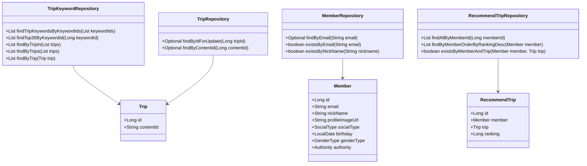
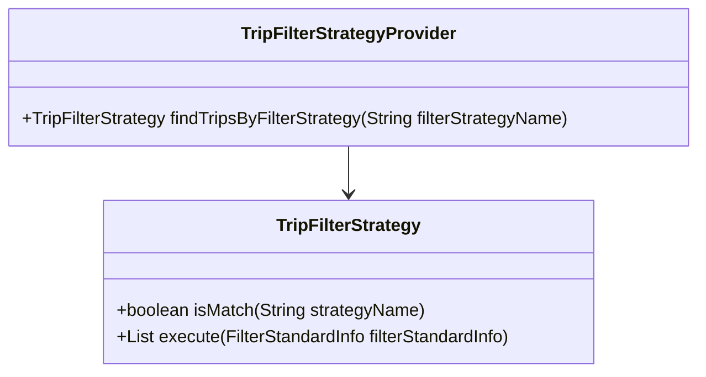
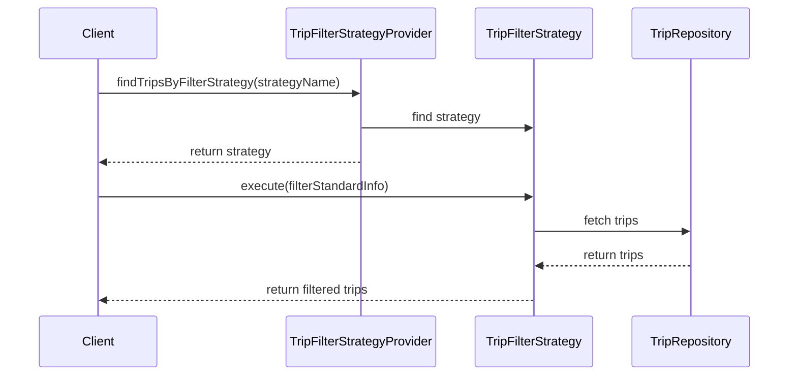

# Comprehensive Documentation for the Service Code

## 1. Overall Structure

### High-Level Overview
The codebase is structured into several packages, each serving a specific domain within the application. The main packages include:
- **domain**: Contains the core business entities and their relationships.
- **repository**: Interfaces for data access using Spring Data JPA.
- **exception**: Custom exceptions for error handling.
- **dto**: Data Transfer Objects for communication between layers.
- **tripfilterstrategy**: Strategy pattern implementation for filtering trips.

### Purpose and Function of Service Code
The service code primarily handles the business logic related to trips, members, and recommendations. It interacts with repositories to fetch data, applies business rules, and manages exceptions.

### Interaction Between Different Parts
- **Entities** (e.g., `Trip`, `Member`, `RecommendTrip`) represent the core data model.
- **Repositories** (e.g., `TripRepository`, `MemberRepository`) provide methods to interact with the database.
- **DTOs** (e.g., `FindTripsResponse`, `RecommendTripCreateRequest`) facilitate data transfer between layers.
- **Exceptions** (e.g., `NoExistTripException`) handle error scenarios gracefully.
- **Strategy Pattern** is implemented to allow dynamic filtering of trips based on different criteria.

### Class Relationships Diagram

## 2. Strategy Pattern Implementation

### Strategy Pattern Overview
The strategy pattern is implemented to allow different filtering strategies for trips. This enables the application to select a filtering method at runtime based on the provided strategy name.

### Strategy Interface and Concrete Strategy Classes
- **Interface**: `TripFilterStrategy`
    - Method `boolean isMatch(final String strategyName)`: Determines if the strategy matches the provided name.
    - Method `List<Trip> execute(final FilterStandardInfo filterStandardInfo)`: Executes the filtering logic.

- **Concrete Strategy Classes**: Implementations of `TripFilterStrategy` would be created for different filtering criteria (not provided in the code snippet).

### Context Class
- **Class**: `TripFilterStrategyProvider`
    - This class holds a list of strategies and provides a method to find the appropriate strategy based on the name.

### Class Diagram for Strategy Pattern

## 3. Detailed Component Documentation

### a. Classes

#### Class: `TripKeywordRepository`
- **Purpose**: Interface for accessing `TripKeyword` entities.
- **Attributes**: None (interface).
- **Role**: Provides methods to query trip keywords based on various criteria.
- **Relationships**: Extends `JpaRepository`.

#### Class: `Member`
- **Purpose**: Represents a member in the system.
- **Attributes**:
  - `Long id`: Unique identifier.
  - `String email`: Member's email.
  - `String nickName`: Member's nickname.
  - `String profileImageUrl`: URL of the member's profile image.
  - `SocialType socialType`: Type of social login.
  - `LocalDate birthday`: Member's birthday.
  - `GenderType genderType`: Member's gender.
  - `Authority authority`: Member's authority level.
- **Role**: Core entity representing a user in the system.
- **Relationships**: Inherits from `BaseEntity`.

#### Class: `MemberRepository`
- **Purpose**: Interface for accessing `Member` entities.
- **Attributes**: None (interface).
- **Role**: Provides methods to find members by email and nickname.
- **Relationships**: Extends `JpaRepository`.

#### Class: `RecommendTrip`
- **Purpose**: Represents a recommended trip for a member.
- **Attributes**:
  - `Long id`: Unique identifier.
  - `Member member`: The member associated with the recommendation.
  - `Trip trip`: The trip being recommended.
  - `Long ranking`: Ranking of the recommendation.
- **Role**: Core entity for managing trip recommendations.
- **Relationships**: Inherits from `BaseEntity`.

#### Class: `RecommendTripRepository`
- **Purpose**: Interface for accessing `RecommendTrip` entities.
- **Attributes**: None (interface).
- **Role**: Provides methods to manage recommendations for members.
- **Relationships**: Extends `JpaRepository`.

#### Class: `Trip`
- **Purpose**: Represents a trip in the system.
- **Attributes**: `Long id`, `String contentId`.
- **Role**: Core entity representing a trip.
- **Relationships**: None specified.

#### Class: `TripRepository`
- **Purpose**: Interface for accessing `Trip` entities.
- **Attributes**: None (interface).
- **Role**: Provides methods to find trips based on various criteria.
- **Relationships**: Extends `JpaRepository`.

### b. Methods and Functions

#### Method: `findTripKeywordsByKeywordIds`
- **Purpose**: Fetches trip keywords based on a list of keyword IDs.
- **Parameters**:
  - `List<Long> keywordIds`: List of keyword IDs to filter by.
- **Return Value**: `List<TripKeyword>`: List of trip keywords matching the provided IDs.
- **Side Effects**: None.
- **Example**: `tripKeywordRepository.findTripKeywordsByKeywordIds(Arrays.asList(1L, 2L));`

#### Method: `findByEmail`
- **Purpose**: Finds a member by their email.
- **Parameters**:
  - `String email`: The email of the member to find.
- **Return Value**: `Optional<Member>`: The member if found, otherwise empty.
- **Side Effects**: None.
- **Example**: `memberRepository.findByEmail("example@example.com");`

#### Method: `execute`
- **Purpose**: Executes the filtering logic based on the strategy.
- **Parameters**:
  - `FilterStandardInfo filterStandardInfo`: Information used for filtering.
- **Return Value**: `List<Trip>`: List of trips that match the filter criteria.
- **Side Effects**: None.
- **Example**: `tripFilterStrategy.execute(new PreferredLocationsFilterInfo(memberId));`

## 4. Implementation Flow

### Sequence Diagram

This documentation provides a comprehensive overview of the service code, detailing its structure, strategy pattern implementation, and the functionality of its components. It serves as a guide for both new and experienced developers to understand and work with the code effectively.
