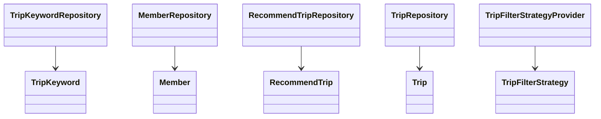
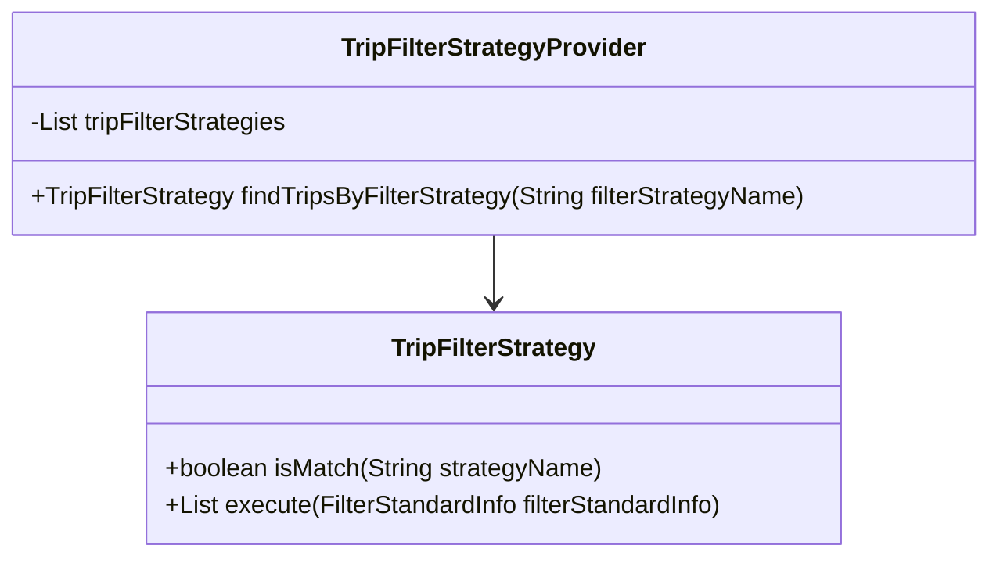
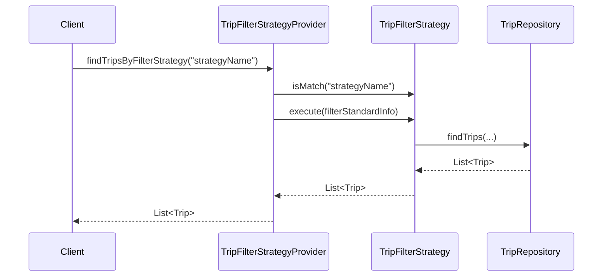

# Comprehensive Documentation for the Service Code

## 1. Overall Structure

### High-Level Overview
The codebase is structured into several packages, each serving a specific domain within the application. The primary packages include:
- `moheng.keyword.domain.repository`: Contains repositories for managing `TripKeyword` entities.
- `moheng.member.domain`: Contains classes related to member management, including the `Member` entity and its repository.
- `moheng.recommendtrip.domain`: Contains classes related to recommending trips, including `RecommendTrip`, its repository, and filtering strategies.
- `moheng.trip.domain`: Contains classes related to trip management, including the `Trip` entity and its repository.

### Purpose and Function of Service Code
The service code primarily handles the business logic related to trips, keywords, and member interactions. It provides a structured way to manage data persistence and retrieval through repositories, while also implementing various strategies for filtering trips based on user preferences.

### Interaction Between Different Parts
- **Repositories**: Each repository interfaces with the database to perform CRUD operations on their respective entities.
- **Entities**: The entities represent the core data models of the application, such as `Trip`, `Member`, and `RecommendTrip`.
- **Filter Strategies**: The filtering strategies allow for dynamic selection of trip recommendations based on different criteria.

### Class Relationships


## 2. Strategy Pattern Implementation

### Strategy Pattern Overview
The strategy pattern is implemented to allow dynamic selection of filtering strategies for trip recommendations. This enables the application to adapt to different filtering criteria without modifying the core logic.

### Strategy Interface and Concrete Strategy Classes
- **Interface**: `TripFilterStrategy`
  - Defines the contract for filtering strategies with methods to check if a strategy matches a name and to execute the filtering logic.
  
- **Concrete Strategies**: Various classes implementing `TripFilterStrategy` would be defined to provide specific filtering logic based on different criteria (not provided in the code snippet).

### Context Class
- **Class**: `TripFilterStrategyProvider`
  - This class acts as the context that uses the strategies. It holds a list of available strategies and provides a method to find a strategy by its name.

### Class Diagram for Strategy Pattern


## 3. Detailed Component Documentation

### a. Classes

#### 1. TripKeywordRepository
- **Purpose**: Interface for managing `TripKeyword` entities.
- **Attributes**: None (inherited from `JpaRepository`).
- **Role**: Provides methods to query `TripKeyword` data from the database.
- **Relationships**: Extends `JpaRepository`.

#### 2. Member
- **Purpose**: Represents a member in the system.
- **Attributes**:
  - `Long id`: Unique identifier for the member.
  - `String email`: Email address of the member.
  - `String nickName`: Nickname of the member.
  - `String profileImageUrl`: URL of the member's profile image.
  - `SocialType socialType`: Type of social login used by the member.
  - `LocalDate birthday`: Member's birthday.
  - `GenderType genderType`: Member's gender.
  - `Authority authority`: Member's authority level.
- **Role**: Represents the member entity and contains validation logic for its attributes.
- **Relationships**: Inherits from `BaseEntity`.

#### 3. MemberRepository
- **Purpose**: Interface for managing `Member` entities.
- **Attributes**: None (inherited from `JpaRepository`).
- **Role**: Provides methods to query `Member` data from the database.
- **Relationships**: Extends `JpaRepository`.

#### 4. RecommendTrip
- **Purpose**: Represents a recommended trip for a member.
- **Attributes**:
  - `Long id`: Unique identifier for the recommendation.
  - `Member member`: The member associated with the recommendation.
  - `Trip trip`: The trip being recommended.
  - `Long ranking`: Ranking of the recommendation.
- **Role**: Represents the recommendation entity and its relationship with members and trips.
- **Relationships**: Inherits from `BaseEntity`.

#### 5. RecommendTripRepository
- **Purpose**: Interface for managing `RecommendTrip` entities.
- **Attributes**: None (inherited from `JpaRepository`).
- **Role**: Provides methods to query `RecommendTrip` data from the database.
- **Relationships**: Extends `JpaRepository`.

#### 6. TripFilterStrategy
- **Purpose**: Interface for defining trip filtering strategies.
- **Attributes**: None.
- **Role**: Provides a contract for implementing various filtering strategies.
- **Relationships**: None.

#### 7. TripFilterStrategyProvider
- **Purpose**: Provides access to available trip filtering strategies.
- **Attributes**:
  - `List<TripFilterStrategy> tripFilterStrategies`: List of available strategies.
- **Role**: Acts as a context for selecting and executing filtering strategies.
- **Relationships**: Contains a list of `TripFilterStrategy`.

### b. Methods and Functions

#### 1. findTripKeywordsByKeywordIds
- **Purpose**: Retrieves `TripKeyword` entities based on a list of keyword IDs.
- **Parameters**:
  - `List<Long> keywordIds`: List of keyword IDs to filter by.
- **Return Value**: `List<TripKeyword>`: List of matching `TripKeyword` entities.
- **Side Effects**: None.
- **Example Usage**:
  ```java
  List<TripKeyword> keywords = tripKeywordRepository.findTripKeywordsByKeywordIds(Arrays.asList(1L, 2L, 3L));
  ```

#### 2. findByEmail
- **Purpose**: Finds a member by their email address.
- **Parameters**:
  - `String email`: The email address to search for.
- **Return Value**: `Optional<Member>`: The member associated with the email, if found.
- **Side Effects**: None.
- **Example Usage**:
  ```java
  Optional<Member> member = memberRepository.findByEmail("example@example.com");
  ```

#### 3. execute (in TripFilterStrategy)
- **Purpose**: Executes the filtering logic based on the provided filter information.
- **Parameters**:
  - `FilterStandardInfo filterStandardInfo`: Information used for filtering.
- **Return Value**: `List<Trip>`: List of trips that match the filter criteria.
- **Side Effects**: None.
- **Example Usage**:
  ```java
  List<Trip> filteredTrips = tripFilterStrategy.execute(new PreferredLocationsFilterInfo(memberId));
  ```

## 4. Implementation Flow

### Sequence Diagram


This documentation provides a comprehensive overview of the service code, detailing its structure, strategy pattern implementation, component documentation, and flow of execution. It serves as a guide for both new and experienced developers to understand and work with the code effectively.
