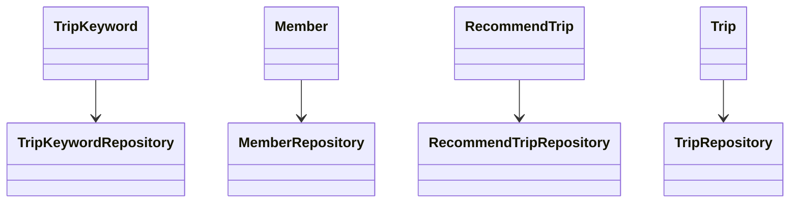
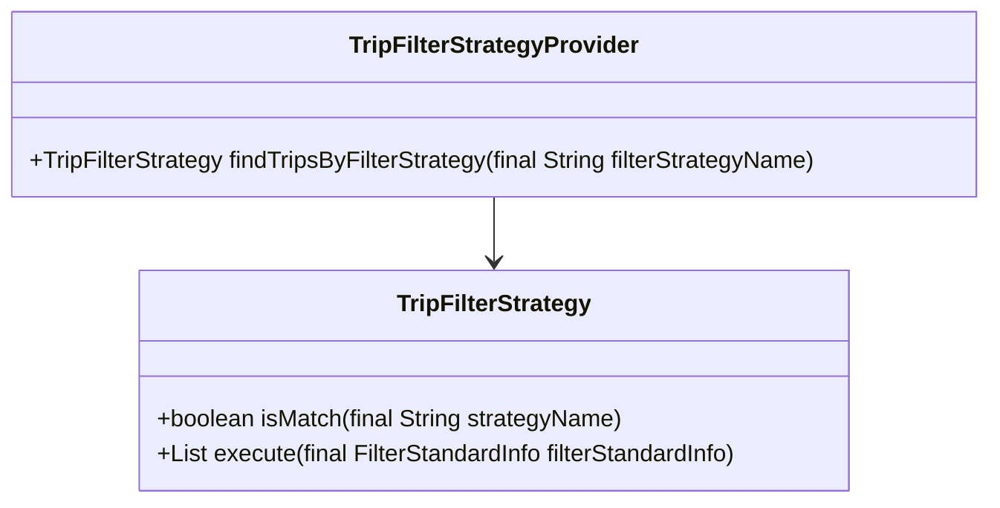
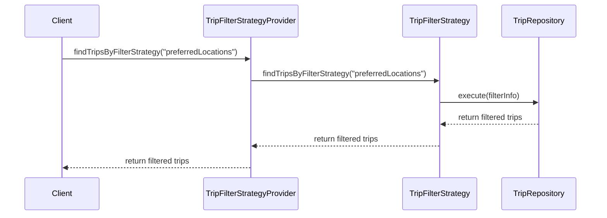

# Comprehensive Documentation for Service Code

## 1. Overall Structure

### High-Level Overview
The codebase is structured into several packages, each serving a specific domain within the application. The primary packages include:

- **domain**: Contains the core business entities and their relationships.
- **repository**: Interfaces for data access, extending Spring Data JPA's `JpaRepository`.
- **exception**: Custom exceptions for handling specific error scenarios.
- **dto**: Data Transfer Objects for transferring data between layers.
- **filterinfo**: Classes that encapsulate filtering criteria for recommendations.
- **tripfilterstrategy**: Strategy pattern implementation for filtering trips based on various criteria.

### Purpose and Function of Service Code
The service code primarily handles the business logic related to trips and their recommendations. It interacts with repositories to fetch data, applies filtering strategies, and manages exceptions. The service layer acts as an intermediary between the controller and the data access layer.

### Interaction Between Different Parts
- **Repositories**: Interfaces like `TripKeywordRepository`, `MemberRepository`, and `RecommendTripRepository` handle data access.
- **Entities**: Classes like `Trip`, `Member`, and `RecommendTrip` represent the core data models.
- **Exceptions**: Custom exceptions like `NoExistTripException` are thrown to handle specific error cases.
- **DTOs**: Classes like `FindTripsResponse` are used to structure the data returned to the client.

### Class-Repositories Relationships


## 2. Strategy Pattern Implementation

### Strategy Pattern Overview
The strategy pattern is implemented to allow dynamic selection of filtering strategies for trips. This enables the application to apply different filtering criteria without modifying the core logic.

### Strategy Interface and Concrete Strategy Classes
- **Interface**: `TripFilterStrategy`
  - **Methods**:
    - `boolean isMatch(final String strategyName)`: Checks if the strategy matches the given name.
    - `List<Trip> execute(final FilterStandardInfo filterStandardInfo)`: Executes the filtering logic based on the provided information.

- **Concrete Strategies**: Various classes implementing `TripFilterStrategy` would define specific filtering logic.

### Context Class
- **Class**: `TripFilterStrategyProvider`
  - **Purpose**: Manages a collection of strategies and provides the appropriate strategy based on the filter name.

### Class Diagram for Strategy Pattern


## 3. Detailed Component Documentation

### a. Classes

#### 1. TripKeywordRepository
- **Purpose**: Interface for accessing `TripKeyword` data.
- **Attributes**: None (interface).
- **Role**: Provides methods to query `TripKeyword` entities from the database.
- **Relationships**: Extends `JpaRepository`.

#### 2. Member
- **Purpose**: Represents a member in the system.
- **Attributes**:
  - `Long id`: Unique identifier.
  - `String email`: Member's email.
  - `String nickName`: Member's nickname.
  - `String profileImageUrl`: URL of the member's profile image.
  - `SocialType socialType`: Type of social login.
  - `LocalDate birthday`: Member's birthday.
  - `GenderType genderType`: Member's gender.
  - `Authority authority`: Member's authority level.
- **Role**: Core entity representing a user in the system.
- **Relationships**: Inherits from `BaseEntity`.

#### 3. MemberRepository
- **Purpose**: Interface for accessing `Member` data.
- **Attributes**: None (interface).
- **Role**: Provides methods to query `Member` entities from the database.
- **Relationships**: Extends `JpaRepository`.

#### 4. NoExistMemberException
- **Purpose**: Custom exception for non-existing members.
- **Attributes**: None.
- **Role**: Used to signal that a requested member does not exist.

#### 5. RecommendTrip
- **Purpose**: Represents a recommended trip for a member.
- **Attributes**:
  - `Long id`: Unique identifier.
  - `Member member`: The member associated with the recommendation.
  - `Trip trip`: The trip being recommended.
  - `Long ranking`: Ranking of the recommendation.
- **Role**: Core entity representing a recommendation.
- **Relationships**: Many-to-one relationship with `Member` and `Trip`.

#### 6. PreferredLocationsFilterInfo
- **Purpose**: Encapsulates filtering criteria for preferred locations.
- **Attributes**:
  - `Long memberId`: ID of the member.
- **Role**: Implements `FilterStandardInfo` for filtering logic.

#### 7. TripFilterStrategy
- **Purpose**: Interface for trip filtering strategies.
- **Attributes**: None (interface).
- **Role**: Defines the contract for filtering strategies.

#### 8. TripFilterStrategyProvider
- **Purpose**: Provides the appropriate filtering strategy.
- **Attributes**:
  - `List<TripFilterStrategy> tripFilterStrategies`: List of available strategies.
- **Role**: Manages and retrieves filtering strategies.

#### 9. RecommendTripRepository
- **Purpose**: Interface for accessing `RecommendTrip` data.
- **Attributes**: None (interface).
- **Role**: Provides methods to query `RecommendTrip` entities from the database.
- **Relationships**: Extends `JpaRepository`.

#### 10. RecommendTripCreateRequest
- **Purpose**: DTO for creating a recommended trip.
- **Attributes**:
  - `Long tripId`: ID of the trip to recommend.
- **Role**: Used to transfer data for creating recommendations.

#### 11. TripRepository
- **Purpose**: Interface for accessing `Trip` data.
- **Attributes**: None (interface).
- **Role**: Provides methods to query `Trip` entities from the database.
- **Relationships**: Extends `JpaRepository`.

#### 12. FindTripsResponse
- **Purpose**: DTO for returning a list of found trips.
- **Attributes**:
  - `List<FindTripResponse> findTripResponses`: List of trip responses.
- **Role**: Structures the response data for trips.

#### 13. NoExistTripException
- **Purpose**: Custom exception for non-existing trips.
- **Attributes**: None.
- **Role**: Used to signal that a requested trip does not exist.

### b. Methods and Functions

#### 1. findTripKeywordsByKeywordIds
- **Purpose**: Fetches trip keywords by their keyword IDs.
- **Parameters**:
  - `List<Long> keywordIds`: List of keyword IDs to search for.
- **Return Value**: `List<TripKeyword>` - List of trip keywords matching the provided IDs.
- **Side Effects**: None.
- **Example Usage**: 
  ```java
  List<TripKeyword> keywords = tripKeywordRepository.findTripKeywordsByKeywordIds(Arrays.asList(1L, 2L));
  ```

#### 2. findByEmail
- **Purpose**: Finds a member by their email.
- **Parameters**:
  - `String email`: Email of the member to find.
- **Return Value**: `Optional<Member>` - The member if found, otherwise empty.
- **Side Effects**: None.
- **Example Usage**: 
  ```java
  Optional<Member> member = memberRepository.findByEmail("example@example.com");
  ```

#### 3. existsByEmail
- **Purpose**: Checks if a member exists by their email.
- **Parameters**:
  - `String email`: Email of the member to check.
- **Return Value**: `boolean` - True if the member exists, false otherwise.
- **Side Effects**: None.
- **Example Usage**: 
  ```java
  boolean exists = memberRepository.existsByEmail("example@example.com");
  ```

#### 4. findAllByMemberId
- **Purpose**: Finds all recommended trips for a member.
- **Parameters**:
  - `Long memberId`: ID of the member.
- **Return Value**: `List<RecommendTrip>` - List of recommended trips for the member.
- **Side Effects**: None.
- **Example Usage**: 
  ```java
  List<RecommendTrip> recommendations = recommendTripRepository.findAllByMemberId(memberId);
  ```

#### 5. execute
- **Purpose**: Executes the filtering logic based on the provided information.
- **Parameters**:
  - `FilterStandardInfo filterStandardInfo`: Information used for filtering.
- **Return Value**: `List<Trip>` - List of trips that match the filter criteria.
- **Side Effects**: None.
- **Example Usage**: 
  ```java
  List<Trip> filteredTrips = tripFilterStrategy.execute(new PreferredLocationsFilterInfo(memberId));
  ```

## 4. Implementation Flow

### Sequence Diagram


This documentation provides a comprehensive overview of the service code, detailing its structure, strategy pattern implementation, and individual components. It serves as a guide for both new and experienced developers to understand and work with the code effectively.
