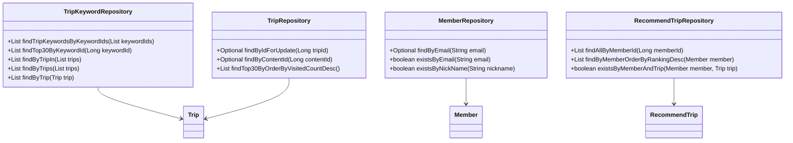
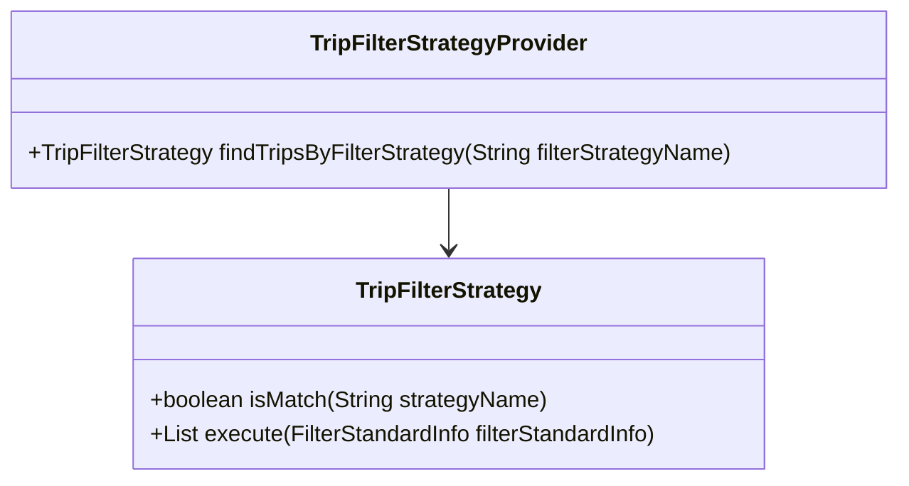
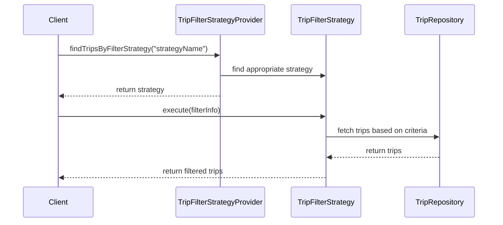

# Comprehensive Documentation for the Service Code

## 1. Overall Structure

### High-Level Overview
The codebase is structured into several packages, each serving a specific domain within the application. The main packages include:

- **domain**: Contains the core business entities and their relationships.
- **repository**: Interfaces for data access, extending Spring Data JPA repositories.
- **exception**: Custom exceptions for handling specific error scenarios.
- **dto**: Data Transfer Objects for transferring data between layers.
- **filterinfo**: Classes that encapsulate filtering criteria for recommendations.
- **tripfilterstrategy**: Strategy pattern implementation for filtering trips based on various criteria.

### Purpose and Function of Service Code
The service code primarily handles the business logic related to trips and recommendations. It interacts with repositories to fetch data, applies filtering strategies, and manages exceptions. The service layer acts as an intermediary between the controller and the repository layers, ensuring that the application adheres to the principles of separation of concerns.

### Interaction Between Different Parts
- **Repositories**: Interfaces like `TripKeywordRepository`, `MemberRepository`, and `RecommendTripRepository` provide methods to interact with the database.
- **Entities**: Classes like `Trip`, `Member`, and `RecommendTrip` represent the core data models.
- **Strategies**: The `TripFilterStrategy` interface and its implementations define various filtering strategies for trips.
- **DTOs**: Classes like `FindTripsResponse` and `RecommendTripCreateRequest` facilitate data transfer between layers.

### Mermaid Diagram

## 2. Strategy Pattern Implementation

### Strategy Pattern Overview
The strategy pattern is implemented to allow dynamic selection of filtering strategies for trips. This enables the application to apply different filtering criteria without modifying the core logic.

### Strategy Interface and Concrete Strategy Classes
- **Interface**: `TripFilterStrategy`
  - Method `boolean isMatch(String strategyName)`: Checks if the strategy matches the given name.
  - Method `List<Trip> execute(FilterStandardInfo filterStandardInfo)`: Executes the filtering logic based on the provided information.

- **Concrete Strategies**: Implementations of `TripFilterStrategy` would define specific filtering logic (not provided in the code).

### Context Class
- **TripFilterStrategyProvider**: This class acts as the context that uses the strategies. It contains a list of strategies and provides a method to find the appropriate strategy based on the filter name.

### Class Diagram

## 3. Detailed Component Documentation

### a. Classes

#### 1. TripKeywordRepository
- **Purpose**: Interface for accessing `TripKeyword` entities.
- **Attributes**: None (interface).
- **Role**: Provides methods to query trip keywords based on various criteria.
- **Relationships**: Extends `JpaRepository`.

#### 2. Member
- **Purpose**: Represents a member in the system.
- **Attributes**:
  - `Long id`: Unique identifier for the member.
  - `String email`: Email address of the member.
  - `String nickName`: Nickname of the member.
  - `String profileImageUrl`: URL of the member's profile image.
  - `SocialType socialType`: Type of social login used.
  - `LocalDate birthday`: Birthday of the member.
  - `GenderType genderType`: Gender of the member.
  - `Authority authority`: Member's authority level.
- **Role**: Encapsulates member-related data and validation logic.
- **Relationships**: Inherits from `BaseEntity`.

#### 3. MemberRepository
- **Purpose**: Interface for accessing `Member` entities.
- **Attributes**: None (interface).
- **Role**: Provides methods to find members by email and nickname.
- **Relationships**: Extends `JpaRepository`.

#### 4. RecommendTrip
- **Purpose**: Represents a recommended trip for a member.
- **Attributes**:
  - `Long id`: Unique identifier for the recommendation.
  - `Member member`: The member associated with the recommendation.
  - `Trip trip`: The trip being recommended.
  - `Long ranking`: Ranking of the recommendation.
- **Role**: Encapsulates the relationship between members and their recommended trips.
- **Relationships**: Many-to-one relationship with `Member` and `Trip`.

#### 5. TripFilterStrategy
- **Purpose**: Interface for defining trip filtering strategies.
- **Attributes**: None (interface).
- **Role**: Provides a contract for implementing various filtering strategies.
- **Relationships**: None.

#### 6. TripFilterStrategyProvider
- **Purpose**: Provides access to filtering strategies.
- **Attributes**:
  - `List<TripFilterStrategy> tripFilterStrategies`: List of available strategies.
- **Role**: Finds and returns the appropriate filtering strategy based on the name.
- **Relationships**: None.

### b. Methods and Functions

#### 1. findTripKeywordsByKeywordIds
- **Purpose**: Fetches trip keywords based on a list of keyword IDs.
- **Parameters**:
  - `List<Long> keywordIds`: List of keyword IDs to filter by.
- **Return Value**: `List<TripKeyword>`: List of trip keywords matching the provided IDs.
- **Side Effects**: None.
- **Example**: `tripKeywordRepository.findTripKeywordsByKeywordIds(Arrays.asList(1L, 2L));`

#### 2. findByEmail
- **Purpose**: Finds a member by their email address.
- **Parameters**:
  - `String email`: The email address to search for.
- **Return Value**: `Optional<Member>`: The member associated with the email, if found.
- **Side Effects**: None.
- **Example**: `memberRepository.findByEmail("example@example.com");`

#### 3. execute
- **Purpose**: Executes the filtering logic based on the provided filter information.
- **Parameters**:
  - `FilterStandardInfo filterStandardInfo`: Information used for filtering.
- **Return Value**: `List<Trip>`: List of trips that match the filtering criteria.
- **Side Effects**: None.
- **Example**: `tripFilterStrategy.execute(new PreferredLocationsFilterInfo(memberId));`

## 4. Implementation Flow

### Sequence Diagram

This documentation provides a comprehensive overview of the service code, detailing its structure, strategy pattern implementation, and individual components. It serves as a guide for both new and experienced developers to understand and work with the code effectively.
