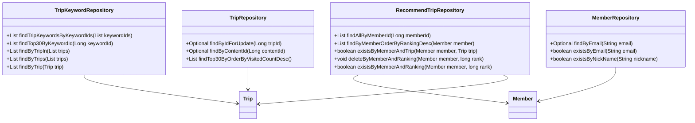
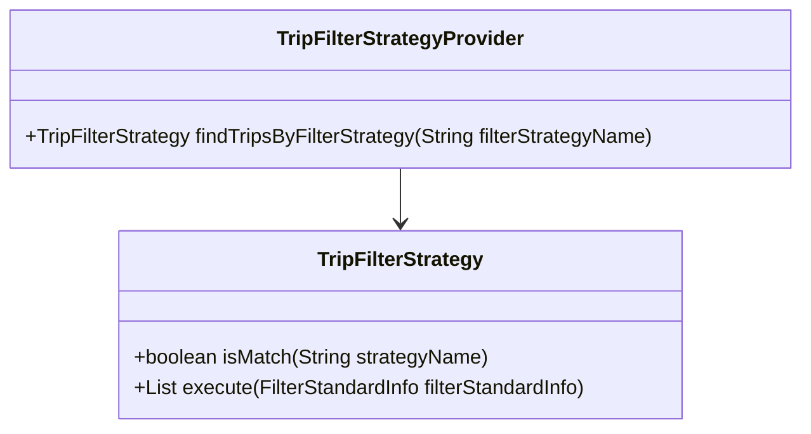
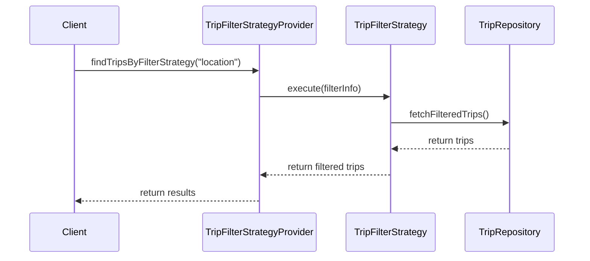

# Comprehensive Documentation for the Service Code

## 1. Overall Structure

### High-Level Overview
The codebase is structured into several packages, each serving a specific domain within the application. The main packages include:
- **domain**: Contains the core business entities and their repositories.
- **repository**: Interfaces for data access, extending Spring Data JPA's `JpaRepository`.
- **exception**: Custom exceptions for handling specific error scenarios.
- **dto**: Data Transfer Objects for transferring data between layers.
- **filterinfo**: Classes that encapsulate filtering criteria for recommendations.
- **tripfilterstrategy**: Strategy pattern implementation for filtering trips based on various criteria.

### Purpose and Function of Service Code
The service code primarily handles the business logic related to trips and their recommendations. It interacts with repositories to fetch, create, and manipulate trip data while ensuring that the application adheres to the defined business rules.

### Interaction Between Different Parts
- **Entities**: Represent the core data models (e.g., `Trip`, `Member`, `RecommendTrip`).
- **Repositories**: Provide methods for data access and manipulation (e.g., `TripRepository`, `MemberRepository`).
- **Services**: Implement business logic and coordinate between repositories and controllers.
- **DTOs**: Facilitate data transfer between layers, especially between the service and presentation layers.
- **Exceptions**: Handle error scenarios gracefully.

### Mermaid Diagram

## 2. Strategy Pattern Implementation

### Strategy Pattern Overview
The strategy pattern is implemented to allow dynamic selection of filtering strategies for trips. This enables the application to apply different filtering criteria without modifying the core logic.

### Strategy Interface and Concrete Strategy Classes
- **TripFilterStrategy**: This interface defines the contract for all filtering strategies.
  - **Methods**:
    - `boolean isMatch(final String strategyName)`: Checks if the strategy matches the given name.
    - `List<Trip> execute(final FilterStandardInfo filterStandardInfo)`: Executes the filtering logic based on the provided information.

### Context Class
- **TripFilterStrategyProvider**: This class acts as a context that holds a list of strategies and provides a method to find the appropriate strategy based on the filter name.

### Class Diagram

## 3. Detailed Component Documentation

### a. Classes

#### TripKeywordRepository
- **Purpose**: Interface for accessing `TripKeyword` entities.
- **Attributes**: None (inherited from `JpaRepository`).
- **Role**: Provides methods to query trip keywords based on various criteria.
- **Relationships**: 
  - Uses `Trip` entity for relationships.

#### Member
- **Purpose**: Represents a member in the system.
- **Attributes**:
  - `Long id`: Unique identifier for the member.
  - `String email`: Email address of the member.
  - `String nickName`: Nickname of the member.
  - `String profileImageUrl`: URL of the member's profile image.
  - `SocialType socialType`: Type of social login used.
  - `LocalDate birthday`: Member's birthday.
  - `GenderType genderType`: Member's gender.
  - `Authority authority`: Member's authority level.
- **Role**: Encapsulates member-related data and validation logic.
- **Relationships**: 
  - Inherits from `BaseEntity`.

#### RecommendTrip
- **Purpose**: Represents a recommended trip for a member.
- **Attributes**:
  - `Long id`: Unique identifier for the recommendation.
  - `Member member`: The member associated with the recommendation.
  - `Trip trip`: The trip being recommended.
  - `Long ranking`: Ranking of the recommendation.
- **Role**: Holds data related to trip recommendations.
- **Relationships**: 
  - Many-to-one relationship with `Member` and `Trip`.

#### TripFilterStrategyProvider
- **Purpose**: Provides the appropriate trip filter strategy based on the filter name.
- **Attributes**:
  - `List<TripFilterStrategy> tripFilterStrategies`: List of available strategies.
- **Role**: Acts as a factory for retrieving the correct filtering strategy.
- **Relationships**: 
  - Contains multiple `TripFilterStrategy` implementations.

### b. Methods and Functions

#### TripKeywordRepository Methods
- **findTripKeywordsByKeywordIds**
  - **Purpose**: Fetches trip keywords based on a list of keyword IDs.
  - **Parameters**: 
    - `List<Long> keywordIds`: List of keyword IDs to filter by.
  - **Return Value**: `List<TripKeyword>`: List of matching trip keywords.
  
- **findTop30ByKeywordId**
  - **Purpose**: Retrieves the top 30 trip keywords for a specific keyword ID.
  - **Parameters**: 
    - `Long keywordId`: The keyword ID to filter by.
  - **Return Value**: `List<TripKeyword>`: List of top trip keywords.

#### Member Methods
- **changePrivilege**
  - **Purpose**: Changes the authority level of the member.
  - **Parameters**: 
    - `Authority authority`: The new authority level.
  - **Return Value**: None.
  
- **validateEmail**
  - **Purpose**: Validates the email format.
  - **Parameters**: 
    - `String email`: The email to validate.
  - **Return Value**: None (throws exception if invalid).

#### RecommendTrip Methods
- **getId**
  - **Purpose**: Retrieves the ID of the recommendation.
  - **Return Value**: `Long`: The ID of the recommendation.

- **getRanking**
  - **Purpose**: Retrieves the ranking of the recommendation.
  - **Return Value**: `Long`: The ranking of the recommendation.

#### TripFilterStrategyProvider Methods
- **findTripsByFilterStrategy**
  - **Purpose**: Finds the appropriate trip filter strategy based on the filter name.
  - **Parameters**: 
    - `String filterStrategyName`: The name of the filter strategy.
  - **Return Value**: `TripFilterStrategy`: The matching strategy.

## 4. Implementation Flow

### Sequence Diagram

This documentation provides a comprehensive overview of the service code, detailing its structure, strategy pattern implementation, and individual components. It aims to assist both new and experienced developers in understanding and working with the code effectively.
