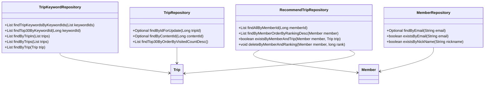
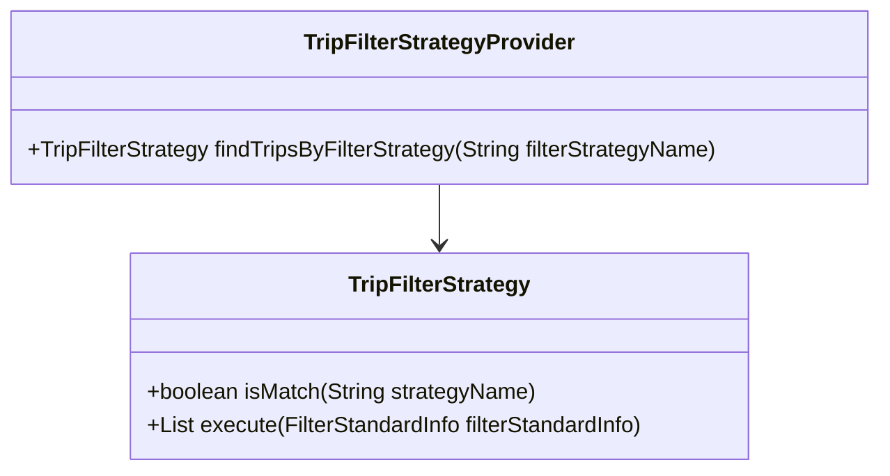
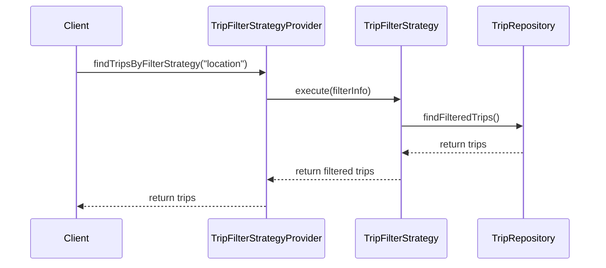

# Comprehensive Documentation for the Service Code

## 1. Overall Structure

### High-Level Overview
The codebase is structured into several packages, each serving a specific domain within the application. The main packages include:

- **domain**: Contains the core business entities and their relationships.
- **repository**: Interfaces for data access, extending Spring Data JPA repositories.
- **exception**: Custom exceptions for handling specific error scenarios.
- **dto**: Data Transfer Objects for transferring data between layers.
- **filterinfo**: Classes that encapsulate filtering criteria for recommendations.
- **tripfilterstrategy**: Strategy pattern implementation for filtering trips based on various criteria.

### Purpose and Function of Service Code
The service code is responsible for managing the business logic related to trips and recommendations. It interacts with repositories to perform CRUD operations and applies various strategies for filtering trips based on user preferences.

### Interaction Between Parts
- **Entities** (e.g., `Trip`, `Member`, `RecommendTrip`) represent the core data model.
- **Repositories** (e.g., `TripRepository`, `MemberRepository`) provide methods for data access.
- **DTOs** (e.g., `FindTripsResponse`, `RecommendTripCreateRequest`) facilitate data transfer.
- **Exceptions** handle error scenarios gracefully.
- **Filter Strategies** (e.g., `TripFilterStrategy`) define various algorithms for filtering trips.

### Mermaid Diagram


## 2. Strategy Pattern Implementation

### Strategy Pattern Overview
The strategy pattern is implemented to allow dynamic selection of filtering strategies for trips based on user preferences. This enables the application to be flexible and extensible.

### Strategy Interface and Concrete Strategy Classes
- **Interface**: `TripFilterStrategy`
  - Defines methods for matching strategies and executing filtering logic.
  
- **Concrete Strategies**: Various classes implementing `TripFilterStrategy` (not provided in the code snippet) would implement the filtering logic based on different criteria.

### Context Class
- **Class**: `TripFilterStrategyProvider`
  - This class acts as a context that holds a list of strategies and provides a method to find the appropriate strategy based on the filter name.

### Class Diagram


## 3. Detailed Component Documentation

### a. Classes

#### 1. TripKeywordRepository
- **Purpose**: Interface for accessing `TripKeyword` entities.
- **Attributes**: None (extends `JpaRepository`).
- **Role**: Provides methods for querying trip keywords based on various criteria.
- **Relationships**: 
  - Uses `TripKeyword` and `Trip` entities.

#### 2. Member
- **Purpose**: Represents a member in the system.
- **Attributes**:
  - `Long id`: Unique identifier for the member.
  - `String email`: Email address of the member.
  - `String nickName`: Nickname of the member.
  - `String profileImageUrl`: URL of the member's profile image.
  - `SocialType socialType`: Type of social login.
  - `LocalDate birthday`: Member's birthday.
  - `GenderType genderType`: Member's gender.
  - `Authority authority`: Member's authority level.
- **Role**: Encapsulates member-related data and validation logic.
- **Relationships**: 
  - Inherits from `BaseEntity`.

#### 3. RecommendTrip
- **Purpose**: Represents a recommended trip for a member.
- **Attributes**:
  - `Long id`: Unique identifier for the recommendation.
  - `Member member`: The member associated with the recommendation.
  - `Trip trip`: The trip being recommended.
  - `Long ranking`: Ranking of the recommendation.
- **Role**: Holds data related to trip recommendations.
- **Relationships**: 
  - Many-to-one relationship with `Member` and `Trip`.

### b. Methods and Functions

#### 1. findTripKeywordsByKeywordIds
- **Purpose**: Retrieves trip keywords based on a list of keyword IDs.
- **Parameters**:
  - `List<Long> keywordIds`: List of keyword IDs to filter by.
- **Return Value**: 
  - `List<TripKeyword>`: List of matching trip keywords.
- **Side Effects**: None.
- **Code Example**:
  ```java
  List<TripKeyword> keywords = tripKeywordRepository.findTripKeywordsByKeywordIds(Arrays.asList(1L, 2L, 3L));
  ```

#### 2. changePrivilege
- **Purpose**: Changes the authority level of the member.
- **Parameters**:
  - `Authority authority`: New authority level to set.
- **Return Value**: None.
- **Side Effects**: Updates the member's authority.
- **Code Example**:
  ```java
  member.changePrivilege(Authority.ADMIN);
  ```

## 4. Implementation Flow

### Sequence Diagram


This documentation provides a comprehensive overview of the service code, detailing its structure, strategy pattern implementation, and individual components. It serves as a guide for both new and experienced developers to understand and work with the code effectively.
