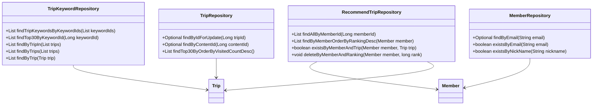
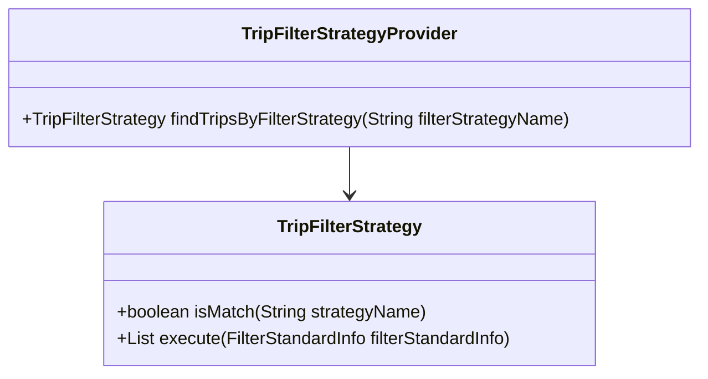
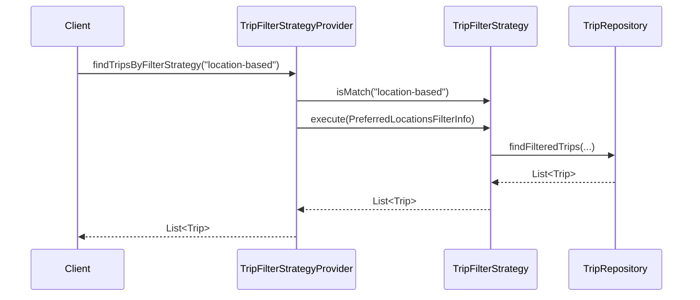

# Comprehensive Documentation for the Service Code

## 1. Overall Structure

### High-Level Overview
The codebase is structured into several packages, each serving a specific domain within the application. The main packages include:

- **domain**: Contains the core business entities and their repositories.
- **repository**: Interfaces for data access, extending Spring Data JPA's `JpaRepository`.
- **exception**: Custom exceptions for handling specific error scenarios.
- **dto**: Data Transfer Objects for transferring data between layers.
- **filterinfo**: Classes that encapsulate filtering criteria for trips.
- **tripfilterstrategy**: Strategy pattern implementation for filtering trips based on various criteria.

### Purpose and Function of Service Code
The service code primarily handles the business logic related to trips and their recommendations. It interacts with repositories to fetch, create, and manipulate trip data while applying various filtering strategies.

### Interaction Between Different Parts
- **Entities**: Represent the core data model (e.g., `Trip`, `Member`, `RecommendTrip`).
- **Repositories**: Provide methods to interact with the database (e.g., `TripRepository`, `MemberRepository`).
- **DTOs**: Facilitate data transfer between layers (e.g., `FindTripsResponse`, `RecommendTripCreateRequest`).
- **Exceptions**: Handle error scenarios gracefully (e.g., `NoExistTripException`, `NoExistMemberException`).
- **Filter Strategies**: Implement the strategy pattern to filter trips based on different criteria.

### Mermaid Diagram


## 2. Strategy Pattern Implementation

### Strategy Pattern Overview
The strategy pattern is implemented to allow dynamic selection of filtering strategies for trips. This enables the application to apply different filtering criteria without modifying the core logic.

### Strategy Interface and Concrete Strategy Classes
- **TripFilterStrategy**: This interface defines the contract for filtering strategies.
  - **Methods**:
    - `boolean isMatch(final String strategyName)`: Checks if the strategy matches the given name.
    - `List<Trip> execute(final FilterStandardInfo filterStandardInfo)`: Executes the filtering logic based on the provided information.

### Context Class
- **TripFilterStrategyProvider**: This class acts as a context that holds a list of strategies and provides a method to find the appropriate strategy based on the filter name.

### Class Diagram


## 3. Detailed Component Documentation

### a. Classes

#### TripKeywordRepository
- **Purpose**: Interface for accessing `TripKeyword` entities.
- **Attributes**: None (inherited from `JpaRepository`).
- **Role**: Provides methods to query trip keywords based on various criteria.
- **Relationships**: Interacts with `TripKeyword` and `Trip`.

#### Member
- **Purpose**: Represents a member in the system.
- **Attributes**:
  - `Long id`: Unique identifier for the member.
  - `String email`: Email address of the member.
  - `String nickName`: Nickname of the member.
  - `String profileImageUrl`: URL of the member's profile image.
  - `SocialType socialType`: Type of social login used.
  - `LocalDate birthday`: Birthday of the member.
  - `GenderType genderType`: Gender of the member.
  - `Authority authority`: Member's authority level.
- **Role**: Encapsulates member-related data and validation logic.
- **Relationships**: Inherits from `BaseEntity`.

#### MemberRepository
- **Purpose**: Interface for accessing `Member` entities.
- **Attributes**: None (inherited from `JpaRepository`).
- **Role**: Provides methods to find members by email and nickname.
- **Relationships**: Interacts with `Member`.

#### RecommendTrip
- **Purpose**: Represents a recommended trip for a member.
- **Attributes**:
  - `Long id`: Unique identifier for the recommendation.
  - `Member member`: The member associated with the recommendation.
  - `Trip trip`: The trip being recommended.
  - `Long ranking`: Ranking of the recommendation.
- **Role**: Encapsulates the relationship between members and their recommended trips.
- **Relationships**: Interacts with `Member` and `Trip`.

#### TripFilterStrategy
- **Purpose**: Interface for defining trip filtering strategies.
- **Attributes**: None.
- **Role**: Provides a contract for implementing various filtering strategies.
- **Relationships**: None.

#### TripFilterStrategyProvider
- **Purpose**: Provides access to filtering strategies.
- **Attributes**:
  - `List<TripFilterStrategy> tripFilterStrategies`: List of available strategies.
- **Role**: Finds and returns the appropriate filtering strategy based on the name.
- **Relationships**: Contains multiple `TripFilterStrategy` implementations.

### b. Methods and Functions

#### TripKeywordRepository Methods
- **findTripKeywordsByKeywordIds**
  - **Purpose**: Fetches trip keywords based on a list of keyword IDs.
  - **Parameters**: 
    - `List<Long> keywordIds`: List of keyword IDs to filter by.
  - **Return Value**: `List<TripKeyword>`: List of matching trip keywords.
  - **Example**:
    ```java
    List<TripKeyword> keywords = tripKeywordRepository.findTripKeywordsByKeywordIds(Arrays.asList(1L, 2L, 3L));
    ```

#### Member Methods
- **changePrivilege**
  - **Purpose**: Changes the authority level of the member.
  - **Parameters**: 
    - `Authority authority`: New authority level to set.
  - **Return Value**: None.
  - **Example**:
    ```java
    member.changePrivilege(Authority.ADMIN);
    ```

#### TripFilterStrategy Methods
- **isMatch**
  - **Purpose**: Checks if the strategy matches the given name.
  - **Parameters**: 
    - `String strategyName`: Name of the strategy to match.
  - **Return Value**: `boolean`: True if it matches, false otherwise.
  - **Example**:
    ```java
    boolean matches = tripFilterStrategy.isMatch("location-based");
    ```

- **execute**
  - **Purpose**: Executes the filtering logic based on the provided information.
  - **Parameters**: 
    - `FilterStandardInfo filterStandardInfo`: Information used for filtering.
  - **Return Value**: `List<Trip>`: List of trips that match the criteria.
  - **Example**:
    ```java
    List<Trip> filteredTrips = tripFilterStrategy.execute(new PreferredLocationsFilterInfo(memberId));
    ```

### 4. Implementation Flow

#### Sequence Diagram


This documentation provides a comprehensive overview of the service code, detailing its structure, strategy pattern implementation, and individual components. It serves as a guide for both new and experienced developers to understand and work with the code effectively.
