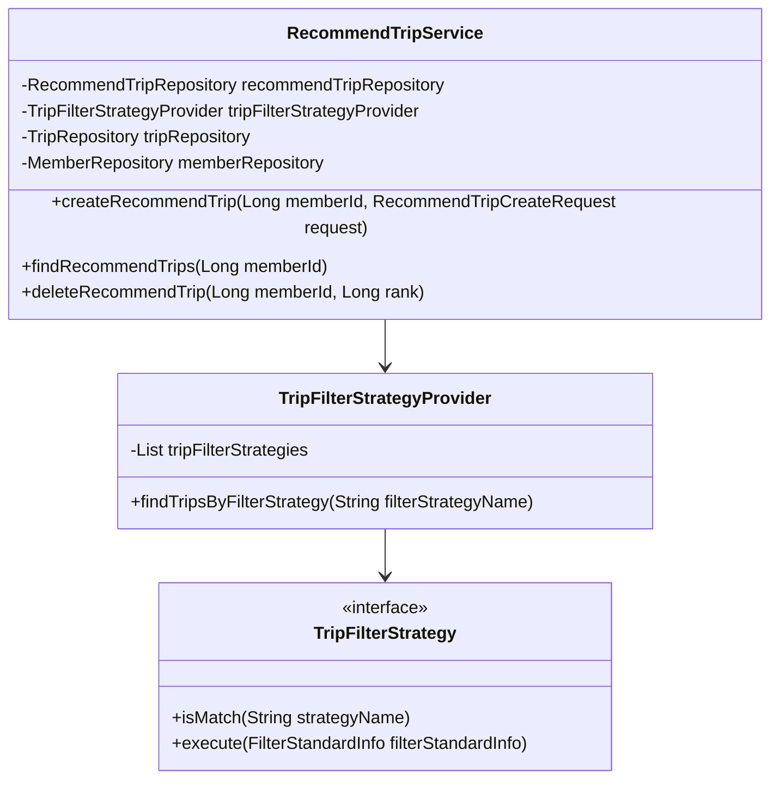
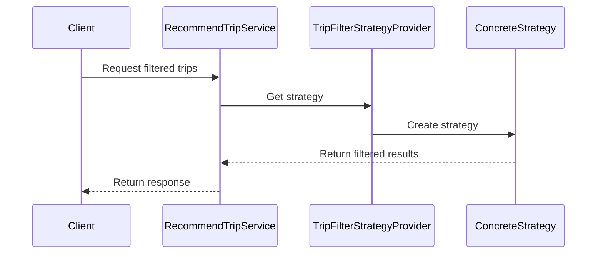

# RecommendTripService Documentation

## 1. Overall Structure

The RecommendTripService is part of a travel recommendation system that implements the Strategy pattern for filtering trips based on different criteria. The service manages recommended trips for users and interacts with various repositories and domain objects.

### Core Components:
- RecommendTripService (Main service class)
- TripFilterStrategy (Strategy interface)
- TripFilterStrategyProvider (Strategy factory)
- Various repositories (RecommendTripRepository, TripRepository, MemberRepository)



## 2. Strategy Pattern Implementation

The service implements the Strategy pattern to handle different trip filtering mechanisms:



## 3. Detailed Component Documentation

### Classes

#### RecommendTripService
- **Purpose**: Manages recommended trips for users
- **Dependencies**:
  - RecommendTripRepository
  - TripFilterStrategyProvider
  - TripRepository
  - MemberRepository

#### Methods

##### createRecommendTrip
```java
public void createRecommendTrip(Long memberId, RecommendTripCreateRequest request)
```
- **Purpose**: Creates a new trip recommendation for a user
- **Parameters**:
  - memberId: ID of the member
  - request: Contains trip details to be recommended
- **Returns**: void

##### findRecommendTrips
```java
public List<RecommendTrip> findRecommendTrips(Long memberId)
```
- **Purpose**: Retrieves recommended trips for a user
- **Parameters**:
  - memberId: ID of the member
- **Returns**: List of RecommendTrip objects

##### deleteRecommendTrip
```java
public void deleteRecommendTrip(Long memberId, Long rank)
```
- **Purpose**: Removes a trip recommendation
- **Parameters**:
  - memberId: ID of the member
  - rank: Ranking of the recommendation to delete
- **Returns**: void

## 4. Implementation Flow

The service follows these general steps for processing recommendations:

1. Validate member existence
2. Apply appropriate filtering strategy
3. Create/Update/Delete recommendations
4. Return results to client

### Error Handling
- NoExistMemberException: Thrown when member not found
- NoExistTripException: Thrown when trip not found
- Other runtime exceptions as needed

### Transaction Management
- Methods are transactional where appropriate
- Pessimistic locking used for concurrent operations
