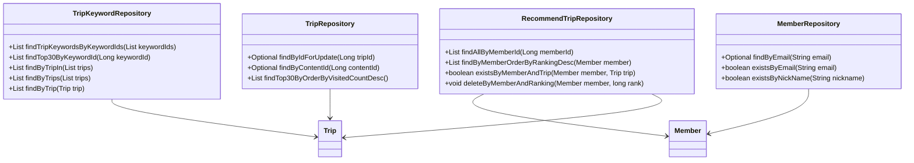
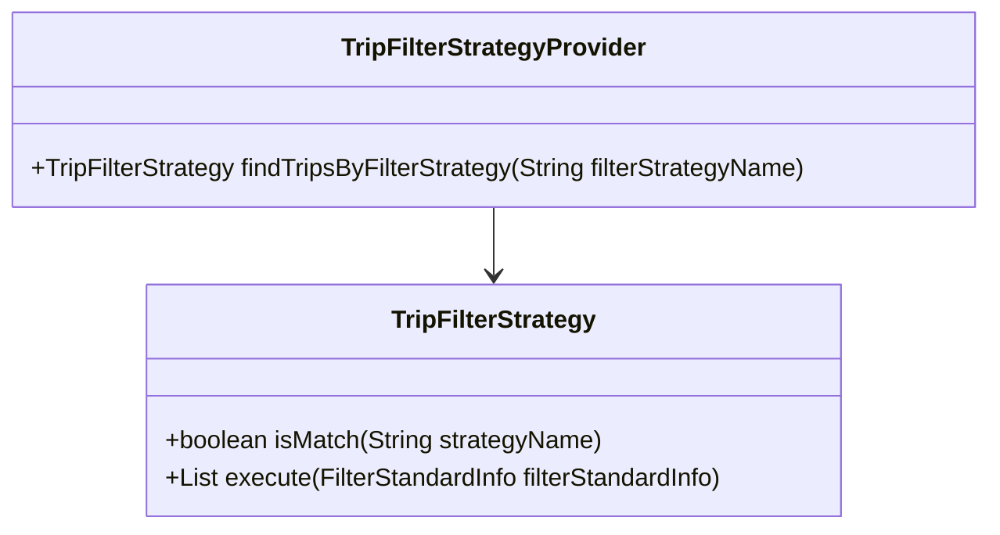
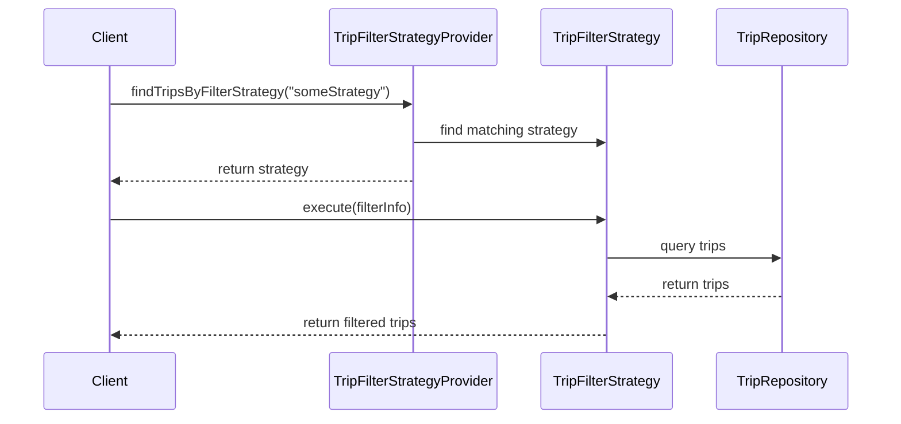

# Comprehensive Documentation for the Service Code

## 1. Overall Structure

### High-Level Overview
The codebase is structured into several packages, each serving a specific domain within the application. The main packages include:

- **Domain**: Contains the core business entities such as `Member`, `Trip`, `TripKeyword`, and `RecommendTrip`.
- **Repository**: Interfaces for data access, extending `JpaRepository` for CRUD operations.
- **DTO**: Data Transfer Objects for transferring data between layers.
- **Exception**: Custom exceptions for handling specific error scenarios.
- **Filter Strategy**: Contains the strategy pattern implementation for filtering trips based on various criteria.

### Purpose and Function of Service Code
The service code is responsible for implementing business logic and orchestrating interactions between the domain entities and repositories. It handles operations such as creating, retrieving, updating, and deleting entities, as well as applying various filtering strategies to recommend trips.

### Interaction Between Parts
- **Repositories** interact with the database to perform CRUD operations.
- **Entities** represent the core data model.
- **DTOs** are used to transfer data between the service layer and the presentation layer.
- **Exceptions** are thrown to handle error scenarios gracefully.
- **Filter Strategies** are used to encapsulate different filtering algorithms for recommending trips.

### Mermaid Diagram


## 2. Strategy Pattern Implementation

### Strategy Pattern Overview
The strategy pattern is implemented to allow dynamic selection of filtering strategies for recommending trips based on different criteria. This design pattern encapsulates algorithms and makes them interchangeable.

### Strategy Interface and Concrete Strategy Classes
- **Interface**: `TripFilterStrategy`
  - Method `boolean isMatch(String strategyName)`: Checks if the strategy matches the given name.
  - Method `List<Trip> execute(FilterStandardInfo filterStandardInfo)`: Executes the filtering logic.

- **Concrete Strategies**: Implementations of `TripFilterStrategy` would be created for different filtering criteria (not provided in the code).

### Context Class
- **TripFilterStrategyProvider**: This class acts as a context that uses the strategies. It holds a list of strategies and provides a method to find the appropriate strategy based on the name.

### Class Diagram


## 3. Detailed Component Documentation

### a. Classes

#### 1. TripKeywordRepository
- **Purpose**: Interface for accessing `TripKeyword` entities.
- **Attributes**: None (inherited from `JpaRepository`).
- **Role**: Provides methods to query `TripKeyword` data from the database.

#### 2. Member
- **Purpose**: Represents a member in the system.
- **Attributes**:
  - `Long id`: Unique identifier.
  - `String email`: Member's email.
  - `String nickName`: Member's nickname.
  - `String profileImageUrl`: URL of the member's profile image.
  - `SocialType socialType`: Type of social login.
  - `LocalDate birthday`: Member's birthday.
  - `GenderType genderType`: Member's gender.
  - `Authority authority`: Member's authority level.
- **Role**: Encapsulates member-related data and validation logic.

#### 3. MemberRepository
- **Purpose**: Interface for accessing `Member` entities.
- **Attributes**: None (inherited from `JpaRepository`).
- **Role**: Provides methods to query `Member` data from the database.

#### 4. RecommendTrip
- **Purpose**: Represents a recommended trip for a member.
- **Attributes**:
  - `Long id`: Unique identifier.
  - `Member member`: The member who recommended the trip.
  - `Trip trip`: The recommended trip.
  - `Long ranking`: Ranking of the recommendation.
- **Role**: Encapsulates the relationship between members and their recommended trips.

### b. Methods and Functions

#### 1. findTripKeywordsByKeywordIds
- **Purpose**: Retrieves `TripKeyword` entities by keyword IDs.
- **Parameters**:
  - `List<Long> keywordIds`: List of keyword IDs to filter by.
- **Return Value**: `List<TripKeyword>`: List of matching `TripKeyword` entities.
- **Example**:
  ```java
  List<TripKeyword> keywords = tripKeywordRepository.findTripKeywordsByKeywordIds(Arrays.asList(1L, 2L, 3L));
  ```

#### 2. findByEmail
- **Purpose**: Finds a member by their email.
- **Parameters**:
  - `String email`: The email of the member to find.
- **Return Value**: `Optional<Member>`: The member if found, otherwise empty.
- **Example**:
  ```java
  Optional<Member> member = memberRepository.findByEmail("example@example.com");
  ```

#### 3. findByMemberOrderByRankingDesc
- **Purpose**: Retrieves recommended trips for a member ordered by ranking.
- **Parameters**:
  - `Member member`: The member whose recommendations to retrieve.
- **Return Value**: `List<RecommendTrip>`: List of recommended trips for the member.
- **Example**:
  ```java
  List<RecommendTrip> recommendations = recommendTripRepository.findByMemberOrderByRankingDesc(member);
  ```

## 4. Implementation Flow

### Sequence Diagram


This documentation provides a comprehensive overview of the service code, including its structure, strategy pattern implementation, detailed component documentation, and the flow of execution. It aims to assist both new and experienced developers in understanding and working with the code effectively.
