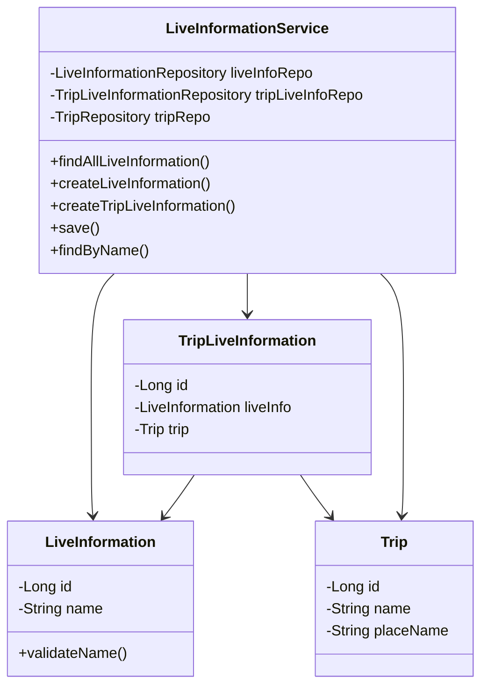
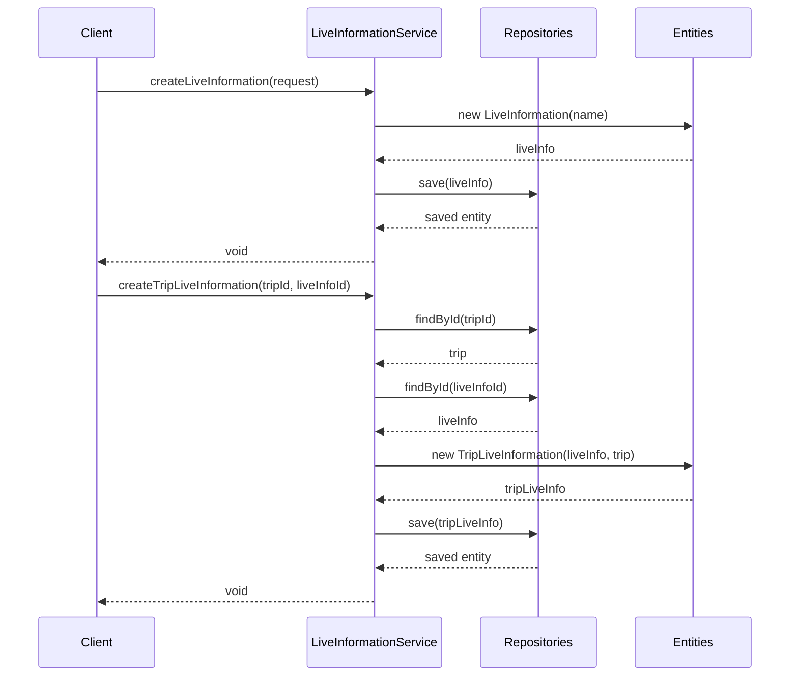

# LiveInformation Service Documentation

## 1. Overall Structure

### Purpose
The LiveInformation service manages life information related to trips, allowing creation and retrieval of life information and its associations with trips.

### Core Components
- `LiveInformationService`: Main service class handling business logic
- `LiveInformation`: Domain entity representing life information
- `TripLiveInformation`: Junction entity connecting trips and life information
- Associated repositories for data access



## 2. Detailed Component Documentation

### Classes

#### LiveInformationService
Main service class managing life information operations.

**Attributes:**
- `liveInformationRepository`: Repository for LiveInformation entities
- `tripLiveInformationRepository`: Repository for TripLiveInformation entities
- `tripRepository`: Repository for Trip entities

**Methods:**

##### `findAllLiveInformation()`
- Purpose: Retrieves all life information entries
- Returns: `FindAllLiveInformationResponse` containing list of life information
- Usage:
```java
FindAllLiveInformationResponse response = liveInformationService.findAllLiveInformation();
```

##### `createLiveInformation(LiveInformationCreateRequest request)`
- Purpose: Creates new life information entry
- Parameters:
  - `request`: Contains name for new life information
- Usage:
```java
LiveInformationCreateRequest request = new LiveInformationCreateRequest("Info Name");
liveInformationService.createLiveInformation(request);
```

##### `createTripLiveInformation(long tripId, long liveInfoId)`
- Purpose: Associates life information with a trip
- Parameters:
  - `tripId`: ID of the trip
  - `liveInfoId`: ID of the life information
- Throws:
  - `NoExistTripException`
  - `NoExistLiveInformationException`

## 3. Implementation Flow



## 4. Transaction Management
- Service is annotated with `@Transactional(readOnly = true)`
- Write operations are explicitly marked with `@Transactional`
- Ensures data consistency and proper transaction boundaries

## 5. Error Handling
- Custom exceptions for business logic validation:
  - `NoExistTripException`
  - `NoExistLiveInformationException`
  - `LiveInfoNameException`
