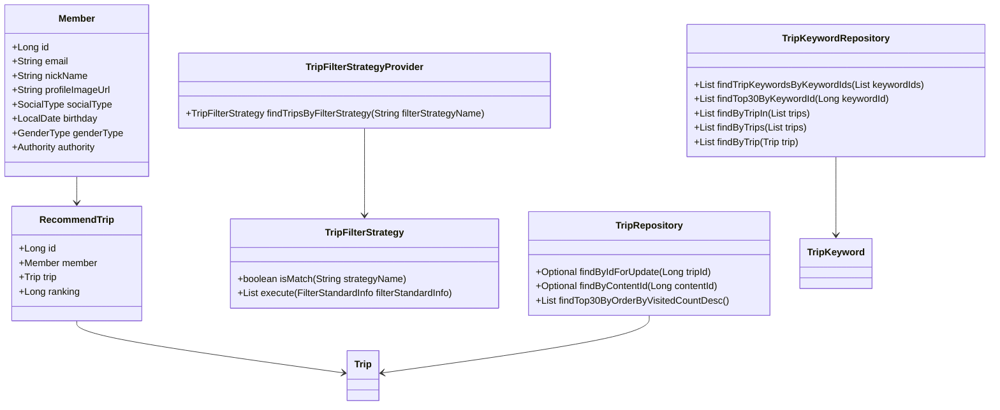
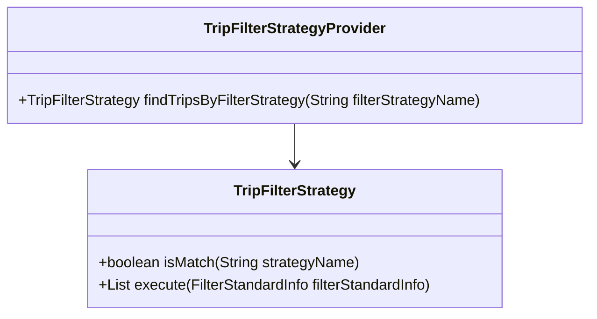
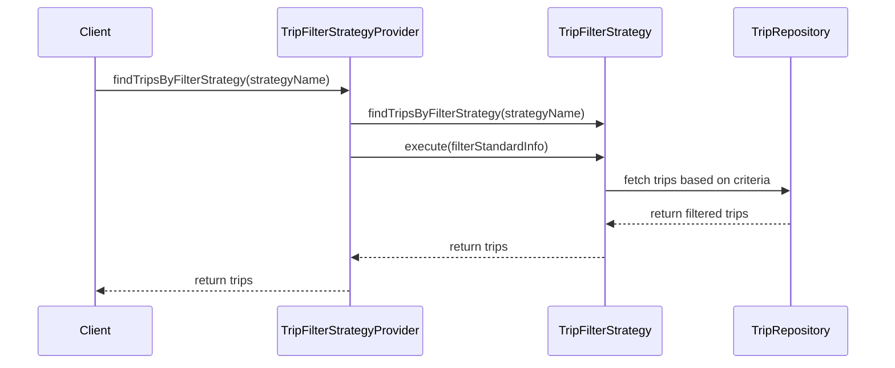

# Codebase Documentation

## 1. Overall Structure

The codebase is organized into several packages, each serving a specific purpose within the application. Below is a high-level overview of the structure:

- **moheng.keyword.domain.repository**: Contains the `TripKeywordRepository` interface for managing `TripKeyword` entities.
- **moheng.member.domain**: Contains the `Member` class representing a user in the system, along with its repository and exception handling.
- **moheng.recommendtrip.domain**: Contains classes related to recommending trips, including `RecommendTrip`, its repository, and filter information.
- **moheng.recommendtrip.domain.tripfilterstrategy**: Contains the strategy interface and provider for filtering trips based on various criteria.
- **moheng.trip.domain.repository**: Contains the `TripRepository` interface for managing `Trip` entities.
- **moheng.trip.dto**: Contains data transfer objects (DTOs) for transferring data between layers.
- **moheng.trip.exception**: Contains exceptions related to trip operations.

### Interaction Between Components

- The `TripKeywordRepository` interacts with `TripKeyword` entities to fetch keywords associated with trips.
- The `Member` class represents users and interacts with the `MemberRepository` for user-related operations.
- The `RecommendTrip` class is used to recommend trips to members, utilizing the `RecommendTripRepository`.
- The `TripFilterStrategy` interface defines various strategies for filtering trips, which are provided by the `TripFilterStrategyProvider`.
- The `TripRepository` manages `Trip` entities and provides methods to retrieve trips based on various criteria.

## 2. Strategy Pattern Implementation

The strategy pattern is implemented in the `TripFilterStrategy` interface and its concrete implementations. This allows for dynamic selection of filtering strategies based on the provided criteria.

### Strategy Interface and Concrete Strategy Classes

- **TripFilterStrategy**: This interface defines the methods that all filtering strategies must implement.
    - `boolean isMatch(final String strategyName)`: Determines if the strategy matches the given name.
    - `List<Trip> execute(final FilterStandardInfo filterStandardInfo)`: Executes the filtering logic based on the provided information.

- **TripFilterStrategyProvider**: This class is responsible for providing the appropriate filtering strategy based on the strategy name.

### Context Class

The context class in this implementation is the `TripFilterStrategyProvider`, which uses the strategies to filter trips based on the provided criteria.

## 3. Detailed Component Documentation

### a. Classes

#### TripKeywordRepository
- **Purpose**: Interface for managing `TripKeyword` entities.
- **Attributes**: None (interface).
- **Role**: Provides methods to query trip keywords based on various criteria.
- **Relationships**: Extends `JpaRepository`.

#### Member
- **Purpose**: Represents a user in the system.
- **Attributes**:
    - `Long id`: Unique identifier for the member.
    - `String email`: Email address of the member.
    - `String nickName`: Nickname of the member.
    - `String profileImageUrl`: URL of the member's profile image.
    - `SocialType socialType`: Type of social login used.
    - `LocalDate birthday`: Birthday of the member.
    - `GenderType genderType`: Gender of the member.
    - `Authority authority`: Authority level of the member.
- **Role**: Manages member-related data and validation.
- **Relationships**: Inherits from `BaseEntity`.

#### RecommendTrip
- **Purpose**: Represents a recommended trip for a member.
- **Attributes**:
    - `Long id`: Unique identifier for the recommendation.
    - `Member member`: The member associated with the recommendation.
    - `Trip trip`: The trip being recommended.
    - `Long ranking`: Ranking of the recommendation.
- **Role**: Holds data related to trip recommendations.
- **Relationships**: Many-to-one relationship with `Member` and `Trip`.

#### TripFilterStrategy
- **Purpose**: Interface for defining trip filtering strategies.
- **Attributes**: None (interface).
- **Role**: Provides a contract for implementing various filtering strategies.

#### TripFilterStrategyProvider
- **Purpose**: Provides the appropriate filtering strategy based on the strategy name.
- **Attributes**:
    - `List<TripFilterStrategy> tripFilterStrategies`: List of available filtering strategies.
- **Role**: Acts as a factory for obtaining the correct filtering strategy.

### b. Methods and Functions

#### TripKeywordRepository Methods
- **findTripKeywordsByKeywordIds**
    - **Purpose**: Fetches trip keywords by their keyword IDs.
    - **Parameters**: 
        - `List<Long> keywordIds`: List of keyword IDs to search for.
    - **Return Value**: `List<TripKeyword>`: List of matching trip keywords.

- **findTop30ByKeywordId**
    - **Purpose**: Fetches the top 30 trip keywords by keyword ID.
    - **Parameters**: 
        - `Long keywordId`: The keyword ID to search for.
    - **Return Value**: `List<TripKeyword>`: List of top 30 trip keywords.

- **findByTripIn**
    - **Purpose**: Fetches trip keywords for a list of trips.
    - **Parameters**: 
        - `List<Trip> trips`: List of trips to search for.
    - **Return Value**: `List<TripKeyword>`: List of matching trip keywords.

#### Member Methods
- **changePrivilege**
    - **Purpose**: Changes the authority level of the member.
    - **Parameters**: 
        - `Authority authority`: New authority level.
    - **Return Value**: None.
    - **Side Effects**: Updates the member's authority.

- **validateEmail**
    - **Purpose**: Validates the email format.
    - **Parameters**: 
        - `String email`: Email to validate.
    - **Return Value**: None.
    - **Side Effects**: Throws `InvalidEmailFormatException` if invalid.

#### RecommendTrip Methods
- **getId**
    - **Purpose**: Retrieves the ID of the recommendation.
    - **Return Value**: `Long`: ID of the recommendation.

- **getRanking**
    - **Purpose**: Retrieves the ranking of the recommendation.
    - **Return Value**: `Long`: Ranking of the recommendation.

### c. Important Variables

#### Global Variables
- **EMAIL_FORMAT**: 
    - **Purpose**: Regex pattern for validating email format.
    - **Type**: `Pattern`.

- **MAX_NICK_NAME_LENGTH**: 
    - **Purpose**: Maximum allowed length for nicknames.
    - **Type**: `int`.

- **MIN_NICK_NAME_LENGTH**: 
    - **Purpose**: Minimum allowed length for nicknames.
    - **Type**: `int`.

## 4. Implementation Flow

