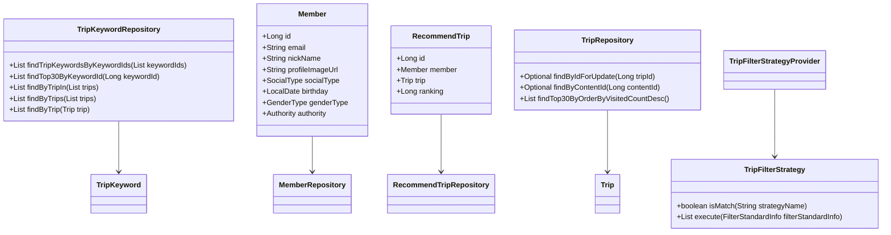
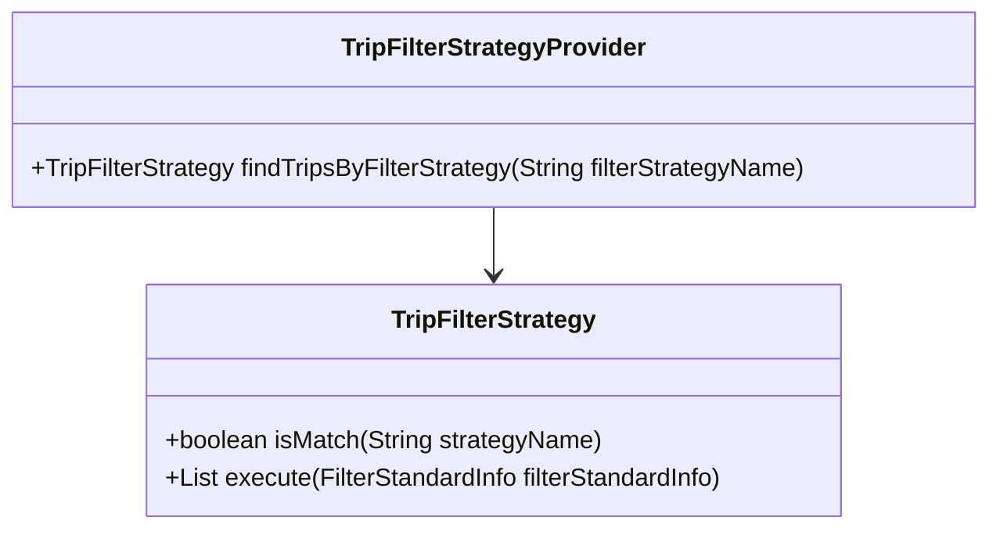
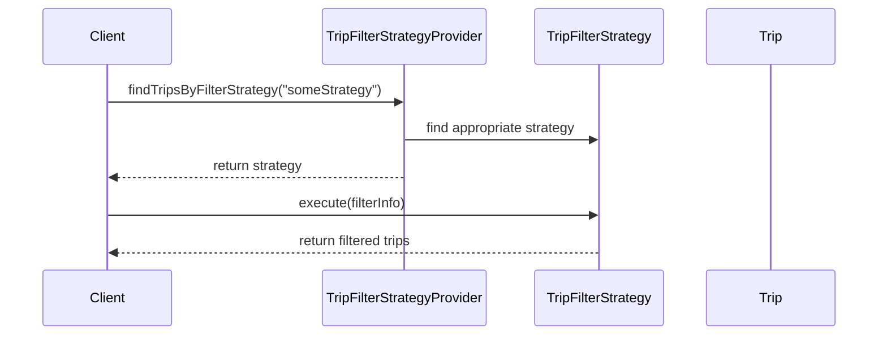

# Codebase Documentation

## 1. Overall Structure

The codebase is organized into several packages, each serving a specific purpose within the application. Below is a high-level overview of the structure:

- **moheng.keyword.domain.repository**: Contains the `TripKeywordRepository` interface for managing `TripKeyword` entities.
- **moheng.member.domain**: Contains the `Member` class representing a user in the system, along with its repository and exception handling.
- **moheng.recommendtrip.domain**: Contains classes related to recommending trips, including `RecommendTrip`, filter information, and the repository for managing recommendations.
- **moheng.recommendtrip.domain.tripfilterstrategy**: Contains the strategy interface and provider for filtering trips based on different criteria.
- **moheng.trip.domain.repository**: Contains the `TripRepository` interface for managing `Trip` entities.
- **moheng.trip.dto**: Contains data transfer objects (DTOs) for transferring data between layers.
- **moheng.trip.exception**: Contains exceptions related to trip operations.

### Interaction Between Components

- The `TripKeywordRepository` interacts with `TripKeyword` entities to fetch keywords associated with trips.
- The `Member` class represents users and interacts with the `MemberRepository` for user-related operations.
- The `RecommendTrip` class is used to manage recommendations for trips, interacting with `RecommendTripRepository`.
- The `TripFilterStrategy` interface defines various strategies for filtering trips, which are provided by `TripFilterStrategyProvider`.
- The `TripRepository` manages `Trip` entities and provides methods to fetch trips based on various criteria.

## 2. Strategy Pattern Implementation

The strategy pattern is implemented in the `TripFilterStrategy` interface and its concrete implementations. This allows for dynamic selection of filtering strategies based on the provided criteria.

### Strategy Interface and Concrete Strategy Classes

- **TripFilterStrategy**: This interface defines the contract for filtering strategies.
    - **Methods**:
        - `boolean isMatch(final String strategyName)`: Checks if the strategy matches the given name.
        - `List<Trip> execute(final FilterStandardInfo filterStandardInfo)`: Executes the filtering logic based on the provided information.

- **Concrete Strategies**: Various classes implementing `TripFilterStrategy` would provide specific filtering logic (not shown in the provided code).

### Context Class

- **TripFilterStrategyProvider**: This class acts as the context that uses the strategies.
    - **Methods**:
        - `TripFilterStrategy findTripsByFilterStrategy(final String filterStrategyName)`: Finds and returns the appropriate filtering strategy based on the name.

## 3. Detailed Component Documentation

### a. Classes

#### TripKeywordRepository
- **Purpose**: Interface for managing `TripKeyword` entities.
- **Attributes**: None (interface).
- **Role**: Provides methods to query `TripKeyword` data from the database.
- **Relationships**: Extends `JpaRepository`.

#### Member
- **Purpose**: Represents a user in the system.
- **Attributes**:
    - `Long id`: Unique identifier for the member.
    - `String email`: Email address of the member.
    - `String nickName`: Nickname of the member.
    - `String profileImageUrl`: URL of the member's profile image.
    - `SocialType socialType`: Type of social login used.
    - `LocalDate birthday`: Birthday of the member.
    - `GenderType genderType`: Gender of the member.
    - `Authority authority`: Access level of the member.
- **Role**: Manages member-related data and validation.
- **Relationships**: Inherits from `BaseEntity`.

#### RecommendTrip
- **Purpose**: Represents a recommended trip for a member.
- **Attributes**:
    - `Long id`: Unique identifier for the recommendation.
    - `Member member`: The member associated with the recommendation.
    - `Trip trip`: The trip being recommended.
    - `Long ranking`: Ranking of the recommendation.
- **Role**: Manages the relationship between members and their recommended trips.
- **Relationships**: Many-to-one relationship with `Member` and `Trip`.

### b. Methods and Functions

#### findTripKeywordsByKeywordIds
- **Purpose**: Fetches `TripKeyword` entities based on a list of keyword IDs.
- **Parameters**:
    - `List<Long> keywordIds`: List of keyword IDs to search for.
- **Return Value**: `List<TripKeyword>` - List of matching `TripKeyword` entities.
- **Side Effects**: None.
- **Example**: `tripKeywordRepository.findTripKeywordsByKeywordIds(Arrays.asList(1L, 2L));`

#### validateEmail
- **Purpose**: Validates the format of an email address.
- **Parameters**:
    - `String email`: Email address to validate.
- **Return Value**: None (throws exception if invalid).
- **Side Effects**: Throws `InvalidEmailFormatException` if the email format is invalid.
- **Example**: `validateEmail("test@example.com");`

### c. Important Variables

#### EMAIL_FORMAT
- **Purpose**: Regular expression pattern for validating email formats.
- **Type**: `Pattern`
- **Constraints**: Must match the specified email format.

#### MAX_NICK_NAME_LENGTH
- **Purpose**: Maximum allowed length for a nickname.
- **Type**: `int`
- **Constraints**: Must be less than or equal to 50.

## 4. Implementation Flow

