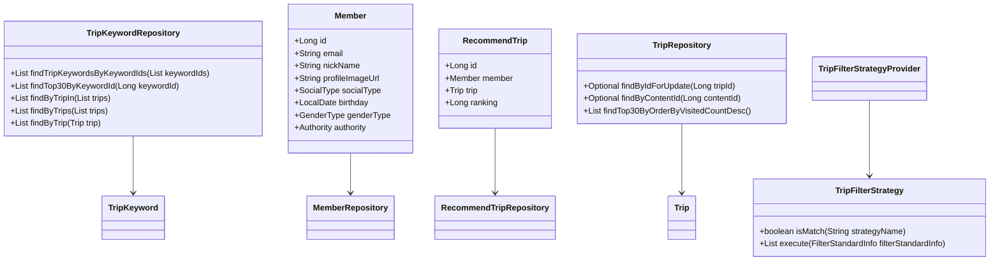
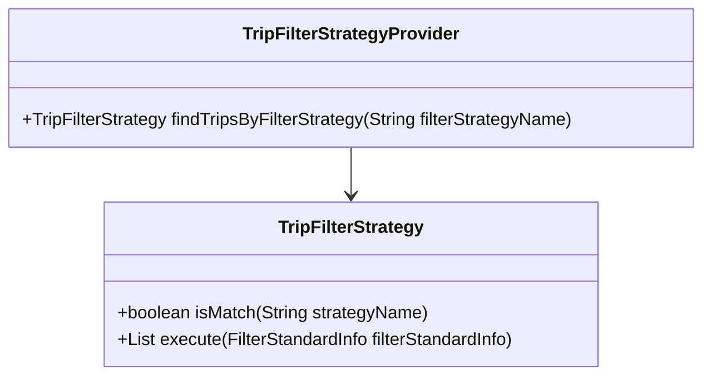
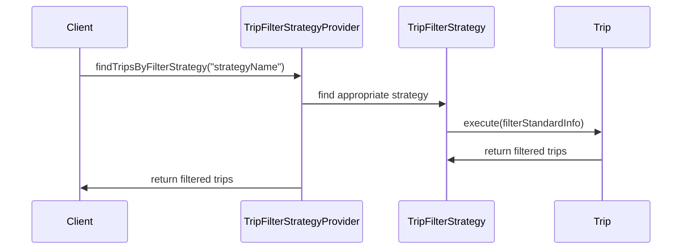

# Documentation for Codebase

## 1. Overall Structure

The codebase is organized into several packages, each serving a specific purpose related to the domain of trip recommendations, members, and keywords. Below is a high-level overview of the structure:

- **moheng.keyword.domain.repository**: Contains the `TripKeywordRepository` interface for managing `TripKeyword` entities.
- **moheng.member.domain**: Contains the `Member` class representing a user, along with its repository and exception classes.
- **moheng.recommendtrip.domain**: Contains classes related to recommended trips, including `RecommendTrip`, filter information, and the strategy for filtering trips.
- **moheng.recommendtrip.domain.tripfilterstrategy**: Contains the strategy interface and provider for trip filtering strategies.
- **moheng.recommendtrip.domain.repository**: Contains the `RecommendTripRepository` interface for managing `RecommendTrip` entities.
- **moheng.trip.domain.repository**: Contains the `TripRepository` interface for managing `Trip` entities.
- **moheng.trip.dto**: Contains data transfer objects related to trips.
- **moheng.trip.exception**: Contains exception classes related to trips.

### Interaction Between Components

- The `TripKeywordRepository` interacts with `TripKeyword` entities to fetch keywords associated with trips.
- The `Member` class represents users and interacts with the `MemberRepository` for user-related operations.
- The `RecommendTrip` class represents a recommendation for a trip and interacts with the `RecommendTripRepository`.
- The `TripFilterStrategy` interface and its implementations define various strategies for filtering trips based on user preferences.
- The `TripRepository` manages `Trip` entities and provides methods to retrieve trips based on various criteria.

## 2. Strategy Pattern Implementation

The strategy pattern is implemented to allow dynamic selection of filtering strategies for trips based on user preferences.

### Strategy Interface and Concrete Strategy Classes

- **TripFilterStrategy**: This is the strategy interface that defines the methods for matching and executing a filtering strategy.
  
### Context Class

- **TripFilterStrategyProvider**: This class acts as the context that uses the strategies. It holds a list of `TripFilterStrategy` implementations and provides a method to find the appropriate strategy based on the filter strategy name.

## 3. Detailed Component Documentation

### a. Classes

#### TripKeywordRepository
- **Purpose**: Interface for managing `TripKeyword` entities.
- **Attributes**: None (interface).
- **Role**: Provides methods to query trip keywords based on various criteria.
- **Relationships**: Extends `JpaRepository`.

#### Member
- **Purpose**: Represents a user in the system.
- **Attributes**:
  - `Long id`: Unique identifier for the member.
  - `String email`: Email address of the member.
  - `String nickName`: Nickname of the member.
  - `String profileImageUrl`: URL of the member's profile image.
  - `SocialType socialType`: Type of social login used.
  - `LocalDate birthday`: Birthday of the member.
  - `GenderType genderType`: Gender of the member.
  - `Authority authority`: Role of the member.
- **Role**: Manages member data and validation.
- **Relationships**: Inherits from `BaseEntity`.

#### RecommendTrip
- **Purpose**: Represents a recommended trip for a member.
- **Attributes**:
  - `Long id`: Unique identifier for the recommendation.
  - `Member member`: The member associated with the recommendation.
  - `Trip trip`: The trip being recommended.
  - `Long ranking`: Ranking of the recommendation.
- **Role**: Holds data related to trip recommendations.
- **Relationships**: Many-to-one relationship with `Member` and `Trip`.

#### TripFilterStrategy
- **Purpose**: Interface for defining trip filtering strategies.
- **Attributes**: None (interface).
- **Role**: Provides a contract for implementing different filtering strategies.
- **Relationships**: None.

#### TripFilterStrategyProvider
- **Purpose**: Provides the appropriate trip filtering strategy based on the strategy name.
- **Attributes**:
  - `List<TripFilterStrategy> tripFilterStrategies`: List of available filtering strategies.
- **Role**: Acts as a context for selecting and executing strategies.
- **Relationships**: None.

### b. Methods and Functions

#### TripKeywordRepository Methods
- **findTripKeywordsByKeywordIds**
  - **Purpose**: Fetches trip keywords by their keyword IDs.
  - **Parameters**: 
    - `List<Long> keywordIds`: List of keyword IDs to search for.
  - **Return Value**: `List<TripKeyword>`: List of matching trip keywords.
  
- **findTop30ByKeywordId**
  - **Purpose**: Fetches the top 30 trip keywords by keyword ID.
  - **Parameters**: 
    - `Long keywordId`: The keyword ID to search for.
  - **Return Value**: `List<TripKeyword>`: List of top 30 trip keywords.

#### Member Methods
- **changePrivilege**
  - **Purpose**: Changes the authority of the member.
  - **Parameters**: 
    - `Authority authority`: The new authority to set.
  - **Return Value**: None.
  
- **validateEmail**
  - **Purpose**: Validates the email format.
  - **Parameters**: 
    - `String email`: The email to validate.
  - **Return Value**: None (throws exception if invalid).

#### RecommendTrip Methods
- **getId**
  - **Purpose**: Gets the ID of the recommendation.
  - **Return Value**: `Long`: The ID of the recommendation.

- **getRanking**
  - **Purpose**: Gets the ranking of the recommendation.
  - **Return Value**: `Long`: The ranking of the recommendation.

### c. Important Variables

#### Global Variables
- **EMAIL_FORMAT**: 
  - **Purpose**: Regex pattern for validating email format.
  - **Type**: `Pattern`.
  
- **MAX_NICK_NAME_LENGTH**: 
  - **Purpose**: Maximum allowed length for nicknames.
  - **Type**: `int`.

- **MIN_NICK_NAME_LENGTH**: 
  - **Purpose**: Minimum allowed length for nicknames.
  - **Type**: `int`.

## 4. Implementation Flow

