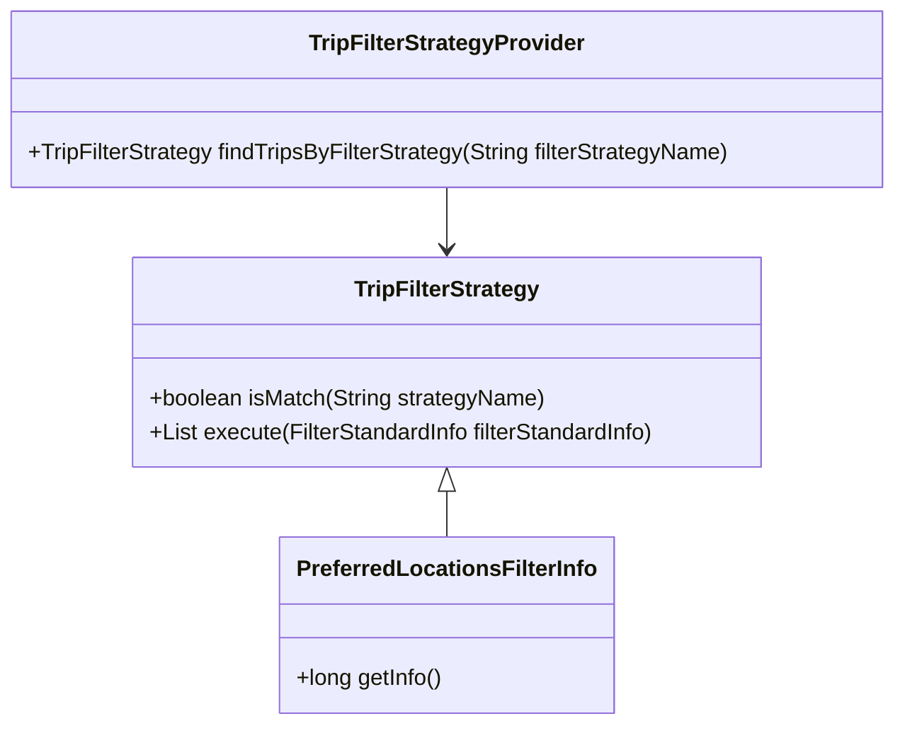
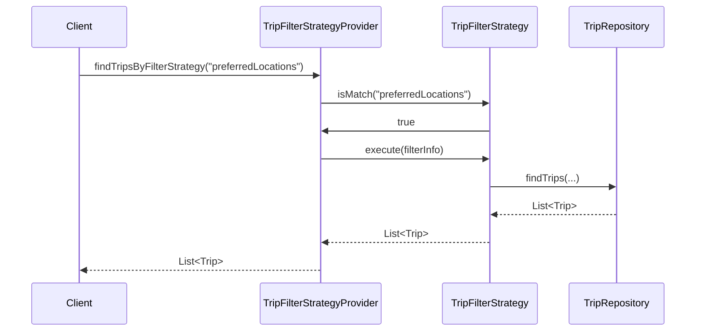

# Comprehensive Documentation for the Codebase

## 1. Overall Structure

### High-Level Overview
The codebase is structured into several packages, each serving a specific domain within the application. The main packages include:

- **moheng.keyword**: Contains classes related to keywords associated with trips.
- **moheng.member**: Manages member-related functionalities, including member data and validation.
- **moheng.recommendtrip**: Handles the recommendation logic for trips based on various filters and strategies.
- **moheng.trip**: Contains classes related to trip management, including repositories and DTOs.

### Purpose and Function of Each File/Module

- **TripKeywordRepository**: A repository interface for managing `TripKeyword` entities, providing methods to find keywords associated with trips based on various criteria.
  
- **Member**: Represents a member in the system, encapsulating member attributes and validation logic.

- **MemberRepository**: A repository interface for managing `Member` entities, providing methods to find members by email and check for existing members.

- **NoExistMemberException**: A custom exception thrown when a requested member does not exist.

- **RecommendTrip**: Represents a recommended trip for a member, including attributes for ranking and associations with members and trips.

- **PreferredLocationsFilterInfo**: A filter info class that encapsulates member-specific filtering criteria.

- **TripFilterStrategy**: An interface defining the strategy for filtering trips based on specific criteria.

- **TripFilterStrategyProvider**: A provider class that manages and retrieves the appropriate trip filter strategy based on the given name.

- **RecommendTripRepository**: A repository interface for managing `RecommendTrip` entities, providing methods to find recommendations and manage rankings.

- **RecommendTripCreateRequest**: A DTO for creating a new recommended trip.

- **TripRepository**: A repository interface for managing `Trip` entities, providing various methods to query trips based on different criteria.

- **FindTripsResponse**: A DTO that encapsulates the response structure for finding trips, including associated keywords.

- **NoExistTripException**: A custom exception thrown when a requested trip does not exist.

### Interaction Between Components
The components interact primarily through repository interfaces and DTOs. For example, the `Member` class interacts with the `MemberRepository` to perform CRUD operations, while the `RecommendTrip` class interacts with the `RecommendTripRepository` to manage recommendations. The strategy pattern is implemented in the `TripFilterStrategy` interface and its implementations, allowing for flexible filtering of trips based on different criteria.

### Mermaid Diagram: Strategy Pattern Flow and Class Relationships

## 2. Strategy Pattern Implementation

### Strategy Pattern Overview
The strategy pattern is implemented through the `TripFilterStrategy` interface and its concrete implementations. This allows for different filtering strategies to be applied dynamically based on the context.

### Strategy Interface and Concrete Strategy Classes
- **TripFilterStrategy**: This interface defines the methods that all filtering strategies must implement, including `isMatch` to check if the strategy applies and `execute` to perform the filtering.

### Context Class
- **TripFilterStrategyProvider**: This class acts as the context that uses the strategies. It holds a list of available strategies and provides a method to find the appropriate strategy based on the filter strategy name.

### Class Diagram: Strategy Pattern Structure

## 3. Detailed Component Documentation

### a. Classes

#### TripKeywordRepository
- **Purpose**: Interface for managing `TripKeyword` entities.
- **Attributes**: None (interface).
- **Role**: Provides methods to query trip keywords based on various criteria.
- **Relationships**: Extends `JpaRepository`.

#### Member
- **Purpose**: Represents a member in the system.
- **Attributes**:
  - `Long id`: Unique identifier for the member.
  - `String email`: Email address of the member.
  - `String nickName`: Nickname of the member.
  - `String profileImageUrl`: URL of the member's profile image.
  - `SocialType socialType`: Type of social login used.
  - `LocalDate birthday`: Birthday of the member.
  - `GenderType genderType`: Gender of the member.
  - `Authority authority`: Member's authority level.
- **Role**: Encapsulates member data and validation logic.
- **Relationships**: Inherits from `BaseEntity`.

#### MemberRepository
- **Purpose**: Interface for managing `Member` entities.
- **Attributes**: None (interface).
- **Role**: Provides methods to find members by email and check for existing members.
- **Relationships**: Extends `JpaRepository`.

#### NoExistMemberException
- **Purpose**: Custom exception for non-existent members.
- **Attributes**: None.
- **Role**: Indicates that a requested member does not exist.

#### RecommendTrip
- **Purpose**: Represents a recommended trip for a member.
- **Attributes**:
  - `Long id`: Unique identifier for the recommendation.
  - `Member member`: The member associated with the recommendation.
  - `Trip trip`: The trip being recommended.
  - `Long ranking`: Ranking of the recommendation.
- **Role**: Encapsulates the relationship between members and their recommended trips.
- **Relationships**: Many-to-one relationship with `Member` and `Trip`.

#### PreferredLocationsFilterInfo
- **Purpose**: Encapsulates member-specific filtering criteria.
- **Attributes**:
  - `Long memberId`: ID of the member for filtering.
- **Role**: Provides filtering information for trip recommendations.

#### TripFilterStrategy
- **Purpose**: Interface for trip filtering strategies.
- **Attributes**: None (interface).
- **Role**: Defines methods for filtering trips based on specific criteria.

#### TripFilterStrategyProvider
- **Purpose**: Provides access to trip filtering strategies.
- **Attributes**:
  - `List<TripFilterStrategy> tripFilterStrategies`: List of available strategies.
- **Role**: Retrieves the appropriate strategy based on the filter strategy name.

#### RecommendTripRepository
- **Purpose**: Interface for managing `RecommendTrip` entities.
- **Attributes**: None (interface).
- **Role**: Provides methods to find recommendations and manage rankings.
- **Relationships**: Extends `JpaRepository`.

#### RecommendTripCreateRequest
- **Purpose**: DTO for creating a new recommended trip.
- **Attributes**:
  - `Long tripId`: ID of the trip to be recommended.
- **Role**: Encapsulates data required for creating a recommendation.

#### TripRepository
- **Purpose**: Interface for managing `Trip` entities.
- **Attributes**: None (interface).
- **Role**: Provides various methods to query trips based on different criteria.
- **Relationships**: Extends `JpaRepository`.

#### FindTripsResponse
- **Purpose**: DTO for finding trips.
- **Attributes**:
  - `List<FindTripResponse> findTripResponses`: List of trip responses.
- **Role**: Encapsulates the response structure for finding trips, including associated keywords.

#### NoExistTripException
- **Purpose**: Custom exception for non-existent trips.
- **Attributes**: None.
- **Role**: Indicates that a requested trip does not exist.

### b. Methods and Functions

#### Member.changePrivilege
- **Purpose**: Changes the authority level of the member.
- **Parameters**:
  - `Authority authority`: The new authority level to set.
- **Return Value**: None.
- **Side Effects**: Updates the authority attribute of the member.

#### TripFilterStrategyProvider.findTripsByFilterStrategy
- **Purpose**: Finds the appropriate trip filter strategy based on the given name.
- **Parameters**:
  - `String filterStrategyName`: The name of the filter strategy to find.
- **Return Value**: `TripFilterStrategy`: The matching strategy.
- **Side Effects**: Throws an exception if no matching strategy is found.

### c. Important Variables

#### EMAIL_FORMAT
- **Purpose**: Regular expression pattern for validating email formats.
- **Type**: `Pattern`.
- **Constraints**: Must match the specified email format.

#### MAX_NICK_NAME_LENGTH
- **Purpose**: Maximum allowed length for nicknames.
- **Type**: `int`.
- **Constraints**: Must be less than or equal to 50.

#### MIN_NICK_NAME_LENGTH
- **Purpose**: Minimum allowed length for nicknames.
- **Type**: `int`.
- **Constraints**: Must be greater than or equal to 2.

## 4. Implementation Flow

### Sequence Diagram: Runtime Behavior

This sequence diagram illustrates how the client interacts with the `TripFilterStrategyProvider` to retrieve trips based on a specific filtering strategy. The provider delegates the filtering logic to the appropriate strategy, which in turn queries the `TripRepository` for the relevant trips. The results are then returned to the client.
